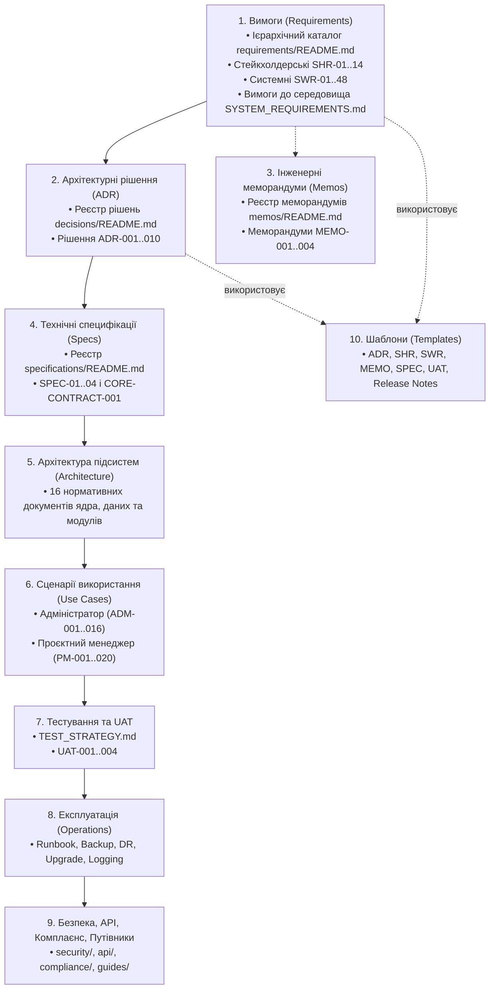

# Технічна та архітектурна документація DELMOS

Дата оновлення: 2026-09-23.  
Платформа: **DELMOS** (Discovery, Engineering & Lifecycle Management Operating System).  
Ліцензія: Apache 2.0.

---

## 1. Структура інженерної документації

---

## 2. Реєстр документів за категоріями

### 2.1. Нормативні вимоги (Requirements)
* **[Ієрархічні вимоги (Методологія та каталог)](requirements/README.md)** — структура декомпозиції вимог за стандартами ISO/IEC/IEEE 29148 та ASPICE SYS.1–SYS.2.
* **[Стейкхолдерські вимоги (SHR-01..14)](requirements/stakeholder/README.md)** — інженерні та бізнес-потреби користувачів системи.
* **[Системні вимоги (SWR-01..48)](requirements/software/README.md)** — декомпозиція системних вимог за 10 підсистемами платформи.
* **[Вимоги до середовища](requirements/SYSTEM_REQUIREMENTS.md)** — інструменти розробки, PostgreSQL, Linux і запуск сервісу; функціональні вимоги й простежуваність — в окремих каталогах.

### 2.2. Архітектурні рішення (Architecture Decision Records - ADR)
* **[Реєстр архітектурних рішень (ADR-001..010)](architecture/decisions/README.md)**:
  * [ADR-001: All-in-PostgreSQL Storage](architecture/decisions/ADR-001-all-in-postgresql-storage.md)
  * [ADR-002: Strict WorkItem & WorkProduct Separation](architecture/decisions/ADR-002-strict-workitem-workproduct-separation.md)
  * [ADR-003: Composite Specification Manifests](architecture/decisions/ADR-003-composite-specification-manifests.md)
  * [ADR-004: Two-tier Module Governance & Generic Plan](architecture/decisions/ADR-004-two-tier-module-governance-generic-plan.md)
  * [ADR-005: Multi-provider Repository Abstraction](architecture/decisions/ADR-005-multi-provider-repository-abstraction.md)
  * [ADR-006: Project Economics & Resource Accounting](architecture/decisions/ADR-006-project-economics-resource-accounting.md)
  * [ADR-007: Transactional Outbox & Event Scheduler](architecture/decisions/ADR-007-transactional-outbox-event-scheduler.md)
  * [ADR-008: SVG Vector Visualization for Compliance](architecture/decisions/ADR-008-svg-vector-visualization-for-compliance.md)
  * [ADR-009: Незалежна рецензія та погодження ревізії](architecture/decisions/ADR-009-core-review-and-approval-policy.md)
  * [ADR-010: Незмінні докази та контрольоване очищення outbox](architecture/decisions/ADR-010-audit-evidence-and-outbox-retention.md)

### 2.3. Інженерні меморандуми (Memos)
* **[Реєстр інженерних меморандумів](memos/README.md)**:
  * [MEMO-001: Розширення інженерного контуру (Pre-sales, Feasibility, Research, Hardware, Systems, Delivery)](memos/MEMO-001-full-lifecycle-scope-expansion.md)
  * [MEMO-002: Стратегія сертифікаційних аудитів та Tool Qualification за ISO 26262 (TCL)](memos/MEMO-002-tool-qualification-and-compliance-strategy.md)
  * [MEMO-003: Архітектура Graph-RAG у PostgreSQL (вектори + рекурсивні CTE)](memos/MEMO-003-graph-rag-architecture-in-postgresql.md)
  * [MEMO-004: Стратегія валідації цілісності продуктового задуму (Working Backwards, Wardley Mapping, beachhead-сегмент, OSS-готовність)](memos/MEMO-004-product-concept-validation-strategy.md)

### 2.4. Технічні специфікації (Specifications)
* **[Реєстр технічних специфікацій](specifications/README.md)**:
  * [SPEC-01: Composite Specifications Engine (Маніфести, хеші, SPEC-01..10)](specifications/SPEC-01-COMPOSITE-SPECIFICATIONS-ENGINE.md)
  * [SPEC-02: Repository Provider Interface (Go-інтерфейс, адаптери сховищ)](specifications/SPEC-02-REPOSITORY-PROVIDER-INTERFACE.md)
  * [SPEC-03: Project Economics & EVM Models (Бюджети, табелі, розрахунки EVM/P&L)](specifications/SPEC-03-PROJECT-ECONOMICS-EVM-MODELS.md)
  * [SPEC-04: Events, Triggers & Rules Engine (Конверт, черга Outbox, оренда ліз, FSM)](specifications/SPEC-04-EVENTS-TRIGGERS-RULES-ENGINE.md)
  * [CORE-CONTRACT-001: перший зріз ролей, ревізій та погодження](specifications/CORE-CONTRACT-001-ROLE-WORKFLOW.md) — [OpenAPI](api/openapi.core.v1.yaml) та [JSON Schema подій](api/events.core.v1.schema.json).

### 2.5. Архітектура підсистем та моделей
* [Ядро та архітектура платформи](architecture/ARCHITECTURE.md) — загальна архітектура модульного моноліту та технологічні межі.
* **[Готовність до активного кодування](architecture/PRE_CODING_GUIDE.md)** — пріоритетний gate першого вертикального зрізу й окремі вимоги до публічного preview.
* [Межі реалізації](architecture/IMPLEMENTATION_GUARDRAILS.md) — власники первинних даних, межі команд і транзакцій, сумісність контрактів та питання retention до першої міграції.
* [Архітектурні шаблони реалізації](architecture/IMPLEMENTATION_PATTERNS.md) — прийняті напрями, кандидати й патерни, яких свідомо не застосовуємо без ADR.
* [Предметна модель та сутності](architecture/DOMAIN_MODEL.md) — ER-діаграми, сутності ядра, зв'язки та матриця CRUD.
* **[Каталог сутностей, розширень та типових операцій](architecture/ENTITY_CATALOG.md)** — консолідований довідник: базові сутності, правила розширення модулями, CRUD-команди та FSM в одному місці.
* [Item, Work Item, Content і колекції](architecture/ITEMS_AND_CONTENT.md) — семантичне розмежування діяльності та результату.
* [Work Products та специфікації](architecture/WORK_PRODUCTS.md) — базові типи артефактів, життєвий цикл ревізій та сценарії SPEC-01..10.
* [Векторні та графові моделі даних](architecture/VECTOR_AND_GRAPH_DATA.md) — pgvector, CTE CYCLE, Graph-RAG та векторна графіка SVG.
* [Проєкт, сховища та конфігурація](architecture/PROJECT_MODEL.md) — модель проєкту, абстракція RepositoryProvider, фази та віхи.
* [Project Plan Engine та модулі](architecture/PROJECT_PLAN_ENGINE.md) — дворівневе керування: Generic Project Plan та модулі.
* [Модульна система та розширюваність](architecture/MODULES.md) — контракт маніфестів, ізоляція та Module UI Host.
* [Каталог модулів](architecture/MODULE_CATALOG.md) — каталог процесних, комплаєнс-, ресурсних та інженерних модулів.
* **[Web GUI та Guided UI](architecture/gui/README.md)** — оболонка й допомога на сторінках, [бренд DELMOS](architecture/gui/BRANDING.md), [елементи](architecture/gui/COMPONENT_SPECIFICATIONS.md), [локалізація](architecture/gui/LOCALIZATION.md), [UI-тексти](architecture/gui/UI_CONTENT.md) та [UX-артефакти](architecture/gui/UX_DELIVERABLES.md); [каталог екранів](architecture/gui/SCREEN_CATALOG.md) розрізняє Core, горизонтальні та галузеві сценарії.
* [Події, тригери, правила та автоматизація](architecture/EVENTS_TRIGGERS_RULES.md) — конверт подій, планувальник та надійна черга outbox.
* [Метрики та реєстр вимірювань](architecture/METRICS.md) — реєстр показників, формули Earned Value Management (EVM) та якість даних.
* [Користувачі та керування доступом](architecture/ACCESS_CONTROL.md) — ідентичності, Scoped RBAC, перевірка правила SoD.
* [Таксономії та довідкові дані](architecture/TAXONOMY.md) — поліієрархічні класифікатори та контроль ациклічності.
* [Глосарій термінів та понять](architecture/GLOSSARY.md) — нормативний термінологічний стандарт платформи (ELM, EVM, ASPICE, ISO 26262, Outbox, pgvector).
* [Архітектурні патерни систем](architecture/CONTENT_PROJECT_PATTERNS.md) — порівняльний аналіз архітектурних патернів ALM, ELM та CMS.
* [Стратегічний SWOT-аналіз](architecture/SWOT_ANALYSIS.md) — стратегічна оцінка сильних/слабких сторін та ринкових перспектив.
* [Дорожня карта розбудови](architecture/ROADMAP.md) — фази реалізації P0–P7.

### 2.6. Сценарії використання (Use Cases)
* **[Реєстр базових ролей ядра](use-cases/README.md)** — сценарії USR/VIEW/ENG/REV/APR/AUD, адміністратор і PM; межі прав, незалежність погодження й пріоритет першого зрізу.
* [Use Cases адміністратора](use-cases/ADMINISTRATOR.md) — сценарії адміністрування, безпеки та бекапів (ADM-001..016).
* [Use Cases проєктного менеджера](use-cases/PROJECT_MANAGER.md) — сценарії ведення проєкту, розкладу, бюджету та шлюзів (PM-001..020).

### 2.7. Тестування та приймальне тестування (Testing & UAT)
* **[Стратегія тестування](testing/TEST_STRATEGY.md)** — чотирирівнева V-модель (Unit → Integration → Qualification → Acceptance) з простежуваністю до SWR/SHR.
* **[Реєстр приймального тестування (UAT-001..004)](uat/README.md)** — сценарії, що перевіряють спостережувану цінність для ролей стейкхолдерів і базову незалежність погодження.

### 2.8. Експлуатація (Operations)
* **[Реєстр операційних документів](operations/README.md)**:
  * [RUNBOOK.md](operations/RUNBOOK.md) — керування процесом служби, дерево діагностики, відомі несправності.
  * [BACKUP_AND_RESTORE.md](operations/BACKUP_AND_RESTORE.md) — резервне копіювання та відновлення PostgreSQL.
  * [DISASTER_RECOVERY.md](operations/DISASTER_RECOVERY.md) — цілі RPO/RTO, регулярні навчання (DR Drill).
  * [UPGRADE_AND_ROLLBACK.md](operations/UPGRADE_AND_ROLLBACK.md) — оновлення версії та відкат при збої.
  * [LOGGING_AND_OBSERVABILITY.md](operations/LOGGING_AND_OBSERVABILITY.md) — журналювання, ротація логів, трасування.

### 2.9. Безпека, API та комплаєнс
* **[Безпека](security/README.md)**: [SECURITY_SPECIFICATION.md](security/SECURITY_SPECIFICATION.md) — шифрування в стані спокою/передачі, керування секретами, безпека вебхуків (доповнює [ACCESS_CONTROL.md](architecture/ACCESS_CONTROL.md)).
* **[REST API](api/README.md)**: [API_SPECIFICATION.md](api/API_SPECIFICATION.md) — цільовий контракт ресурсів, помилок і пагінації.
* **[Комплаєнс](compliance/README.md)**: [STANDARD_MAPPING_TEMPLATE.md](compliance/STANDARD_MAPPING_TEMPLATE.md) — шаблон мапування галузевого стандарту на можливості DELMOS; [domains/](compliance/domains/README.md) — напрямки розширення за 21 вертикальним галузевим доменом (Automotive, Aviation, Medicine, Marine, Military, Financial, Railway, Industrial Automation, Space, Nuclear Energy, Power Generation & Distribution, Public Safety, IoT Cybersecurity, Gaming & Gambling, Digital Media, Home Security, Telecom, Commodity Networks & Wi-Fi, Consumer Electronics, Biology Research, Pharmaceutical) та 2 наскрізними горизонтальними стандартами (Information Security & Cybersecurity, Personal Data Protection).

### 2.10. Путівники (Guides) та шаблони (Templates)
* **[Путівники](guides/README.md)**: [VISION.md](guides/VISION.md) (бачення продукту), [developer/LOCAL_SETUP.md](guides/developer/LOCAL_SETUP.md), [developer/CONTRIBUTING_WORKFLOW.md](guides/developer/CONTRIBUTING_WORKFLOW.md), [user/CREATE_PROJECT.md](guides/user/CREATE_PROJECT.md).
* **[Шаблони документів](templates/README.md)** — порожні шаблони `ADR`, `SHR`, `SWR`, `MEMO`, `SPEC`, `UAT`, нотаток релізу для майбутнього заповнення.
* **[Політика версіонування](VERSIONING.md)** — семантичне версіонування, теги, чек-лист релізу.
* **[Матриця наскрізної простежуваності](TRACEABILITY.md)** — агрегований покажчик SHR↔SWR↔ADR↔SPEC↔UAT.

---

## 3. Ключові архітектурні інваріанти DELMOS

1. **All-in-PostgreSQL:** реляційні таблиці, графічні зв'язки, ієрархічні структури та векторні ембедінги функціонують в єдиній базі даних під керуванням надійного транзакційного механізму ACID.
2. **Docs-as-Code та незмінні ревізії:** будь-яка зміна інженерного артефакту породжує нову незмінну ревізію з точним розрахунком `payload_hash`.
3. **Строге розмежування завдань і артефактів:** виконання завдання не означає схвалення результату (`Task.done != WP.approved`). Погодження є окремим суворим процесом із перевіркою SoD.
4. **Композитний документ:** специфікація є структурованим деревом розділів, що посилається на точні ревізії атомарних вимог або тест-кейсів, запобігаючи дублюванню копій змісту.
5. **Мультипровайдерне зберігання:** вибір сховища адаптується під потреби замовника через інтерфейс `RepositoryProvider`.
6. **Інженерна економіка:** пряма інтеграція обліку праці (`WorkRecord`), базового кошторису (`CostBaseline`) та контролю виконання за методикою освоєного обсягу ($EVM$).
