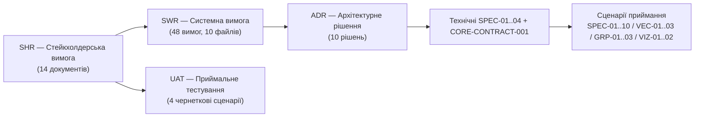

# DELMOS: матриця наскрізної простежуваності (Traceability)

Дата: 2026-09-23. Статус: агрегований покажчик простежуваності (canonical джерела — окремі реєстри, наведені нижче).
Ліцензія: Apache 2.0.
Контекст: [методологія вимог](requirements/README.md), [реєстр стейкхолдерських вимог](requirements/stakeholder/README.md),
[реєстр системних вимог](requirements/software/README.md), [реєстр архітектурних рішень](architecture/decisions/README.md),
[реєстр специфікацій](specifications/README.md), [реєстр UAT](uat/README.md).

---

## 1. Модель простежуваності

Цей документ **не дублює** первинні дані — кожен реєстр (SHR, SWR, ADR, SPEC, UAT) залишається єдиним джерелом істини (single source of truth) для своєї ланки. Тут наведено лише зведений покажчик та явно визнані прогалини покриття.

## 2. SHR → SWR (пряме покриття)

Повна таблиця відповідності всіх 14 стейкхолдерських вимог до 48 системних вимог (10 групових файлів) підтримується канонічно в [requirements/software/README.md, розділ 1](requirements/software/README.md#1-структура-системних-вимог-за-підсистемами). Кожна `SHR-01`..`SHR-14` має щонайменше одну декомпозовану `SWR`; [SHR-14](requirements/stakeholder/SHR-14-core-access-and-assurance.md) декомпозовано в [SWR-42..48](requirements/software/SWR-10-core-access-assurance.md).

## 3. SWR → ADR (архітектурне обґрунтування)

| ADR | Назва | Пов'язані SWR-групи |
| --- | --- | --- |
| [ADR-001](architecture/decisions/ADR-001-all-in-postgresql-storage.md) | All-in-PostgreSQL Storage | SWR-01..05, SWR-36..38 |
| [ADR-002](architecture/decisions/ADR-002-strict-workitem-workproduct-separation.md) | Розмежування WorkItem/WorkProduct | SWR-06..08, SWR-28..30 |
| [ADR-003](architecture/decisions/ADR-003-composite-specification-manifests.md) | Маніфести композитних специфікацій | SWR-33..35 |
| [ADR-004](architecture/decisions/ADR-004-two-tier-module-governance-generic-plan.md) | Дворівневе керування модулями + Generic Plan | SWR-01..05, SWR-15, SWR-17..18 |
| [ADR-005](architecture/decisions/ADR-005-multi-provider-repository-abstraction.md) | Мультипровайдерна абстракція сховищ | SWR-09..11, SWR-31..32 |
| [ADR-006](architecture/decisions/ADR-006-project-economics-resource-accounting.md) | Облік проєктної економіки та ресурсів | SWR-39..41 |
| [ADR-007](architecture/decisions/ADR-007-transactional-outbox-event-scheduler.md) | Транзакційний outbox + планувальник подій | SWR-12..14, SWR-16, SWR-19..20, SWR-23..27 |
| [ADR-008](architecture/decisions/ADR-008-svg-vector-visualization-for-compliance.md) | SVG-візуалізація для комплаєнсу | SWR-36..38 |
| [ADR-009](architecture/decisions/ADR-009-core-review-and-approval-policy.md) | Незалежне погодження точної ревізії | SWR-42..46, SWR-48 |
| [ADR-010](architecture/decisions/ADR-010-audit-evidence-and-outbox-retention.md) | Захист доказів і контрольоване очищення | SWR-47, SWR-48; SWR-23..27 для технічної доставки |

## 4. ADR → SPEC (технічна деталізація)

| Технічний документ | Назва | Пов'язаний ADR |
| --- | --- | --- |
| [SPEC-01](specifications/SPEC-01-COMPOSITE-SPECIFICATIONS-ENGINE.md) | Рушій композитних специфікацій | ADR-003 |
| [SPEC-02](specifications/SPEC-02-REPOSITORY-PROVIDER-INTERFACE.md) | Інтерфейс RepositoryProvider | ADR-005 |
| [SPEC-03](specifications/SPEC-03-PROJECT-ECONOMICS-EVM-MODELS.md) | Моделі проєктної економіки та EVM | ADR-006 |
| [SPEC-04](specifications/SPEC-04-EVENTS-TRIGGERS-RULES-ENGINE.md) | Рушій подій, тригерів і правил | ADR-007 |
| [CORE-CONTRACT-001](specifications/CORE-CONTRACT-001-ROLE-WORKFLOW.md) | Перший зріз базових ролей, WP, Review/Approval; [OpenAPI](api/openapi.core.v1.yaml) та [схема подій](api/events.core.v1.schema.json) | ADR-009, ADR-010; SHR-14, SWR-42..48 |

Технічні файли `SPEC-01..04` і сценарії приймання `SPEC-01..10` історично мають однаковий короткий префікс; посилання без повного шляху неоднозначні. Новий Core-контракт використовує окремий префікс.

## 5. SHR → UAT (приймальне покриття)

Повний реєстр покриття стейкхолдерських вимог сценаріями приймального тестування підтримується канонічно в [uat/README.md, розділ 3](uat/README.md#3-покриття-стейкхолдерських-вимог).

Для ядра [UAT-004](uat/UAT-004-core-roles-review-approval.md) перевіряє SHR-14 і SWR-42..48; статус сценарію — Draft, результатів виконання поки немає.

**Визнана прогалина:** станом на 2026-09-23 стейкхолдерські вимоги `SHR-04`..`SHR-08`, `SHR-10`, `SHR-12`, `SHR-13` ще не мають затвердженого сценарію `UAT-NNN`. Новий сценарій створюється за [templates/UAT-TEMPLATE.md](templates/UAT-TEMPLATE.md) під час розробки відповідної підсистеми.

## 6. Правило підтримки актуальності

Кожен новий документ `SHR`, `SWR`, `ADR`, `SPEC` або `UAT` повинен явно вказувати свої батьківські та дочірні посилання у власному тексті (розділ «Простежуваність» / «Traceability»). Цей файл лише агрегує та вказує на канонічні джерела — він оновлюється при додаванні нового реєстрового документа, а не при кожній дрібній правці окремої вимоги.
