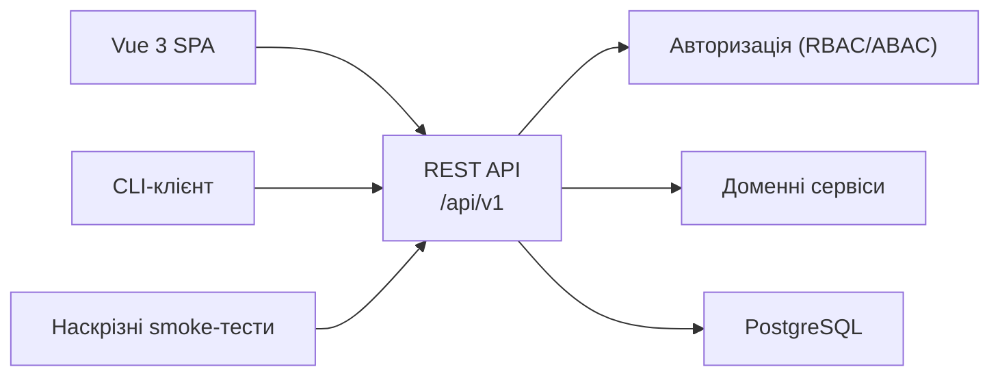
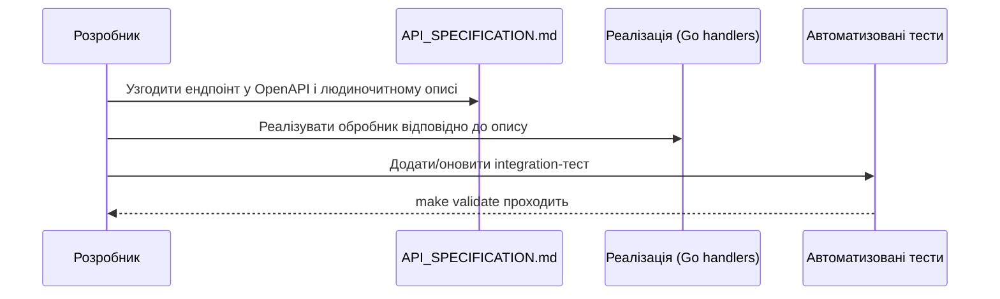

# DELMOS: REST API

Дата: 2026-09-23. Статус: два рівні контракту — реалізований та цільовий (див. розділ 2).
Ліцензія: Apache 2.0.
Контекст: [ядро та архітектура](../architecture/ARCHITECTURE.md), [дорожня карта](../architecture/ROADMAP.md).

---

## 1. Поверхня API

## 2. Документи

| Документ | Призначення |
| --- | --- |
| [openapi.v1.yaml](openapi.v1.yaml) | **Заморожений контракт `v1.0.0`** — локальний вхід, CRUD проєкту/`PLAN-001`, CRUD базового Work Product, RepositoryProvider (plain Git). Звіряється з реальними відповідями сервера в `internal/server/contract_test.go`. |
| [API_SPECIFICATION.md](API_SPECIFICATION.md) | Людиночитний опис ресурсів REST API з прикладами запитів/відповідей |
| [openapi.core.v1.yaml](openapi.core.v1.yaml) | **Цільовий контракт** повного Core-зрізу з Review/Approval, `plan.apply` та аудитом — **не реалізовано** в `v1.0.0`, ціль для `v1.x`+ (див. [CORE-CONTRACT-001](../specifications/CORE-CONTRACT-001-ROLE-WORKFLOW.md)) |
| [events.core.v1.schema.json](events.core.v1.schema.json) | JSON Schema Draft 2020-12 для конвертів подій Core (цільовий, потребує рушія подій/автоматизації) |

## 3. Життєвий цикл контракту

## 4. Правила для нових ендпоінтів

* Заморожений контракт — [openapi.v1.yaml](openapi.v1.yaml); кожен реалізований ендпоінт має там відповідний опис і контрактний тест у `internal/server/contract_test.go`.
* Усі ендпоінти живуть під префіксом `/api/v1`; зміна формату відповіді в межах `v1` є **зворотносумісною** (додавання полів дозволене, видалення чи перейменування — ні).
* Кожен ендпоінт, що змінює стан, перевіряє права доступу через RBAC/ABAC (див. [ACCESS_CONTROL.md](../architecture/ACCESS_CONTROL.md)) до виконання будь-якої бізнес-логіки.
* Помилки повертаються в єдиному узгодженому форматі (розділ 3 [API_SPECIFICATION.md](API_SPECIFICATION.md)).

## 5. Пов'язані документи

* [architecture/ACCESS_CONTROL.md](../architecture/ACCESS_CONTROL.md) — модель авторизації, що застосовується до кожного запиту.
* [specifications/SPEC-02-REPOSITORY-PROVIDER-INTERFACE.md](../specifications/SPEC-02-REPOSITORY-PROVIDER-INTERFACE.md) — контракт постачальників сховищ, окремий від публічного REST API.
