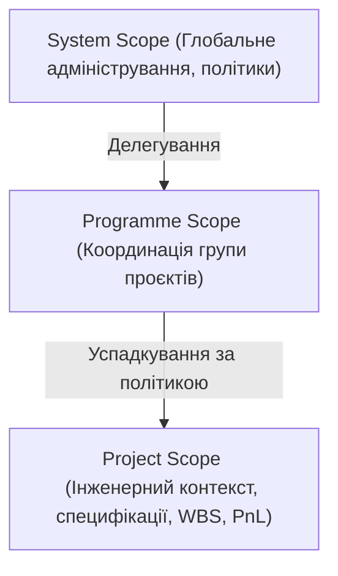
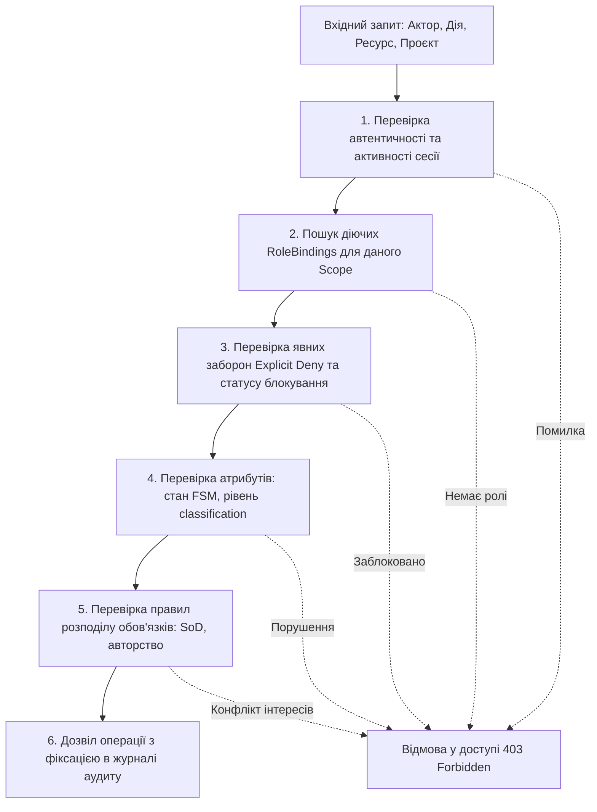

# DELMOS: користувачі, ролі та керування доступом

Дата: 2026-09-23. Статус: цільовий нормативний контракт авторизації та безпеки.  
Ліцензія: Apache 2.0.  
Контекст: [ядро та архітектура](ARCHITECTURE.md), [предметна модель](DOMAIN_MODEL.md),
[проєкт і сховища](PROJECT_MODEL.md), [Work Products та специфікації](WORK_PRODUCTS.md),
[сценарії адміністратора](../use-cases/ADMINISTRATOR.md).

---

## 1. Концептуальний підхід до авторизації

Для платформи **DELMOS** визначено цільову комбіновану модель доступу; її реалізація ще не завершена:
* **Scoped RBAC (Role-Based Access Control):** призначення типізованих ролей у чітко обмежених просторах (System, Programme, Project).
* **Attribute-Based Guards (ABAC):** перевірка стану життєвого циклу артефакту (наприклад, `status = in_review`) та грифу секретності (`classification`).
* **Relation Checks:** перевірка відношень між суб'єктом і об'єктом (наприклад, призначений рецензент, власник фази).
* **Segregation of Duties (SoD):** суворі правила інженерної безпеки (автор ревізії не може бути її незалежним затверджувачем).

### Фундаментальні принципи:
1. **Deny-by-default:** будь-яка дія за замовчуванням заборонена, якщо немає явного дозволу.
2. **Least Privilege:** користувач отримує мінімальний обсяг прав, необхідний для виконання посадових обов'язків у межах конкретного проєкту.
3. **No Superuser Bypass:** глобальний системний адміністратор керує інфраструктурою, але не має неявного права одноосібно підписувати або змінювати інженерні специфікації безпеки (ISO 26262, ASPICE).
4. **Server-Side Enforcement:** права перевіряються для кожного API-запиту та фонової операції; приховування кнопки в інтерфейсі не замінює авторизацію. Автор ревізії ніколи не погоджує її сам, навіть якщо має обидві ролі Reviewer/Approver ([ADR-009](decisions/ADR-009-core-review-and-approval-policy.md)).

---

## 2. Ідентичності, сесії та автентифікація

| Сутність | Призначення та правила |
| --- | --- |
| **User** | Обліковий запис фізичної особи з незмінним UUID, системним іменем та адресою пошти. |
| **ExternalIdentity** | Зв'язок користувача DELMOS із зовнішніми провайдерами автентифікації (GitHub, GitLab, Azure AD/Entra ID, OIDC/SAML). Унікальна пара `(provider_id, external_sub)`. |
| **Break-Glass Administrator** | Локальний аварійний адміністратор із криптографічним хешем пароля в захищеній БД, призначений виключно для відновлення системи у випадку збою зовнішньої автентифікації. |
| **ServicePrincipal** | Технічний обліковий запис для автоматизації (CI/CD, фонові синхронізатори) із жорстко обмеженим терміном дії та відсутністю інтерактивного входу. |
| **Session** | Серверна сесія: HttpOnly Strict cookie з прапорцями Secure та SameSite=Strict, захист від CSRF через окремий токен у заголовку. |
| **RoleDefinition** | Версійований реєстр ролей із точним переліком дозволених дій (`permission_keys`) та стелею делегування (`delegation_ceiling`). |
| **RoleBinding** | Прив'язка ролі до користувача в конкретному просторі (System, Programme, Project) із зазначенням терміну дії та обґрунтування. |

---

## 3. Простори дій (Scopes) та успадкування

* **System Scope:** керування користувачами, глобальним каталогом модулів, налаштуваннями сховищ та аудитом безпеки.
* **Programme Scope:** перегляд зведених статусів, координація розподілу ресурсів та інтеграційних залежностей між пов'язаними проєктами.
* **Project Scope:** повне інженерне середовище — створення артефактів, ведення вимог, тестування, облік витрат часу (`WorkRecord`) та закриття віх.
* **Правило ізоляції:** права в одному проєкті не дають доступу до інших проєктів програми. Міжпроєктні зв'язки трасованості вимагають прав читання обох кінців.

---

## 4. Сімейства дозволів (Permissions Taxonomy)

| Сімейство | Приклади дій | Обмеження та межі |
| --- | --- | --- |
| **Read & Discovery** | `project.read`, `wp.read`, `wp.history.read`, `baseline.read` | Однаково діють на пряме читання, пошук, списки та графи. |
| **Authoring** | `wp.create`, `wp.edit`, `wp.retire`, `trace.create`, `trace.unlink` | Дозволяють створення чернеток та ревізій, але не остаточне затвердження. |
| **Workflow & SoD** | `wp.submit`, `wp.review`, `wp.approve`, `wp.request_changes` | Вимагають активної фази рецензування та перевірки незалежності автора. |
| **Project Planning** | `plan.edit`, `plan.approve`, `plan.apply`, `milestone.accept` | Редагування, погодження та набуття чинності конфігурацією є різними кроками. |
| **Resources & Economics** | `work_record.log`, `cost_baseline.create`, `financials.read` | Списання годин дозволене лише в активних фазах; доступ до ставок обмежений. |
| **Administration** | `identities.manage`, `access.grant`, `access.revoke`, `modules.manage` | Делегування обмежене рівнем повноважень суб'єкта (Delegation Ceiling). |
| **Assurance & Audit** | `compliance.assess`, `compliance.waiver.approve`, `baseline.publish` | Фіксація аудиторських доказів, незмінність опублікованого бейзлайну. |

---

## 5. Базові ролі системи

| Роль | Основні обов'язки | Обмеження за замовчуванням |
| --- | --- | --- |
| **Viewer** | Читання дозволених документів, специфікацій, бейзлайнів та статусів віх | Заборонено редагування, затвердження та експорт закритих даних |
| **Auditor** | Читання аудиторських журналів, історії ревізій, доказів комплаєнсу та матриць | Заборонено внесення змін до документів та конфігурацій |
| **Engineer** | Створення вимог, архітектурних рішень, тест-кейсів, зв'язування трасованості | Заборонено затверджувати власні артефакти на офіційних етапах |
| **Reviewer** | Проведення інженерних рецензій, фіксація зауважень, запит змін | Не може надавати фінальне погодження без ролі Approver |
| **Approver** | Фінальне затвердження інженерних специфікацій у межах своєї спеціалізації | Не може виступати затверджувачем для ревізій, де є автором |
| **Project Manager** | Керування проєктним планом, розкладом, фазами, ресурсами та кошторисом | Не може самостійно перепризначати собі ролі з інженерної безпеки |
| **Safety / Compliance Officer** | Оцінка відповідності стандартам (ISO 26262, ASPICE), погодження відхилень | Підпорядковується суворим інваріантам незалежності SoD |
| **System Administrator** | Налаштування інфраструктури, керування політиками модулів, системний аудит | Не має доступу до затвердження інженерного контенту |

Мінімальні призначення й дозволи для ядра визначають [SWR-42..48](../requirements/software/SWR-10-core-access-assurance.md); рішення про незалежний Review і Approval — [ADR-009](decisions/ADR-009-core-review-and-approval-policy.md). Таблиця ролей сама по собі не є RoleBinding користувача.

---

## 6. Алгоритм прийняття рішень (Policy Evaluation Engine)

* **Атомарність перевірки:** Рішення приймається на рівні прикладного шару DELMOS перед виконанням будь-якої зміни в базі даних.
* **Пояснення відмови (`access.explain`):** Система повертає чітку причину відмови (наприклад: *«Автор ревізії REQ-001/r2 не може затверджувати власну зміну відповідно до правила SoD-01»*) без витоку конфіденційної інформації про сторонні об'єкти.
