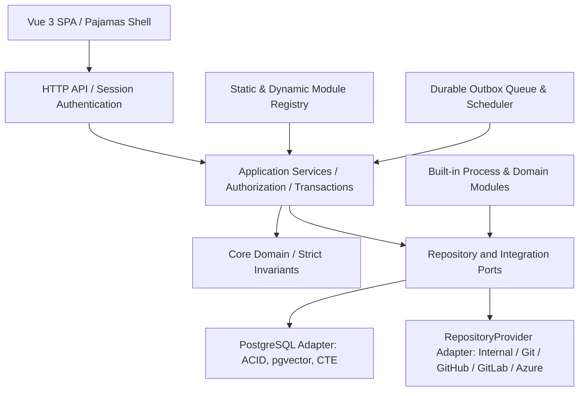

# DELMOS: ядро та архітектурні межі

Дата: 2026-09-23. Статус: архітектурний контракт та технічні межі платформи.  
Ліцензія: Apache 2.0.  
Контекст: [предметна модель](DOMAIN_MODEL.md), [проєкт і сховища](PROJECT_MODEL.md),
[Work Products](WORK_PRODUCTS.md), [вектори та графи](VECTOR_AND_GRAPH_DATA.md),
[модульна система](MODULES.md).

---

## 1. Призначення та місія системи

**DELMOS** (Discovery, Engineering & Lifecycle Management Operating System) — це автономна операційна система інженерного життєвого циклу (**ELM**) та проєктної економіки (**Project ERP / PPM**).

Платформа забезпечує наскрізний ланцюг створення високотехнологічних продуктів у критичних галузях (Automotive, Aerospace, MedTech, Industrial IoT):
$$\text{Pre-sales / RFQ} \longrightarrow \text{Research / R&D} \longrightarrow \text{Systems / HW / SW} \longrightarrow \text{Economics / EVM} \longrightarrow \text{Compliance / Delivery}$$

Основний сценарій платформи:
$$\text{Програма} \longrightarrow \text{Проєкт} \longrightarrow \text{Generic Project Plan} \longrightarrow \text{Підключення сховища} \longrightarrow \text{Специфікації} \longrightarrow \text{Трасованість} \longrightarrow \text{Бейзлайн}$$

Галузеві стандарти (ASPICE 4.0, ISO 26262, ISO 21434, IEC 62304) та методології (Scrum, Waterfall, V-Model) підключаються як модульні розширення і не перевантажують ядро.

---

## 2. Архітектурні межі та технологічний фундамент

### 2.1. Незмінні рамки розгортання
- **Автономність операцій:** нативний запуск на сервері Ubuntu 26.04 під керуванням `systemd` без обов'язкових зовнішніх контейнерів.
- **Єдиний артефакт збірки:** один скомпільований Go-бінарник із вбудованим SPA-фронтендом (Vue 3, Pajamas Design System tokens).
- **All-in-PostgreSQL:** PostgreSQL є єдиною базою даних для реляційних сутностей, графового обходу зв'язків (`WITH RECURSIVE` + `CYCLE`), матеріалізованих шляхів (`ltree`) та векторного семантичного пошуку (`pgvector`). Окремі сервери графів чи векторів не потрібні.
- **Docs-as-Code та незмінні ревізії:** будь-яка зміна інженерного артефакту породжує нову незмінну ревізію з точним розрахунком `payload_hash`.
- **Мультипровайдерність сховищ:** система абстрагована від конкретного сервісу зберігання завдяки інтерфейсу `RepositoryProvider` (внутрішня БД/Git, чистий віддалений Git, GitLab, GitHub, Azure DevOps, Bitbucket, Gitea).

---

## 3. Цільове ядро: модульний моноліт

Прикладний сервіс володіє транзакцією та перевіряє права. HTTP-адаптер лише декодує запит, викликає сценарій і повертає результат. Домен не залежить від HTTP, конкретних СУБД-драйверів чи сторонніх хмарних SDK.

### Розподіл відповідальності ядра

| Область | Межа та інваріанти |
| --- | --- |
| **Identity та доступ** | Локальний аварійний адміністратор (Break-glass), зовнішні ідентичності (SSO/OAuth), Scoped RBAC, перевірка правила розподілу обов'язків (SoD). |
| **Programme / Project** | Ієрархія управління, межі проектних прав, життєвий цикл та обов'язковий `Generic Project Plan`. |
| **Work Products** | Стабільна ідентичність артефактів, незмінні ревізії, валідація схем метаданих (JSON Schema 2020-12), композитні специфікації. |
| **Traceability & Graphs** | Типізовані зв'язки, контроль цілісності обох кінців, рекурсивний обхід графа та поширення прапорця підозрілості (`is_suspect`). |
| **Baselines & Audit** | Узгоджений знімок точних ревізій і зв'язків, незмінні маніфести, цифрові підписи та аудит. |
| **Automation & Rules** | Події, секундний планувальник, надійна черга (outbox), FSM-рушій станів та декларативні перевірки (guards). |
| **Economics & Metrics** | Реєстр числових та якісних показників, облік праці (`WorkRecord`), базові бюджети (`CostBaseline`), формули EVM. |

---

## 4. Джерела істини та синхронізація

| Дані | Цільовий первинний власник | Що зберігає DELMOS |
| --- | --- | --- |
| **Версійовані специфікації та код** | Внутрішнє сховище або зовнішній Git (GitHub/GitLab/Azure) | Точні ревізії, відновлюваний індекс, стан синхронізації та хеші |
| **Програми, проєкти, доступи, черга** | PostgreSQL DELMOS | Первинні транзакційні записи |
| **Конфігурація проєкту, методології, розклад** | `Generic Project Plan` (WP типу `plan`) | Проєкція діючої ревізії плану (`effective_plan_revision`), генерація конфігурації |
| **Рішення, погодження (SoD), бейзлайни** | PostgreSQL DELMOS | Незмінні аудиторські записи з хешами (`payload_hash`), кворум підписів |
| **Семантичні вектори (Embeddings)** | PostgreSQL (`pgvector`) | Вектори ревізій, прив'язані до `(work_product_id, revision_id, model_name)` |
| **Трудовитрати та фактичні витрати** | PostgreSQL DELMOS | Записи `WorkRecord`, `ExpenseRecord`, розрахункові індекси EVM |

---

## 5. Безпека, права та обробка відмов

1. **Модель доступу (Scoped RBAC + SoD):**
   * Глобальний адміністратор системи не має права одноосібно затверджувати інженерні специфікації безпеки.
   * Автор ревізії не може бути її єдиним затверджувачем (Segregation of Duties).
   * Права перевіряються для кожної операції на сервері з урахуванням проєкту та класифікації секретності (`classification`).
2. **Сесії браузера:**
   * Серверні HttpOnly Strict cookies з прапорцем Secure (під HTTPS) та SameSite=Strict.
   * Окремий CSRF-токен для операцій модифікації (POST, PUT, PATCH, DELETE).
   * Захист від підробки запитів через перевірку заголовка Origin та обмеження частоти спроб входу (Rate Limiting).
3. **Автономність при відмові зовнішніх сервісів (Graceful Degradation):**
   * Тимчасова недоступність зовнішнього Git-провайдера (наприклад, GitHub або GitLab) переводить модуль синхронізації у стан очікування (degraded), але **не блокує локальну роботу інженерів, читання раніше проіндексованих специфікацій та проходження фазових шлюзів**.
   * Діагностичні перевірки `/healthz` (стан процесу) та `/readyz` (готовність БД ядра).

---

## 6. Експлуатаційні параметри середовища

| Ресурс | Стандартне значення |
| --- | --- |
| **Системний сервіс / користувач** | `delmos.service` / `delmos:delmos` |
| **Виконуваний файл** | `/usr/local/bin/delmos` |
| **Конфігураційний файл** | `/usr/local/etc/delmos/delmos.yaml` (права `0640`, власник `root:delmos`) |
| **Робочі директорії** | `/var/lib/delmos` (сховище та bare-репо), `/var/log/delmos` (журнали) |
| **СУБД** | PostgreSQL 16+ (локальний Unix socket або TCP localhost), розширення `pgvector` та `ltree` |
| **Мережевий порт** | `10020` (за проксі-сервером Nginx з підтримкою TLS) |
| **Резервне копіювання** | Нативний `pg_dump` кастомного формату із перевіркою SHA-256 та регулярними тестовими відновленнями |
