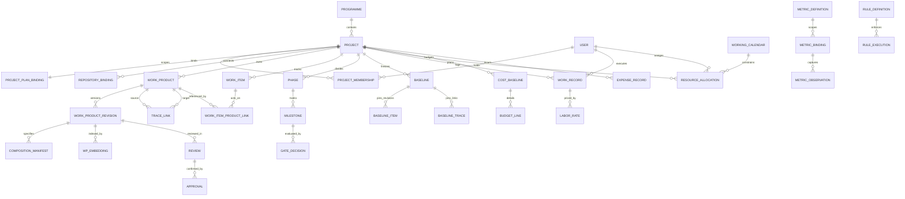

# DELMOS: предметна модель, сутності та відносини

Дата: 2026-09-23. Статус: нормативна цільова предметна модель платформи.  
Ліцензія: Apache 2.0.  
Контекст: [ядро та архітектура](ARCHITECTURE.md), [права доступу](ACCESS_CONTROL.md),
[проєкт і сховища](PROJECT_MODEL.md), [Work Products та специфікації](WORK_PRODUCTS.md),
[вектори та графи](VECTOR_AND_GRAPH_DATA.md), [каталог модулів](MODULE_CATALOG.md),
[метрики та економіка](METRICS.md).

---

## 1. Базові принципи моделі

1. **Сутність (Entity):** Об'єкт предметної області з унікальною ідентичністю (UUID), життєвим циклом (FSM), бізнес-кодом (`code`) та незмінними правилами переходу між станами.
2. **Розмежування діяльності та результату:**
   * **Work Item (Діяльність / Робота):** завдання, баг, дефект або користувацька історія. Має виконавця (`assignee`), пріоритет, оцінку часу та статус виконання (`open`, `in_progress`, `done`).
   * **Work Product (Результат / Артефакт):** керований інженерний документ, вимога, тест-план чи звіт. Має версію, схему, незмінні ревізії, хеш корисного навантаження (`payload_hash`) та аудиторський статус погодження (`draft`, `in_review`, `approved`, `obsolete`).
   * **Інваріант:** виконання завдання ніколи не замінює формального погодження артефакту (`Task.done != WP.approved`).
3. **Композитні документи (Специфікації):** Специфікація є Work Product, дерево розділів якого посилається на точні ревізії атомарних вимог або тест-кейсів, унеможливлюючи дублювання тексту.
4. **Docs-as-Code та незмінність:** Зміна артефакту створює нову незмінну ревізію (`WorkProductRevision`). Історичні ревізії зберігаються для відтворення бейзлайнів.
5. **Проєктна економіка та облік ресурсів:** Інженерна діяльність прив'язана до ресурсів (`WorkRecord`), місткості (`ResourceAllocation`), затвердженого бюджету (`CostBaseline`) та розрахунку здобутої цінності (EVM: $PV, AC, EV, CPI, SPI$).

---

## 2. Цільовий реєстр сутностей DELMOS

| Сутність | Область / Модуль | Призначення та ключові інваріанти |
| --- | --- | --- |
| **Programme** | Ядро | Стратегічна програма інженерної розробки; об'єднує групу пов'язаних проєктів. |
| **Project** | Ядро | Контекст розробки, межа ресурсів, прав та артефактів. Атомарно створюється разом із `Generic Project Plan`. |
| **ProjectPlanBinding** | Ядро | Нерозривний зв'язок між проєктом та його головним планом `PLAN-001`. |
| **RepositoryBinding** | Ядро / Сховище | Конфігурація сховища через `RepositoryProvider` (Internal DB/Git, чистий Git, GitHub, GitLab, Azure Repos, Bitbucket, Gitea). |
| **WorkItem** | Ядро / Трекінг робіт | Одиниця планування та відстеження виконання (базовий тип `task`, розширення `defect`, `user_story`). |
| **WorkProduct** | Ядро | Керований артефакт (базові типи `plan`, `requirement`, `architecture`, `test_spec`, `report`, `record`). |
| **WorkProductRevision** | Ядро | Незмінний знімок вмісту та метаданих артефакту з точним розрахунком `payload_hash` та `content_hash`. |
| **CompositionManifest** | Ядро / Специфікації | Маніфест структури композитного документа з точними ревізіями включених елементів (SPEC-01..10). |
| **TraceLink** | Ядро / Графи | Типізований зв'язок простежуваності (`verifies`, `satisfies`, `refines`, `derives_from`) з прапорцем `is_suspect`. |
| **WPEmbedding** | Векторна підсистема | Семантичний вектор у PostgreSQL (`pgvector`), прив'язаний до точної ревізії артефакту та моделі. |
| **Baseline / BaselineItem** | Ядро / Аудит | Зафіксований незмінний знімок проєктних ревізій та зв'язків для аудиту або релізу. |
| **Review / Approval** | Ядро / Workflow | Аудиторське рішення щодо ревізії із фіксацією хешу, ролі, перевірки незалежності (SoD) та кворуму. |
| **Phase / Milestone** | Ядро / Планування | Інтервали розкладу та контрольні точки приймання результатів (Gate Reviews). |
| **GateDecision** | Ядро / Планування | Формальне рішення комісії щодо проходження фазового шлюзу чи віхи (`passed`, `failed`, `waived`). |
| **WorkRecord** | Ресурси / Економіка | Запис про фактично відпрацьовані години інженером: `(user_id, subject_ref, date, duration, comment)`. |
| **ResourceAllocation** | Модуль `resources` | Планова зайнятість ролі чи інженера у фазі/спринті у відсотках (FTE) або годинах. |
| **WorkingCalendar** | Модуль `resources` | Виробничий календар доступності: робочі дні, свята, винятки та часовий пояс. |
| **CostBaseline** | Модуль `economics` | Базовий затверджений кошторис проєкту за фазами та WBS із лімітами фінансування. |
| **BudgetLine** | Модуль `economics` | Стаття витрат кошторису (`Labor`, `Hardware`, `NRE`, `Licenses`, `Testing`, `Contingency`). |
| **LaborRate** | Модуль `economics` | Версійована внутрішня собівартість години праці інженерної ролі чи грейду. |
| **ExpenseRecord** | Модуль `economics` | Фактичні прямі та накладні витрати (`CapEx` проти `OpEx` згідно з IAS 38, рахунки, зразки). |
| **MetricDefinition** | Ядро / Метрики | Реєстр числових та якісних показників, інженерні формули, EVM ($PV, AC, EV, CPI, SPI$). |
| **MetricObservation** | Ядро / Метрики | Фактичний результат вимірювання з оцінкою якості (`valid`, `stale`, `no_data`) та джерелом. |
| **EventDefinition / Instance** | Ядро / Автоматизація | Реєстр подій та незмінний журнал їх настання в рантаймі. |
| **TriggerDefinition** | Ядро / Автоматизація | Точка перехоплення команди (`before`) або реакція на подію (`after`). |
| **RuleDefinition / RuleSet** | Ядро / Автоматизація | Декларативні правила інваріантів (`when` applicability, `assert` condition, `veto/audit` actions). |
| **WorkflowDefinition** | Ядро / Workflow | Декларативна FSM-схема життєвого циклу артефакту (стани, переходи, guards, actions). |

---

## 3. Діаграма сутностей платформи (ER-діаграма)

---

## 4. Матриця операцій та команд (CRUD & Domain Commands)

| Сутність | Create / Register | Read / Query | Update / Revise | State Transition / Commands | Delete / Archive |
| --- | --- | --- | --- | --- | --- |
| **Project** | `project.create` (генерує `PLAN-001`) | Scoped за членством | Зміна метаданих (найменування) | `plan.apply` (зміна конфігурації) | `project.archive` (без видалення доказів) |
| **WorkProduct** | `wp.create` (Draft r1) | Пошук, RTM-граф, фільтр прав | Створення нової ревізії `wp.revise` | `wp.submit`, `wp.approve`, `wp.retire` | Фізичне видалення заборонене |
| **WorkItem** | `work_item.create` | Список, канбан, фільтр | Зміна опису, пріоритету, оцінки | Перехід стану `open -> in_progress -> done` | `work_item.cancel` |
| **TraceLink** | `trace.link` (з валідацією) | Рекурсивний обхід CTE | Оновлення анотації чи типу зв'язку | Проставлення/зняття `is_suspect` | `trace.unlink` |
| **Specification** | `spec.create` | Дерево розділів з елементами | `spec.update_manifest` (нова ревізія) | Незалежне погодження специфікації | Збереження referenced ревізій |
| **WorkRecord** | `work_record.log` | Табель, звіт утилізації | Коригування автором до закриття фази | Перевірка лімітів робочого часу | Аудиторське сторнування |
| **CostBaseline** | `economics.create_baseline` | Фінансові звіти, EVM | Нова ревізія через запит зміни (CR) | Затвердження комісією проєкту | Історичний бейзлайн незмінний |
| **Baseline** | `baseline.freeze` | Аудиторський маніфест | Незмінний (модифікація заборонена) | Публікація бейзлайну | Видалення заборонене |

---

## 5. Інваріанти цілісності зв'язків та збереження даних

1. **Захист від каскадного знищення доказів:**
   * Зовнішні ключі для історичних ревізій, зв'язків трасованості та бейзлайнів використовують `ON DELETE RESTRICT`. Жоден підтверджений артефакт не може бути випадково стертий каскадним видаленням батьківського об'єкта.
   * Аудиторські `audit_events` зберігаються окремо від технічної черги outbox/delivery. Відношення до проєкту та невиконаних доставок не каскадують видалення; дозволене очищення лише завершеної технічної доставки за [ADR-010](decisions/ADR-010-audit-evidence-and-outbox-retention.md).
2. **Ациклічність інженерних графів:**
   * Структурні зв'язки декомпозиції розділів специфікацій та зв'язки розкладу (Phase/Milestone dependencies) перевіряються на відсутність циклів перед збереженням.
   * Граф трасованості `trace_links` підтримує довільні складні топології, але захищений від зациклення під час рекурсивного обходу через SQL `CYCLE`.
3. **Строга відповідність ревізій:**
   * Посилання на артефакт у маніфесті композитного документа або бейзлайні обов'язково містить конкретний `revision_id` та перевіряється на відповідність його хешу вмісту (`payload_hash`).
