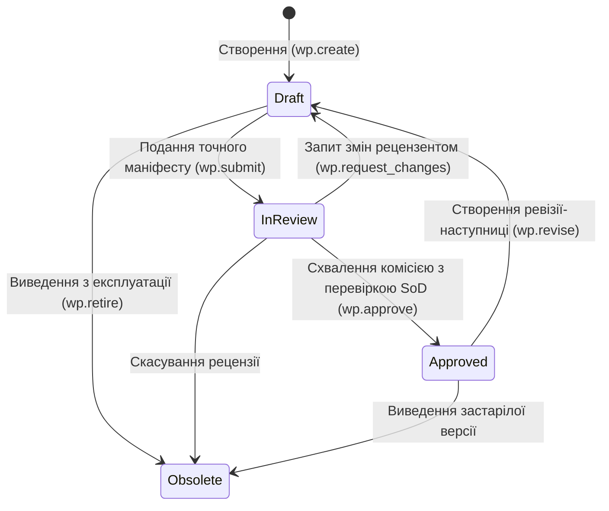

# DELMOS: каталог сутностей, розширень та типових операцій (Entity Catalog)

Дата: 2026-09-23. Статус: консолідований довідник (агрегує канонічний зміст трьох джерел, наведених у розділі 5).
Ліцензія: Apache 2.0.
Контекст: [предметна модель](DOMAIN_MODEL.md), [Work Products та специфікації](WORK_PRODUCTS.md),
[модульна система](MODULES.md), [SWR-02: динамічні поля](../requirements/software/SWR-02-dynamic-fields-content.md).

Цей документ — єдина точка входу для трьох питань: *«Які базові сутності є в DELMOS?»*, *«За якими правилами модулі можуть їх розширювати?»* та *«Які типові операції над ними доступні?»*. Кожен розділ є стислим зведенням; повне обґрунтування та деталі лишаються в канонічних джерелах, на які тут наведено посилання.

---

## 1. Базові сутності ядра

| Сутність | Область / Модуль | Призначення та ключові інваріанти |
| --- | --- | --- |
| **Programme** | Ядро | Стратегічна програма інженерної розробки; об'єднує групу пов'язаних проєктів. |
| **Project** | Ядро | Контекст розробки, межа ресурсів, прав та артефактів. Атомарно створюється разом із `Generic Project Plan`. |
| **ProjectPlanBinding** | Ядро | Нерозривний зв'язок між проєктом та його головним планом `PLAN-001`. |
| **RepositoryBinding** | Ядро / Сховище | Конфігурація сховища через `RepositoryProvider` (Internal DB/Git, чистий Git, GitHub, GitLab, Azure Repos, Bitbucket, Gitea). |
| **WorkItem** | Ядро / Трекінг робіт | Одиниця планування та відстеження виконання (базовий тип `task`, розширення `defect`, `user_story`). |
| **WorkProduct** | Ядро | Керований артефакт (базові типи `plan`, `requirement`, `architecture`, `test_spec`, `report`, `record` — див. розділ 1.1). |
| **WorkProductRevision** | Ядро | Незмінний знімок вмісту та метаданих артефакту з точним розрахунком `payload_hash` та `content_hash`. |
| **CompositionManifest** | Ядро / Специфікації | Маніфест структури композитного документа з точними ревізіями включених елементів (SPEC-01..10). |
| **TraceLink** | Ядро / Графи | Типізований зв'язок простежуваності (`verifies`, `satisfies`, `refines`, `derives_from`) з прапорцем `is_suspect`. |
| **WPEmbedding** | Векторна підсистема | Семантичний вектор у PostgreSQL (`pgvector`), прив'язаний до точної ревізії артефакту та моделі. |
| **Baseline / BaselineItem** | Ядро / Аудит | Зафіксований незмінний знімок проєктних ревізій та зв'язків для аудиту або релізу. |
| **Review / Approval** | Ядро / Workflow | Аудиторське рішення щодо ревізії із фіксацією хешу, ролі, перевірки незалежності (SoD) та кворуму. |
| **ReviewRequest** | Ядро / Workflow | Запит на рецензію точної пари `(revision_id, payload_hash)`. Нова ревізія переводить відкритий запит у `superseded` — рішення ніколи не переносяться на новий хеш (ADR-009 §3). |
| **ReviewDecision** | Ядро / Workflow | Незмінний запис рішення (`review`, `approval`, `request_changes`). Одна особа — щонайбільше одне рішення кожного роду на запит. |
| **PhaseDeliverable** | Ядро / Планування | Прив'язка результату до фази з ваговим коефіцієнтом (ISO 21511). Робить здобуту цінність обчислюваною за правилом 0/100. |
| **Phase / Milestone** | Ядро / Планування | Інтервали розкладу та контрольні точки приймання результатів (Gate Reviews). |
| **GateDecision** | Ядро / Планування | Формальне рішення комісії щодо проходження фазового шлюзу чи віхи (`passed`, `failed`, `waived`). |
| **WorkRecord** | Ресурси / Економіка | Запис про фактично відпрацьовані години інженером: `(user_id, work_product_id, phase_key, role_key, work_date, duration_hours, comment)`. Реалізовано явним FK на `work_products`, а не нетипованим `subject_ref`: сутності `WorkItem` у ядрі ще немає, а UUID без FK — діра в цілісності. |
| **ResourceAllocation** | Модуль `resources` | Планова зайнятість ролі чи інженера у фазі/спринті у відсотках (FTE) або годинах. |
| **WorkingCalendar** | Модуль `resources` | Виробничий календар доступності: робочі дні, свята, винятки та часовий пояс. |
| **MetricDefinition** | Ядро / Метрики | Типоване оголошення метрики: `value_type` з фіксованого переліку та сувора одиниця (`count`, `percent`, `ratio`, `ms`, `currency:XXX`). Довільний нетипований JSON як значення заборонено (SWR-21). |
| **MetricObservation** | Ядро / Метрики | Незмінне вимірювання з якістю `valid`, `stale`, `no_data` або `error`. Значення лежить у колонці, що відповідає оголошеному типу; відповідність тримає складений зовнішній ключ, а не код (SWR-22). |
| **CostBaseline** | Модуль `economics` | Базовий затверджений кошторис проєкту за фазами та WBS із лімітами фінансування. |
| **BudgetLine** | Модуль `economics` | Стаття витрат кошторису (`Labor`, `Hardware`, `NRE`, `Licenses`, `Testing`, `Contingency`). |
| **LaborRate** | Модуль `economics` | Версійована внутрішня собівартість години праці інженерної ролі чи грейду. |
| **ExpenseRecord** | Модуль `economics` | Фактичні прямі та накладні витрати (`CapEx` проти `OpEx` згідно з IAS 38, рахунки, зразки). |
| **MetricDefinition** | Ядро / Метрики | Реєстр числових та якісних показників, інженерні формули, EVM ($PV, AC, EV, CPI, SPI$). |
| **MetricObservation** | Ядро / Метрики | Фактичний результат вимірювання з оцінкою якості (`valid`, `stale`, `no_data`) та джерелом. |
| **EventDefinition / Instance** | Ядро / Автоматизація | Реєстр подій та незмінний журнал їх настання в рантаймі. |
| **TriggerDefinition** | Ядро / Автоматизація | Точка перехоплення команди (`before`) або реакція на подію (`after`). |
| **RuleDefinition / RuleSet** | Ядро / Автоматизація | Декларативні правила інваріантів (`when` applicability, `assert` condition, `veto/audit` actions). |
| **WorkflowDefinition** | Ядро / Workflow | Декларативна FSM-схема життєвого циклу артефакту (стани, переходи, guards, actions). |

Повна ER-діаграма зв'язків між цими сутностями: [DOMAIN_MODEL.md, розділ 3](DOMAIN_MODEL.md#3-діаграма-сутностей-платформи-er-діаграма).

### 1.1. Базові типи Work Product

Ядро надає рівно шість базових типів артефактів (`WorkProduct.type`):

| `type` | Призначення | Умова переходу в `approved` |
| --- | --- | --- |
| `plan` | Цілі, обсяг, розклад, ресурси, бюджет та конфігурація проєкту | Узгоджені дати, WBS, межі та ресурси; для проєкту — `Generic Project Plan` |
| `requirement` | Перевірюване зобов'язання, функціональна чи нефункціональна вимога | Однозначне формулювання, джерело, критерії приймання та метод верифікації |
| `architecture` | Системна, апаратна (HW) чи програмна (SW) структура | Визначені межі, інтерфейси, пряме трасування до батьківських вимог |
| `test_spec` | Опис процедури перевірки (тест-кейс, сценарій випробувань) | Відтворювані кроки та очікувані результати; відсутність фіктивного outcome |
| `report` | Результати виконання робіт, протоколи випробувань, звіти R&D | Точні посилання на перевірені ревізії артефактів та середовище випробувань |
| `record` | Формальний запис рішення, рецензії (Review) чи аудиту | Підтверджений склад учасників, кворум, незалежність рецензентів (SoD) |

Деталі полів кожного типу: [WORK_PRODUCTS.md, розділ 2](WORK_PRODUCTS.md#2-базові-типи-артефактів-ядра).

---

## 2. Правила розширення сутностей

### 2.1. Загальний принцип

Модулі **ніколи не модифікують** базові колонки ядра (`id`, `project_id`, `code`, `status`, `row_version`). Розширення відбувається виключно через фіксовані типізовані інтерфейси-провайдери, зареєстровані модулем у його маніфесті (`capabilities`), і через профілі (`profile: iso26262:safety_goal` поверх `requirement`).

### 2.2. Типізовані провайдери розширень

| Інтерфейс провайдера | Що дозволено постачати модулю | Що заборонено |
| --- | --- | --- |
| **`WPTypeProvider`** | Реєстрація нових типів артефактів (`iso26262:safety_goal`) та JSON Schema. | Зміна базових колонок ядра (`id`, `project_id`, `code`). |
| **`PropertyExtensionProvider`** | Додавання динамічних властивостей до базових типів WP (`metadata.extensions.*`). | Послаблення базових інваріантів перевірки безпеки. |
| **`PlanSectionProvider`** | Додавання конфігураційних розділів і форм до `Generic Project Plan`. | Підміна обов'язкових розділів ядра плану `PLAN-001`. |
| **`MilestoneProvider`** | Каталог спеціалізованих віх (PDR, CDR, Gate Review) та acceptance rules. | Закриття віхи без виконання обов'язкових критеріїв. |
| **`DictionaryProvider`** | Галузеві словники (ASIL, процеси ASPICE, шкали оцінок). | Модифікація системних словників інших модулів. |
| **`TriggerRuleProvider`** | Нові типи подій, точки перехоплення та правила валідації інваріантів. | Скасування системних правил розподілу обов'язків (SoD). |
| **`MetricProvider`** | Формули розрахунку метрик, калькулятори та тригери перерахунку. | Запис фіктивних результатів вимірювань напряму з браузера. |
| **`UIContribution`** | Інженерні віджети, SVG-представлення, форми та контекстна довідка. | Виконання неперевіреного довільного JavaScript у клієнті. |

Повний перелік архітектурних інваріантів модульності: [MODULES.md, розділи 1–3](MODULES.md#1-архітектурні-принципи-модульності).

### 2.3. Нормативні правила розширення WP (SWR-06..08)

1. **Реєстрація нового типу (`SWR-06`).** Модуль реєструє новий тип WP у `wp_type_definitions` із префіксним неймспейсом (`iso26262:safety_goal`) та власною JSON Schema Draft 2020-12 для `metadata`.
2. **Розширення базового типу (`SWR-07`).** Модуль додає типізовані властивості до базових типів (`plan`, `requirement`, `architecture`, `test_spec`, `report`, `record`) через реєстр `wp_property_definitions` (назва, тип значення, правила перевірки, `required_on`).
3. **Ізоляція динамічних даних (`SWR-08`).** Значення розширених полів зберігаються в `work_products.metadata` (JSONB) та дублюються в кожній незмінній ревізії. Вимкнення модуля не видаляє значення полів з історії та бейзлайнів.

Повний нормативний текст: [SWR-02-dynamic-fields-content.md](../requirements/software/SWR-02-dynamic-fields-content.md).

---

## 3. Типові операції (CRUD & Domain Commands)

| Сутність | Create / Register | Read / Query | Update / Revise | State Transition / Commands | Delete / Archive |
| --- | --- | --- | --- | --- | --- |
| **Project** | `project.create` (генерує `PLAN-001`) | Scoped за членством | Зміна метаданих (найменування) | `plan.apply` (зміна конфігурації) | `project.archive` (без видалення доказів) |
| **WorkProduct** | `wp.create` (Draft r1) | Пошук, RTM-граф, фільтр прав | Створення нової ревізії `wp.revise` | `wp.submit`, `wp.approve`, `wp.retire` | Фізичне видалення заборонене |
| **WorkItem** | `work_item.create` | Список, канбан, фільтр | Зміна опису, пріоритету, оцінки | Перехід стану `open -> in_progress -> done` | `work_item.cancel` |
| **TraceLink** | `trace.link` (з валідацією) | Рекурсивний обхід CTE | Оновлення анотації чи типу зв'язку | Проставлення/зняття `is_suspect` | `trace.unlink` |
| **Specification** | `spec.create` | Дерево розділів з елементами | `spec.update_manifest` (нова ревізія) | Незалежне погодження специфікації | Збереження referenced ревізій |
| **WorkRecord** | `work_record.log` | Табель, звіт утилізації | Коригування автором до закриття фази | Перевірка лімітів робочого часу | Аудиторське сторнування |
| **CostBaseline** | `economics.create_baseline` | Фінансові звіти, EVM | Нова ревізія через запит зміни (CR) | Затвердження комісією проєкту | Історичний бейзлайн незмінний |
| **Baseline** | `baseline.freeze` | Аудиторський маніфест | Незмінний (модифікація заборонена) | Публікація бейзлайну | Видалення заборонене |

Повна таблиця з коментарями: [DOMAIN_MODEL.md, розділ 4](DOMAIN_MODEL.md#4-матриця-операцій-та-команд-crud--domain-commands).

### 3.1. Життєвий цикл Work Product (FSM)

Деталі інваріантів переходів: [WORK_PRODUCTS.md, розділ 4](WORK_PRODUCTS.md#4-граф-життєвого-циклу-артефакту-fsm-workflow).

### 3.2. Життєвий цикл модуля (Module Lifecycle FSM)

Активація можливості розширення на проєкті також є типовою операцією з власним життєвим циклом: `Registered → Disabled → Available → Activated (через plan.apply) → Blocked/Suspended`. Повна діаграма: [MODULES.md, розділ 4](MODULES.md#4-життєвий-цикл-модуля-module-lifecycle-fsm).

---

## 4. Правило актуальності

Цей каталог **не є першоджерелом** — кожна зміна сутності, правила розширення чи команди спершу вноситься в канонічний документ (`DOMAIN_MODEL.md`, `WORK_PRODUCTS.md`, `MODULES.md`, відповідний `SWR-NN`), а вже потім синхронізується сюди.

## 5. Канонічні джерела

* [architecture/DOMAIN_MODEL.md](DOMAIN_MODEL.md) — повний реєстр сутностей, ER-діаграма, CRUD-матриця, інваріанти цілісності.
* [architecture/WORK_PRODUCTS.md](WORK_PRODUCTS.md) — базові типи артефактів, спільні поля, FSM життєвого циклу.
* [architecture/MODULES.md](MODULES.md) — принципи модульності, категорії, провайдери розширень, життєвий цикл модуля.
* [requirements/software/SWR-02-dynamic-fields-content.md](../requirements/software/SWR-02-dynamic-fields-content.md) — нормативні вимоги до динамічних полів та розширень.
