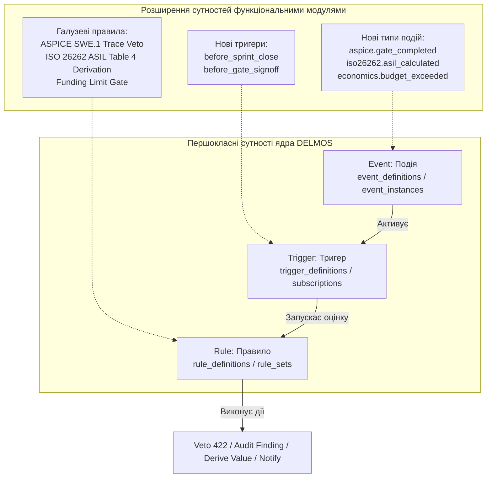
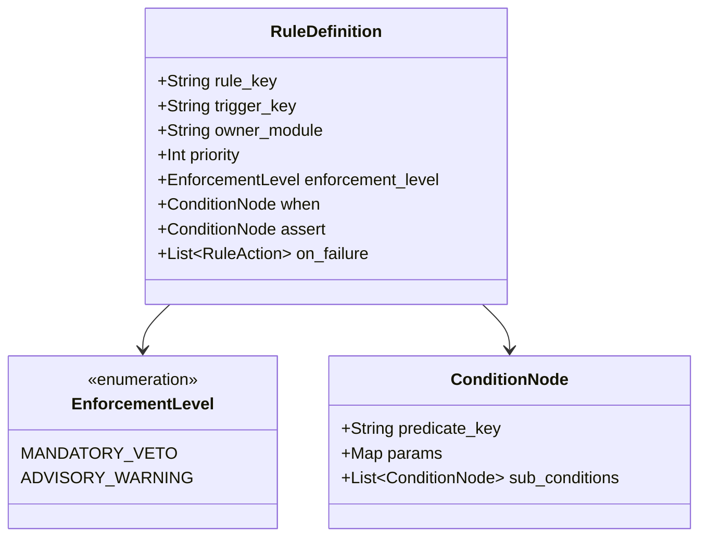

# DELMOS: події, тригери, правила та автоматизація (Events, Triggers & Rules Engine)

Дата: 2026-09-23. Статус: цільовий нормативний контракт автоматизації та інваріантів.  
Ліцензія: Apache 2.0.  
Контекст: [ядро та архітектура](ARCHITECTURE.md), [предметна модель](DOMAIN_MODEL.md),
[Work Products та специфікації](WORK_PRODUCTS.md), [модульна система](MODULES.md),
[каталог модулів](MODULE_CATALOG.md), [метрики та економіка](METRICS.md).

---

## 1. Концепція сутностей автоматизації

Для забезпечення суворого інженерного контролю якості, процесів та галузевих стандартів (ASPICE, ISO 26262, ISO 21434) ядро **DELMOS** містить першокласні сутності автоматизації:

1. **Event (Подія):** незмінний факт зміни стану системи чи артефакту в минулому часі (`occurred_at`); його конверт записується в outbox **у тій самій транзакції** з бізнес-зміною і стає видимим після commit. Асинхронна доставка відбувається пізніше.
2. **Trigger (Тригер):** прив'язка до синхронної перевірки команди (`before` guard у межах транзакції) або до committed Event (`after` observer у черзі outbox).
3. **Rule (Правило):** декларативний опис логіки, що чітко розділяє умову застосовності (`when`), інваріант перевірки (`assert`) та дію при порушенні (`on_failure`: вето або аудиторське зауваження).

Функціональні модулі платформи **безпосередньо розширюють ці базові сутності**: вони реєструють власні типи подій, встановлюють тригери та постачають галузеві правила контролю.

---

## 2. Сутності ядра: Події, Тригери, Правила

### 2.1. Реєстр та екземпляри подій (Events)

| Сутність | Призначення | Основні атрибути |
| --- | --- | --- |
| **`event_definitions`** | Реєстр відомих системних та модульних типів подій | `event_key` (PK/unique), `name`, `description`, `owner_module` (`core` або модуль), `payload_schema_json` |
| **`event_instances`** | Фактичний журнал виниклих подій у проєкті | `id` (UUID), `event_key`, `project_id`, `actor_user_id`, `occurred_at`, `payload_json`, `correlation_id` |

#### Конверт події (Event Envelope):
* `event_id`: унікальний UUID запису.
* `event_key`: унікальний строковий ключ (наприклад, `wp.revision_committed`, `milestone.accepted`, `plan.applied`).
* `schema_version`: версія схеми корисного навантаження.
* `source`: компонент або модуль-емітер.
* `occurred_at`: точний час настання факту (UTC).
* `scope`: `(scope_type, scope_id)` — прив'язка до проекту чи програми.
* `actor`: ідентифікатор користувача або сервісного облікового запису.
* `correlation_id` та `causation_id`: наскрізні ідентифікатори для аудиту та відстеження причинно-наслідкових ланцюжків.

---

### 2.2. Тригери (Triggers)

Тригер визначає, **в який момент життєвого циклу** та за яких системних обставин повинні оцінюватися правила.

| Атрибут | Призначення |
| --- | --- |
| `trigger_key` | Унікальний строковий ключ тригера (наприклад, `trigger.core.before_wp_transition`). |
| `phase` | `before` (синхронний запобіжник — guard у межах транзакції) або `after` (асинхронна реакція в черзі outbox). |
| `input_kind` | `command` для фази `before` або `event` для фази `after`. |
| `execution_mode` | `in_transaction` (блокуючий) або `post_commit` (асинхронний через чергу). |

#### Базові тригери ядра:
1. `trigger.core.before_wp_transition` (фаза `before`): блокуюча перевірка інваріантів повноти, схем та прав SoD перед зміною статусу артефакту (`draft -> in_review -> approved`).
2. `trigger.core.before_trace_create` (фаза `before`): валідація цілісності зв'язку та перевірка відсутності циклів до збереження.
3. `trigger.core.before_milestone_accept` (фаза `before`): автоматична перевірка виконання всіх критеріїв приймання віхи (Gate Review) перед її закриттям.
4. `trigger.core.after_revision_committed` (фаза `after`): асинхронний запуск розрахунку векторів `pgvector`, поширення прапорця підозрілості (`is_suspect`) та сповіщення зацікавлених осіб.

---

### 2.3. Правила (Rules)

Правило пов'язує тригер із застосовністю, інваріантом і дією при порушенні:

#### Таблиця рішень при оцінці правила:

| Умова застосовності `when` | Інваріант перевірки `assert` | Результат оцінки | Дія системи |
| --- | --- | --- | --- |
| `false` | Не обчислюється | `not_applicable` | Операція дозволяється без виконання дій правила |
| `true` | `true` | `passed` | Умова виконана, операція дозволяється |
| `true` | `false` | `violated` | `MANDATORY_VETO`: відкат транзакції (HTTP 422); `ADVISORY_WARNING`: запис зауваження в аудит |
| `error` / `unknown` | Будь-яке | `evaluation_error` | Для обов'язкових правил (Veto) блокує операцію з міркувань безпеки |

---

## 3. Секундний планувальник завдань (Scheduler)

DELMOS містить нативний планувальник завдань із підтримкою секундної дискретності розкладу:
* Режими: `once` (одноразово), `fixed_rate` (з фіксованим інтервалом), `fixed_delay` (з інтервалом після завершення попереднього запуску), `calendar` (календарний розклад Cron/RFC 5545).
* **Атомарність запуску:** запис факту настання (`ScheduleOccurrence`) та постановка завдання у чергу outbox відбуваються в одній транзакції.
* **Захист від дрейфу та дублювання:** унікальний композитний ключ `(schedule_id, occurrence_time_utc)` гарантує, що жодне завдання не виконається двічі навіть при перезапуску сервісу.

---

## 4. Надійна черга повідомлень у PostgreSQL (Durable Outbox Queue)

Для зв'язку між синхронними транзакціями та асинхронними обробниками використовується надійний патерн **Transactional Outbox**:
1. Будь-яка подія записується в таблицю `event_outbox` у тій самій транзакції, що й бізнес-зміна.
2. Фоновий диспетчер опитує outbox (або пробуджується сигналом `LISTEN/NOTIFY`) та атомарно створює записи доставки (`event_deliveries`) для кожної активної підписки.
3. Обробники використовують механізм конкурентної оренди (**Lease Fencing**): воркер резервує пачку повідомлень на фіксований час (`lease_until`). При збої воркера повідомлення автоматично повертається в чергу.
4. **Ідемпотентність обробки:** кожна дія фіксує свій унікальний `idempotency_key`, унеможливлюючи повторне виконання при перезапусках мережі чи воркерів.
