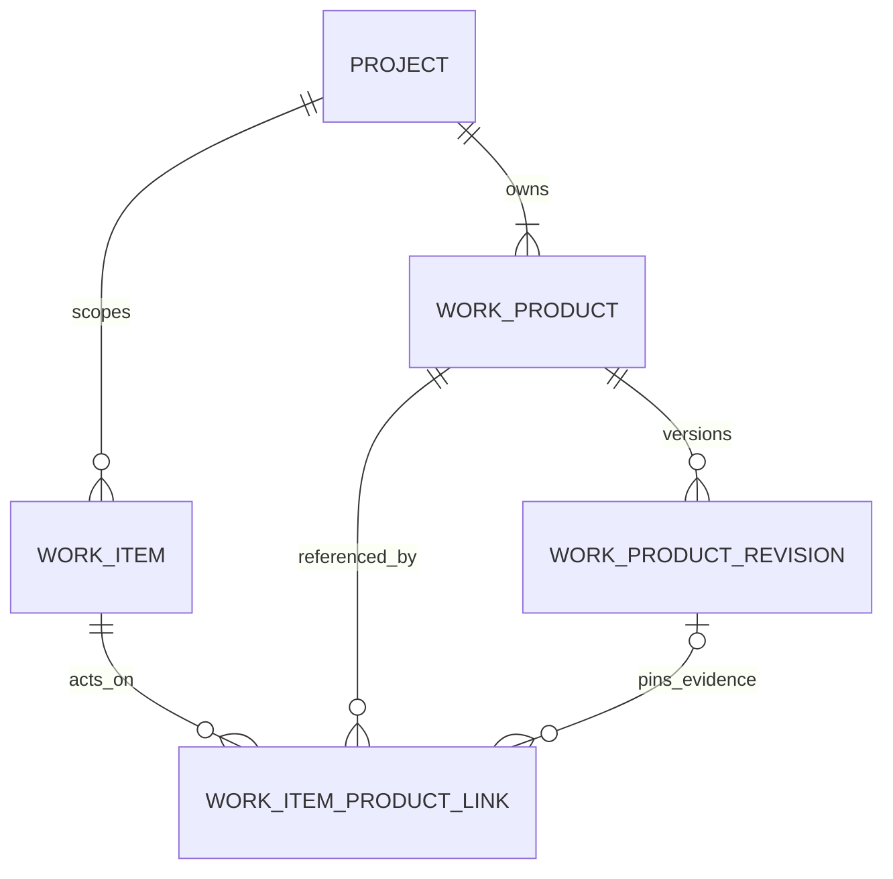

# DELMOS: сутності роботи, результатів, контенту та колекцій

Дата: 2026-09-23. Статус: цільова модель класифікації та зв'язків.  
Ліцензія: Apache 2.0.  
Контекст: [предметна модель](DOMAIN_MODEL.md), [Work Products та специфікації](WORK_PRODUCTS.md),
[проєкт і сховища](PROJECT_MODEL.md), [каталог модулів](MODULE_CATALOG.md).

---

## 1. Фундаментальне розмежування понять

У платформі **DELMOS** встановлено суворе семантичне розмежування:

$$\mathbf{Task} \in \mathbf{WorkItem} \quad \text{та} \quad \mathbf{WorkItem} \neq \mathbf{WorkProduct}$$

* **Work Item (Робота / Діяльність):** описує процес, який потрібно виконати або відстежити (завдання, дефект, користувацька історія, спайк).
* **Work Product (Результат / Артефакт):** керований інформаційний або інженерний об'єкт, що створюється, модифікується, погоджується та версіонується (вимога, архітектурний опис, тест-план, протокол випробувань, звіт).

### Порівняння підходів у світових ALM/ELM системах

| Критерій | Підхід у Polarion ALM | Підхід у DELMOS |
| --- | --- | --- |
| **Семантика терміну** | Універсальний `WorkItem` для всього: вимога, тест-кейс, баг і задача є одним базовим типом. | Чітке розділення: `WorkItem` — це робота; `WorkProduct` — це результат. |
| **Життєвий цикл** | Спільний статусний FSM (`open -> in_progress -> closed`). | Різні життєві цикли: виконання роботи (`open/done`) проти погодження артефакту (`draft/approved`). |
| **Доказова база** | Закриття тікета може випадково вважатися затвердженням вимоги. | `Task.done` ніколи не погоджує `WP.approved`. Затвердження артефакту вимагає перевірки хешу вмісту (`payload_hash`), кворуму та правила SoD. |

---

## 2. Словник понять моделі

| Поняття | Значення в DELMOS | Чим НЕ є |
| --- | --- | --- |
| **Work Item** | Одиниця планування, оцінки та обліку виконання роботи. | Не є затверджуваним інженерним документом або сертифікаційним доказом. |
| **Task** | Конкретне завдання інженеру з критеріями завершення (DoD). | Не стає Work Product лише через наявність докладного опису. |
| **Work Product (WP)** | Керований інформаційний артефакт із типом, схемою, незмінними ревізіями та хешем вмісту. | Не є завданням; не видаляється після завершення проєкту. |
| **Content** | Вміст сутності: структуровані поля, текст Markdown, посилання на вкладення. | Не є окремою сутністю з власним життєвим циклом. |
| **Specification** | Складений керований Work Product, розділи якого посилаються на точні ревізії атомарних елементів. | Не є файлом на диску чи просто статичним списком. |
| **Collection** | Іменований набір типізованих посилань (експліцитний, збережений запит або знімок). | Не володіє сутностями й не змінює їхніх прав доступу. |
| **WorkRecord** | Запис фактично відпрацьованого часу інженера над артефактом чи завданням. | Не є коментарем; це основа для розрахунку витрат і P&L. |

---

## 3. Зв'язки між роботою (Work Item) та артефактами (Work Product)

Один Work Item може породжувати або оновлювати кілька Work Products, а над одним Work Product можуть послідовно або паралельно працювати кілька завдань. Це зв'язок **багато-до-багатьох (many-to-many)**.

### Семантичні типи зв'язку (`relation_kind`):
* `produces`: задача створює нову первинну ревізію артефакту.
* `updates`: задача вносить зміни до існуючого артефакту, створюючи наступну чернетку.
* `implements`: виконання завдання реалізує вимогу чи архітектурне рішення в коді чи залізі.
* `verifies`: завдання перевіряє артефакт під час випробувань.
* `reviews`: завдання рецензування, що фіксує зауваження або рекомендації.

---

## 4. Колекції артефактів та посилань

Платформа підтримує три режими колекцій:
1. **Explicit Collection (Пряма добірка):** Явний перелік ідентифікаторів об'єктів із фіксованим порядком (наприклад, пакет документів на рецензію, обрані специфікації релізу).
2. **Query Collection / Saved View (Збережений запит):** Динамічна добірка, результат якої обчислюється за типізованим фільтром (наприклад: *«Усі відкриті дефекти компонента інвертора з рівнем ASIL C»*).
3. **Snapshot Collection (Фіксований знімок):** Зафіксований на момент часу набір конкретних ревізій із точними хешами (основа для звітів або бейзлайнів).
