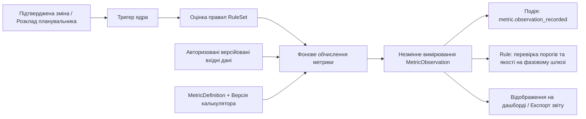

# DELMOS: метрики, вимірювання та інженерно-економічний реєстр

Дата: 2026-09-23. Статус: нормативний цільовий контракт реєстру метрик.  
Ліцензія: Apache 2.0.  
Контекст: [ядро та архітектура](ARCHITECTURE.md), [події, тригери та правила](EVENTS_TRIGGERS_RULES.md),
[модульна система](MODULES.md), [каталог модулів](MODULE_CATALOG.md),
[проєкт і сховища](PROJECT_MODEL.md).

---

## 1. Роль метрик в операційній системі DELMOS

У платформі DELMOS реєстр метрик є першокласним ядром числового та аналітичного контролю.

* **Відокремлення від UI:** Метрика не є віджетом. Віджет у браузері лише відображає розраховане та збережене в БД значення і не може бути авторитарним джерелом істини.
* **Якість та актуальність (Freshness):** Подія в системі позначає кешоване значення застарілим (`stale`) та ініціює фоновий перерахунок. Застаріле значення ніколи не видається за актуальний доказ на фазовому шлюзі (Gate Review).

---

## 2. Сутності реєстру метрик

| Сутність | Призначення | Основні атрибути |
| --- | --- | --- |
| **`MetricDefinition`** | Версійована декларація метрики в реєстрі | `metric_key`, `version`, `name`, `owner_module`, `value_type`, `semantic_kind`, `unit`, `calculator_ref`, `missing_data_policy` |
| **`MetricBinding`** | Активація метрики в конкретному проєкті | `definition_ref`, `project_id`, типізовані параметри, вікно розрахунку, прив'язка до ревізії плану |
| **`MetricCalculation`** | Завдання розрахунку (Job) | `id`, версія калькулятора, часові мітки старту/завершення, хеші вхідних даних, статус |
| **`MetricObservation`** | Незмінний результат конкретного вимірювання | `id`, типізоване значення (`typed_value`), якість (`valid`, `stale`, `no_data`, `error`), час спостереження, хеш ревізії артефакту |
| **`MetricAssessment`** | Оцінка значення правилом шлюзу | Посилання на `observation_id`, версія правила, вердикт (`passed`, `violated`), текстове обґрунтування |

---

## 3. Типи даних та одиниці вимірювання

| Тип (`value_type`) | Семантичний вид (`semantic_kind`) | Допустимі одиниці (`unit`) | Приклад застосування |
| --- | --- | --- | --- |
| `integer` | `count`, `cumulative_counter` | `count` | Кількість вимог, кількість відкритих дефектів |
| `decimal` | `ratio`, `gauge` | `percent`, `ratio` | Відсоток покриття вимог тестами, індекс CPI/SPI |
| `decimal` | `gauge` | `currency:EUR`, `currency:USD` | Плановий кошторис (PV), фактичні витрати (AC), бюджет |
| `duration` | `duration` | `ms`, `hour`, `day` | Час рецензування, трудомісткість у людино-годинах |
| `boolean` | `indicator` | — | Критерій готовності (DoD), дотримання ліміту безпеки |
| `distribution` | `distribution` | `ms`, `story_point` | Гістограма тривалості вирішення запитів, розподіл оцінок |

Фінансові показники та відсотки розраховуються у типі `decimal` із фіксованою точністю та явним правилом заокруглення, запобігаючи похибкам бінарних чисел із плаваючою крапкою (`float`).

---

## 4. Базові інженерні метрики ядра

| Ключ метрики | Тип / Одиниця | Формула та призначення |
| --- | --- | --- |
| `core.wp.count` | integer, `count` | Загальна кількість діючих артефактів заданого типу в проекті |
| `core.wp.approved_share` | decimal, `percent` | Частка артефактів зі статусом `approved` серед усіх релевантних у зрізі |
| `core.trace.requirement_test_coverage` | decimal, `percent` | Відсоток вимог, що мають валідний зв'язок `verifies` до специфікацій тестів |
| `core.milestone.overdue_count` | integer, `count` | Кількість прострочених віх або фазових шлюзів |
| `core.rules.violation_count` | integer, `count` | Кількість активних аудиторських зауважень або порушень правил інваріантів |

---

## 5. Інженерно-економічні метрики та EVM (Project Economics)

Модулі `management.resources` та `management.economics` надають стандартизовані формули аналізу вартості та здобутої цінності (**Earned Value Management за ДСТУ ISO 21508:2022**, див. [ADR-011](decisions/ADR-011-iso-21500-series-normative-base.md)). Позначення BCWS / BCWP наведено довідково як усталені англомовні синоніми.

| Ключ метрики | Тип / Одиниця | Позначення | Формула та економічна інтерпретація |
| --- | --- | --- | --- |
| `resources.utilization_rate` | decimal, `percent` | **Utilization** | Відношення списаних годин до номінальної місткості (FTE capacity) за календарем |
| `economics.pv` | decimal, `currency` | **Planned Value (PV)** | Базовий плановий кошторис робіт за розкладом на поточну дату (BCWS) |
| `economics.ac` | decimal, `currency` | **Actual Cost (AC)** | Фактично понесені витрати: $\sum (\text{hours} \times \text{LaborRate}) + \sum \text{ExpenseRecords}$ |
| `economics.ev` | decimal, `currency` | **Earned Value (EV)** | Здобута цінність: планова вартість фактично завершених та затверджених артефактів (BCWP) |
| `economics.cpi` | decimal, `ratio` | **Cost Performance** | $CPI = EV / AC$ ($>1$ — економія кошторису, $<1$ — перевитрата бюджету) |
| `economics.spi` | decimal, `ratio` | **Schedule Performance**| $SPI = EV / PV$ ($>1$ — випередження, $<1$ — відставання від графіка) |
| `economics.cv` | decimal, `currency` | **Cost Variance** | $CV = EV - AC$ (абсолютне вартісне відхилення від плану) |
| `economics.sv` | decimal, `currency` | **Schedule Variance** | $SV = EV - PV$ (календарне відхилення у фінансовому вираженні) |
| `economics.eac` | decimal, `currency` | **Estimate at Completion**| Прогноз підсумкової вартості проєкту за поточного тренду: $BAC / CPI$ |
| `economics.gross_margin` | decimal, `currency` | **Gross Margin** | Валовий прибуток за комерційними контрактами: $\text{Contract Revenue} - \text{Total Cost}$ |

---

## 6. Критерії прийняття та правила шлюзів

1. **Gate Rejection:** якщо обов'язкова для фазового шлюзу метрика має статус якості `no_data`, `stale` або `error`, перехід шлюзу блокується. Відсутність даних ніколи не інтерпретується як «нуль» або «успіх».
2. **Незмінність доказів:** після закриття віхи або фіксації бейзлайну збережені значення `MetricObservation` залишаються незмінними в історії проєкту, навіть якщо подальші коригувальні події змінять поточні показники.
