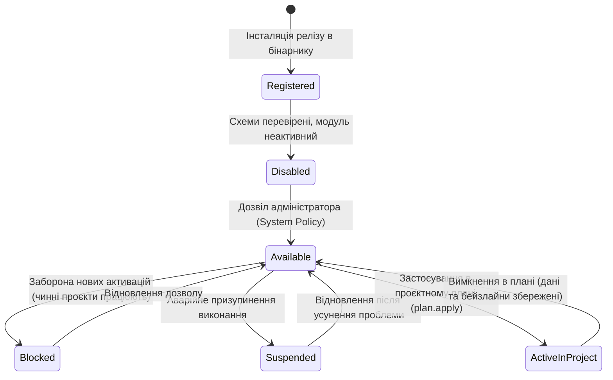

# DELMOS: модульна система, контракти та розширюваність

Дата: 2026-09-23. Статус: нормативний цільовий контракт модульної архітектури.  
Ліцензія: Apache 2.0.  
Контекст: [ядро та архітектура](ARCHITECTURE.md), [предметна модель](DOMAIN_MODEL.md),
[проєкт і сховища](PROJECT_MODEL.md), [каталог модулів](MODULE_CATALOG.md),
[Project Plan Engine](PROJECT_PLAN_ENGINE.md).

---

## 1. Архітектурні принципи модульності

Модуль у **DELMOS** є версійованою одиницею інженерних чи методологічних можливостей усередині модульного моноліту.

### Ключові інваріанти:
1. **Безпека виконання:** Код базових і галузевих модулів компілюється в єдиний Go-бінарник та Vue 3 bundle. Встановлення нового коду здійснюється через офіційні версіовані релізи платформи, а не через завантаження неперевіреного довільного коду з браузера.
2. **Розмежування сутностей модульності:**
   * **`ModuleDefinition`:** стабільний ідентифікатор, назва, опис та категорія модуля.
   * **`ModuleRelease`:** незмінний реліз маніфесту, схем та коду з контрольною сумою (`artifact_digest`).
   * **`ModuleSystemPolicy`:** стан доступності на рівні інсталяції (`available`, `blocked_for_new_activation`, `suspended`), що контролюється системним адміністратором.
   * **`ModuleActivation`:** активація модуля конкретним проєктом через процедуру погодження та застосування `Generic Project Plan`.
   * **`IntegrationConnection`:** налаштування зовнішнього підключення (URL, `secret_ref`), якщо модуль взаємодіє із зовнішніми системами.
3. **Docs-First конфігурація:** Активація та налаштування модуля проєктним менеджером є зміною проєктного плану `PLAN-001`. Жоден модуль не може бути активований в обхід погодження плану.

---

## 2. Категорії та маніфест модуля

Модулі групуються за логічними категоріями (`ModuleCategory`):
* `methodology`: методології керування (Scrum, Waterfall, V-Model, Kanban).
* `compliance`: галузеві стандарти (ASPICE 4.0, ISO 26262, ISO 21434, IEC 62304).
* `economics`: облік ресурсів, трудовитрат, бюджетів та EVM-аналіз (`management.resources`, `management.economics`).
* `tooling`: функціональні інструменти (RTM-матриця, імпорт тестів, семантичний аналіз).
* `integration`: адаптери сховищ та трекерів (`RepositoryProvider`).

### Мінімальний маніфест модуля:
* `id`: унікальний строковий префікс (наприклад, `compliance.iso26262`, `management.economics`).
* `name`, `description`: назва та опис інженерного призначення модуля.
* `category_id`: посилання на категорію.
* `version`: версія релізу за стандартом SemVer.
* `core_api_range`: сумісний діапазон версій ядра DELMOS.
* `dependencies`: список залежностей від інших модулів із версійними діапазонами.
* `capabilities`: перелік типізованих провайдерів розширення.

---

## 3. Типізовані провайдери розширень (Extension Providers)

Модулі розширюють можливості платформи через фіксовані інтерфейси ядра:

| Інтерфейс провайдера | Що дозволено постачати модулю | Що заборонено |
| --- | --- | --- |
| **`WPTypeProvider`** | Реєстрація нових типів артефактів (`iso26262:safety_goal`) та JSON Schema. | Зміна базових колонок ядра (`id`, `project_id`, `code`). |
| **`PropertyExtensionProvider`** | Додавання динамічних властивостей до базових типів WP (`metadata.extensions.*`). | Послаблення базових інваріантів перевірки безпеки. |
| **`PlanSectionProvider`** | Додавання конфігураційних розділів і форм до `Generic Project Plan`. | Підміна обов'язкових розділів ядра плану `PLAN-001`. |
| **`MilestoneProvider`** | Каталог спеціалізованих віх (PDR, CDR, Gate Review) та acceptance rules. | Закриття віхи без виконання обов'язкових критеріїв. |
| **`DictionaryProvider`** | Галузеві словники (ASIL, процеси ASPICE, шкал оцінок). | Модифікація системних словників інших модулів. |
| **`TriggerRuleProvider`** | Нові типи подій, точки перехоплення та правила валідації інваріантів. | Скасування системних правил розподілу обов'язків (SoD). |
| **`MetricProvider`** | Формули розрахунку метрик, калькулятори та тригери перерахунку. | Запис фіктивних результатів вимірювань напряму з браузера. |
| **`UIContribution`** | Інженерні віджети, SVG-представлення, форми та контекстна довідка. | Виконання неперевіреного довільного JavaScript у клієнті. |

Межу між оболонкою, адресними екранами та контекстною довідкою визначає [контракт UI-внесків](gui/MODULE_UI_CONTRIBUTIONS.md); каталог галузевих і горизонтальних екранів наведено у [SCREEN_CATALOG.md](gui/SCREEN_CATALOG.md).

---

## 4. Життєвий цикл модуля (Module Lifecycle FSM)

### Інваріанти життєвого циклу:
1. **Деактивація без втрати даних:** Вимкнення модуля в проєкті приховує специфічні форми редагування, але **ніколи не видаляє історичні дані, збережені ревізії чи раніше зафіксовані бейзлайни**. Вони залишаються доступними в режимі «лише для читання».
2. **Топологічна валідація залежностей:** Неможливо активувати модуль, якщо не активовані модулі, від яких він залежить (наприклад, модуль безпеки вимагає активного модуля розкладу).
3. **Emergency Suspend:** Системний адміністратор може терміново призупинити дію модуля на рівні всієї інсталяції з обов'язковою фіксацією причини в аудиті безпеки. Усі фазові шлюзи, залежні від правил цього модуля, блокуються до відновлення.

---

## 5. Концепція Module UI Host

Для безпечного відображення інтерфейсів модулів у фронтенді (Vue 3 / Pajamas) використовується архітектура **Module UI Host**:
* Модуль декларує свої графічні внески у маніфесті: ідентифікатор компонента, точку монтування (вкладка плану, бічна панель властивостей, аналітичний дашборд), схему конфігурації та права доступу.
* Ядро фронтенду (UI Host) керує авторизацією, збереженням стану, індикацією завантаження та обробкою помилок.
* Заборонено підвантаження віддаленого динамічного коду через `eval` чи зовнішні CDN; усі графічні компоненти проходять аудит і збираються в єдиний дистрибутив.
