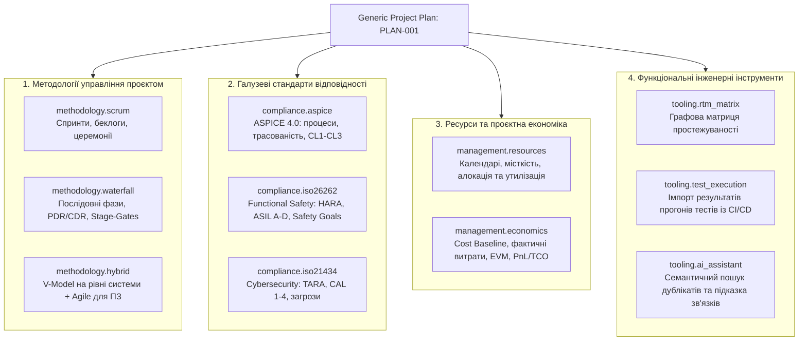

# DELMOS: каталог функціональних та галузевих модулів (Module Catalog)

Дата: 2026-09-23. Статус: детальна специфікація каталогу модулів платформи.  
Ліцензія: Apache 2.0.  
Контекст: [ядро та архітектура](ARCHITECTURE.md), [модульна система](MODULES.md),
[Project Plan Engine](PROJECT_PLAN_ENGINE.md), [Work Products та специфікації](WORK_PRODUCTS.md),
[метрики та економіка](METRICS.md), [вимоги до системи](../requirements/SYSTEM_REQUIREMENTS.md).

---

## 1. Загальна таксономія модулів

Усі функціональні модулі платформи **DELMOS** поділяються на чотири взаємодоповнюючі класи:

---

## 2. Методологічні модулі (Project Governance)

### 2.1. Модуль Scrum (`methodology.scrum`)
- **Призначення:** Організація ітеративної розробки команд із фіксованими часовими інтервалами (Timeboxes).
- **Внесок у Project Plan:**
  - Розділ плану: `Параметри каденції та спринтів` (тривалість, день демо, ліміт WIP).
  - Словники: `STORY_POINT_SCALE` (Fibonacci: `1, 2, 3, 5, 8, 13, 21`), `SCRUM_CEREMONY` (Planning, Daily, Review, Retrospective).
- **Майлстоуни:**
  - `sprint_milestone`: віха завершення спринту (перевірка критеріїв Definition of Done).
  - `release_train_increment`: віха завершення програмного інкременту.
- **Типи та колекції:**
  - `methodology.scrum:user_story`: тип Work Item для беклогу.
  - `Sprint Backlog`: впорядкована колекція Work Items у контексті цілі спринту (Sprint Goal).
  - `scrum:sprint_plan`: артефакт плану спринту; фіксує незмінний знімок на момент старту.
- **Правила (Rules):**
  - `rule.scrum.sprint_close`: спринт не може бути закритий, якщо є незавершені блокуючі дефекти.

### 2.2. Модуль Waterfall & V-Model (`methodology.waterfall`)
- **Призначення:** Класичне керування розробкою систем із фазовим контролем (Stage-Gate Process) за стандартами ISO 12207 / ISO 21502.
- **Внесок у Project Plan:**
  - Розділ плану: `Фазовий графік та критерії переходу (Gate Criteria)`.
  - Словники: `GATE_TYPE` (`SRR` - System Requirements Review, `PDR` - Preliminary Design Review, `CDR` - Critical Design Review, `PRR` - Production Readiness Review).
- **Майлстоуни:** `stage_gate_milestone`: контрольна точка переходу між фазами (кворум підписів).
- **Артефакти:** `waterfall:phase_signoff_record` (протокол рішення комісії), `waterfall:change_request_record` (запит на зміну).
- **Правила:** `rule.waterfall.predecessor_gate_required`: початок наступної фази блокується, якщо не підписано Stage-Gate попередньої.

---

## 3. Галузеві модулі комплаєнсу (Engineering Compliance)

### 3.1. Модуль Automotive SPICE 4.0 (`compliance.aspice`)
- **Призначення:** Відповідність автомобільній моделі оцінки зрілості інженерних процесів розробки ПЗ і систем (ASPICE 4.0).
- **Внесок у Project Plan:**
  - Розділ плану: `ASPICE Scope & Process Tailoring`: вибір процесів (SYS.1–5, SWE.1–6).
  - Словники: `ASPICE_PROCESS`, `ASPICE_CAPABILITY_LEVEL` (`CL0`..`CL3`), шкала `ASPICE_NPLF`.
- **Майлстоуни:** `aspice_gate_review`, `aspice_formal_assessment` (офіційний аудит асесором intacs).
- **Артефакти:** `aspice:process_tailoring_plan`, `aspice:gate_review_record`, `aspice:assessment_report`.
- **Правила:**
  - `rule.aspice.bidirectional_trace_swe1_sys2`: обов'язкова двостороння простежуваність $SWE.1 \leftrightarrow SYS.2$.
  - `rule.aspice.test_coverage_swe6_swe1`: усі вимоги до ПЗ повинні покриватися кваліфікаційними тестами.

### 3.2. Модуль Functional Safety ISO 26262 (`compliance.iso26262`)
- **Призначення:** Управління функціональною безпекою електричних та електронних систем транспортних засобів.
- **Внесок у Project Plan:**
  - Розділ плану: `Safety Plan & Item Definition`: межі виробу, цілі безпеки, безпековий життєвий цикл.
  - Словники: `SEVERITY` (`S0`..`S3`), `EXPOSURE` (`E0`..`E4`), `CONTROLLABILITY` (`C0`..`C3`), `ASIL` (`QM`, `A`, `B`, `C`, `D`).
- **Майлстоуни:** `safety_concept_freeze` (FSC), `technical_safety_freeze` (TSC), `safety_case_confirmation`.
- **Артефакти:** `iso26262:item_definition`, `iso26262:hara_worksheet`, `iso26262:safety_goal`, `iso26262:safety_case`.
- **Правила:**
  - `rule.iso26262.deterministic_asil_calculation`: детермінований розрахунок ASIL за таблицею ISO 26262 Table 4 ($S \times E \times C$).
  - `rule.iso26262.no_asil_downgrade`: похідна вимога не може мати нижчий рівень ASIL без затвердженої декомпозиції.

### 3.3. Модуль Cybersecurity ISO 21434 (`compliance.iso21434`)
- **Призначення:** Інженерія кібербезпеки транспортних засобів на всіх етапах життєвого циклу.
- **Внесок у Project Plan:** `Cybersecurity Plan`: призначення відповідальних, периметр оцінки.
- **Словники:** `DAMAGE_IMPACT` (SFOP), `ATTACK_FEASIBILITY`, `CAL` (Cybersecurity Assurance Level 1..4).
- **Артефакти:** `iso21434:tara_worksheet` (аналіз загроз TARA), `iso21434:cybersecurity_goal`.

---

## 4. Модулі ресурсів та проєктної економіки (Project Resources & Economics)

Розділ розширює платформу функціоналом **Project ERP (PPM / PSA)**. Нормативна база — серія **ISO 21500**: ISO 21502 (настанови щодо управління проєктами), ISO 21508 (управління здобутою цінністю), ISO 21511 (ієрархічні структури робіт). Стандарти **PMBOK**, **SWEBOK** та **ASPICE MAN.3** залучено довідково ([ADR-011](decisions/ADR-011-iso-21500-series-normative-base.md)).

### 4.1. Модуль керування ресурсами та місткістю (`management.resources`)
- **Призначення:** Планування місткості (Capacity Planning), облік доступності та утилізації інженерів і команд, робочі календарі, матриця ролей і компетенцій.
- **Внесок у Project Plan:**
  - Розділ плану: `Матриця ресурсів та доступності`: перелік інженерних ролей, зайнятість у FTE, графіки завантаження.
  - Словники: `RESOURCE_ROLE` (System Architect, Safety Manager, HW Engineer, SW Developer, QA Lead), `AVAILABILITY_STATUS`.
- **Сутності:**
  - `WorkRecord`: запис фактично витраченого часу інженера над артефактом або завданням: `(user_id, subject_id, date, duration, comment)`.
  - `ResourceAllocation`: планова зайнятість ролі чи інженера у фазі/спринті у відсотках (FTE) або годинах.
  - `WorkingCalendar`: робочі дні, свята, винятки та часовий пояс.
- **Метрики:** `resources.utilization_rate` (фактичні години проти планової місткості), `resources.allocated_fte`.
- **Правила:** `rule.resources.safety_role_independence` (SoD: Safety Assessor не може мати значної алокації на розробку тих самих модулів).

### 4.2. Модуль економіки проєкту, базового бюджету та контролю витрат (`management.economics`)
- **Призначення:** Наскрізне фінансове планування, затвердження бюджету (Cost Baseline за ISO 21502), облік прямих і накладних витрат (Labor & Non-Labor), аналіз ефективності за методом здобутої цінності (EVM за ISO 21508) та P&L/TCO.
- **Внесок у Project Plan:**
  - Розділ плану: `Бюджет проєкту та базовий план витрат (Cost Baseline)`: кошторис за фазами, статті витрат, ліміти фінансування (Funding Limits), резерви на ризики (Contingency Reserve).
  - Словники:
    - `COST_CATEGORY`: `Labor`, `Hardware_Prototypes`, `Tooling_NRE`, `Software_Licenses`, `Testing_Services`, `Contingency`.
    - `EXPENSE_TYPE`: `CapEx` (капіталізовані інвестиції в R&D за IAS 38), `OpEx` (операційні витрати).
    - `CURRENCY`: `EUR`, `USD`, `UAH`.
- **Шаблони Work Products:**
  - `economics:cost_baseline_record`: затверджений кошторис проєкту за фазами.
  - `economics:financial_status_report`: регулярний фінансовий звіт з індексами відхилень.
  - `economics:business_case_summary`: техніко-економічне обґрунтування (TCO/ROI) або P&L картка.
- **Динамічні сутності:**
  - `LaborRate`: версіована внутрішня погодинна ставка собівартості ролі/грейду.
  - `ExpenseRecord`: фактичні матеріальні або зовнішні витрати за рахунками та замовленнями.
- **Метрики (EVM):** Planned Value ($PV$), Actual Cost ($AC$), Earned Value ($EV$), Cost Performance Index ($CPI$), Schedule Performance Index ($SPI$), Estimate at Completion ($EAC$), Gross Margin ($P\&L$).
- **Правила:**
  - `rule.economics.funding_limit_gate`: блокування старту наступної фази, якщо витрати перевищують ліміт фінансування етапу.
  - `rule.economics.cost_variance_alert`: генерація сповіщення при відхиленні $CPI < 0.85$.

---

## 5. Функціональні інженерні інструменти (Tooling Extensions)

### 5.1. Модуль матриці простежуваності RTM (`tooling.rtm_matrix`)
- **Призначення:** Інтерактивна векторна візуалізація графа зв'язків між вимогами, архітектурою, залізом, кодом і тестами.
- **Можливості:**
  - Наскрізний рекурсивний аналіз зв'язків через нативний SQL CTE `CYCLE`.
  - Автоматичне виявлення «вимог-сиріт» (Orphan Requirements) та вимог без тестів (Missing Verification).
  - Візуалізація каскадного дерева впливу змін (Change Impact) із підсвічуванням `is_suspect = true`.

### 5.2. Модуль трекінгу результатів тестів (`tooling.test_execution`)
- **Призначення:** Зв'язок між специфікаціями тестів (`test_spec`), прогонами випробувань (`test_run`) та автоматизованими звітами JUnit/XUnit із зовнішніх CI/CD пайплайнів.
- **Артефакти:** `test:execution_run_report` (автоматично збережений звіт із точними результатами кроків та логами).

### 5.3. Модуль семантичного AI-асистента (`tooling.ai_assistant`)
- **Призначення:** Семантичний пошук дублікатів вимог, виявлення суперечностей у специфікаціях та розумна підказка зв'язків трасування (Smart Link Suggestion).
- **Інфраструктурна основа:** Нативний PostgreSQL із розширенням `pgvector` (таблиця `wp_embeddings`, HNSW індекси).
- **Суворе обмеження:** Модуль ніколи не створює та не затверджує зв'язки автоматично; усі пропозиції мають статус `candidate` та вимагають ручного підтвердження інженером (Human-in-the-loop).
