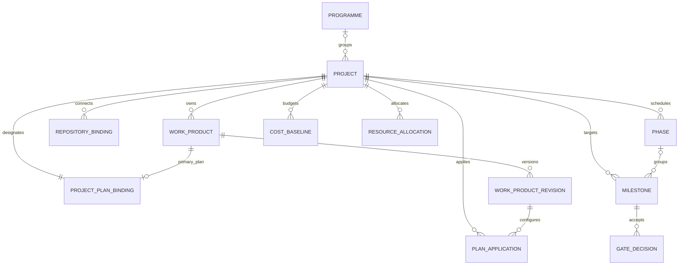
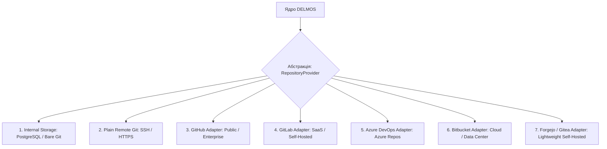
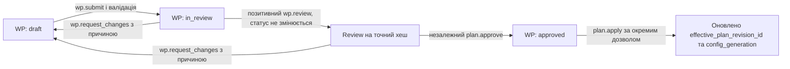

# DELMOS: проєкт, сховища, Project Plan та конфігурація

Дата: 2026-09-23. Статус: цільовий нормативний контракт моделі проєкту та конфігурації.  
Ліцензія: Apache 2.0.  
Контекст: [ядро та архітектура](ARCHITECTURE.md), [предметна модель](DOMAIN_MODEL.md),
[Work Products та специфікації](WORK_PRODUCTS.md), [модульна система](MODULES.md),
[каталог модулів](MODULE_CATALOG.md), [сценарії проєктного менеджера](../use-cases/PROJECT_MANAGER.md).

---

## 1. Концепція проєкту як контексту інженерії

У платформі **DELMOS** сутність `Project` виступає агрегатом верхнього рівня (Aggregate Root) для формування інженерного, комплаєнс- та фінансового контексту.

Проєкт об'єднує повний життєвий цикл розробки продукту:
* **Pre-sales & Bidding:** оцінка запитів (RFQ), попередня калькуляція та комерційні пропозиції;
* **Research & Feasibility:** дослідження технологій, оцінка ризиків, бенчмарки мікроконтролерів;
* **Systems, Hardware & Software:** специфікації системних вимог, схемотехніка, BOM, вбудоване ПЗ;
* **Project Economics:** базовий кошторис (`CostBaseline`), облік праці (`WorkRecord`), EVM-аналіз;
* **Compliance & Assurance:** галузеві шлюзи (ASPICE, ISO 26262, ISO 21434, IEC 62304).



### Кореневий інваріант: обов'язковий `Generic Project Plan`
* При створенні будь-якого проєкту система в межах однієї транзакції автоматично створює головний конфігураційний артефакт — **`Generic Project Plan`** (`PLAN-001`, тип `plan`, профіль `core:project_plan`) та фіксує зв'язок `ProjectPlanBinding`.
* Навіть проєкт у початковому стані (`initializing`) не може існувати без плану.

---

## 2. Модель сховищ коду та артефактів (`RepositoryProvider`)

DELMOS є повністю автономною системою та не прив'язаний до єдиного вендора хостингу коду. Зв'язок проєкту зі сховищем Docs-as-Code та вихідного коду абстраговано через інтерфейс `RepositoryProvider`.



### Варіанти сховища при створенні проєкту:
1. **Внутрішнє сховище DELMOS (Default):**
   * Артефакти та специфікації Docs-as-Code зберігаються безпосередньо у внутрішній базі PostgreSQL (або в локальному bare Git-репозиторії `/var/lib/delmos/repos/{project_id}.git`).
   * Ідеально для швидкого старту, пресейлів, R&D-досліджень та ізольованих лабораторій без зовнішніх серверів.
2. **Чистий віддалений Git (Plain Remote Git):**
   * Підключення стандартного репозиторію через SSH (`git@server:project.git`) або HTTPS із використанням токенів доступу.
3. **Корпоративні адаптери (Enterprise Git Adapters):**
   * Пряма інтеграція через REST API відповідних платформ (GitHub, GitLab, Azure DevOps, Bitbucket, Forgejo/Gitea).
   * Забезпечує читання/запис файлів специфікацій без локального клонування репозиторію на диск, а також підтягування статусів CI/CD пайплайнів.

---

## 3. Структура Generic Project Plan (`PLAN-001`)

Нормативна модель Generic Plan визначена в
[CORE-CONTRACT-002](../specifications/CORE-CONTRACT-002-GENERIC-PROJECT-PLAN.md).
Markdown є пояснювальною частиною ревізії, тоді як системна конфігурація
зберігається у типізованому маніфесті. Наведений нижче YAML є ілюстрацією
цільового представлення, а не форматом, який ядро витягує з Markdown.
Версія самого плану — натуральний `revision_number` його Work Product;
`profile_version` і `plan_schema_version` нижче є версіями форматів.

План є версійованою конфігурацією з типізованим маніфестом; YAML нижче показує
його читабельне представлення. Markdown-тіло ревізії містить лише пояснювальні
нотатки і не є джерелом системних правил:

```yaml
schema_version: delmos.wp.v1
id: "7108ecb7-2639-45f6-98b4-d628d654b201"
project_id: "7108ecb7-2639-45f6-98b4-d628d654b200"
code: PLAN-001
type: plan
profile: core:project_plan
profile_version: "1.0.0"
title: План розробки контролера інвертора тягового приводу
status: draft
classification: internal
metadata:
  plan_schema_version: "1.0.0"
  name: Inverter Control System
  purpose: Розробка високовольтного блоку керування інвертором (HW + SW)
  scope: Системні вимоги, дизайн плати PCB, прошивка ASIL C, випробування
  repository_provider:
    type: internal # або gitlab, github, azure_repos, plain_git
    binding_ref: repo-primary
  modules:
    - id: methodology.waterfall
      enabled: true
    - id: compliance.iso26262
      enabled: true
      configuration:
        target_asil: ASIL_C
    - id: management.economics
      enabled: true
      configuration:
        base_currency: EUR
        cost_baseline_target: 450000.00
  phases:
    - id: PH-01
      name: Concept & Feasibility
      planned_start: "2026-10-01"
      planned_finish: "2026-11-15"
      exit_milestones: [MS-01]
    - id: PH-02
      name: System & Safety Architecture
      planned_start: "2026-11-16"
      planned_finish: "2027-01-31"
      depends_on: [PH-01]
      exit_milestones: [MS-02]
  milestones:
    - id: MS-01
      name: Feasibility & Charter Sign-off
      phase_id: PH-01
      target_date: "2026-11-15"
      deliverables: [REP-001, SPEC-001]
      acceptance_rules:
        - rule: deliverables_approved
        - rule: business_case_accepted
    - id: MS-02
      name: Preliminary Design Review (PDR)
      phase_id: PH-02
      target_date: "2027-01-31"
      deliverables: [ARCH-001, HARA-001]
      acceptance_rules:
        - rule: safety_goals_allocated
        - rule: gate_decision_passed
```

---

## 4. Життєвий цикл конфігурації плану (Plan Apply Pipeline)

Зміна конфігурації проєкту (активація модулів, зміна розкладу, бюджету) здійснюється виключно через процедуру застосування плану:



Відмова в погодженні повертає WP до `draft` із записом рішення, а 409 (застаріла ревізія) залишає стан незмінним. `Reviewed` на схемі означає запис висновку, **не** новий статус WP; `Active` означає чинну проєкцію конфігурації, а не статус WP. Мінімальний кворум і незалежність визначає [ADR-009](decisions/ADR-009-core-review-and-approval-policy.md).

1. **Редагування чернетки:** Менеджер проєкту вносить зміни до чернетки плану `PLAN-001`.
2. **Перевірка сумісності:** Ядро валідує схему, перевіряє, чи дозволені обрані модулі адміністратором на рівні системи, та чи немає циклів у залежностях фаз.
3. **Погодження (Review & Approval):** Призначений Reviewer фіксує позитивний висновок, а незалежний від автора Approver окремо погоджує точний хеш ревізії плану (`payload_hash`).
4. **Атомарне набуття чинності (`plan.apply`):**
   * В одній транзакції PostgreSQL оновлюються діюча ревізія плану (`effective_plan_revision_id`), номер генерації конфігурації (`config_generation`) та активні модульні прив'язки.
   * Жодне налаштування не може потрапити в рантайм в обхід цієї процедури.

---

## 5. Фази, віхи та економічний контроль

* **Фази проєкту (Phases):** Логічні та часові етапи інженерного життєвого циклу.
* **Віхи (Milestones):** Контрольні точки виходу з фази, прив'язані до конкретних результатів (deliverables) та правил приймання.
* **Шлюзові рішення (Gate Decisions):** Формальний результат оцінки зрілості артефактів (`passed`, `failed`, `waived`).
* **Funding Limit Gate:** Правило модуля економіки автоматично блокує відкриття наступної фази проєкту, якщо фактичні витрати ($AC$) поточної фази перевищують встановлений ліміт фінансування без офіційного схвалення запиту на зміну бюджету (CR).
