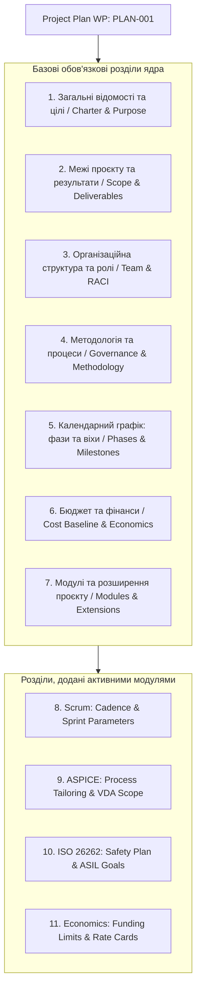

# DELMOS: Project Plan Engine та модульна архітектура конфігурації

Дата: 2026-09-23. Статус: нормативний архітектурний контракт рушія конфігурації.  
Ліцензія: Apache 2.0.  
Контекст: [ядро та архітектура](ARCHITECTURE.md), [предметна модель](DOMAIN_MODEL.md),
[проєкт і сховища](PROJECT_MODEL.md), [модульна система](MODULES.md),
[каталог модулів](MODULE_CATALOG.md), [події, тригери та правила](EVENTS_TRIGGERS_RULES.md).
[Точний контракт Generic Project Plan](../specifications/CORE-CONTRACT-002-GENERIC-PROJECT-PLAN.md)
визначає машинно-виконуваний маніфест, інваріанти та межу між ядром і модулями.

---

## 1. Концепція модульного керування конфігурацією

Інженерні програми охоплюють різні фази та процеси: дослідження (Research / Pre-sales), класичні послідовні фази (Waterfall / V-Model за ISO 12207), гнучкі підходи до розробки ПЗ (Scrum), галузеві стандарти (ASPICE 4.0, ISO 26262, ISO 21434, IEC 62304) та проєктну економіку (EVM, Cost Baseline).

Спроба зашити всі ці галузеві особливості в монолітне ядро робить систему громіздкою. **DELMOS** розв'язує цю задачу через архітектуру динамічної структури контенту та дворівневе керування:

| Інженерний рівень | Реалізація в DELMOS | Призначення в системі |
| --- | --- | --- |
| **Кореневий інваріант** | **Generic Project Plan** | Обов'язковий артефакт `PLAN-001`, що генерується при створенні проєкту та є джерелом його конфігурації. |
| **Рівень 1: Адміністратор** | **System Modules Catalog** | Глобальний перелік модулів, дозволених для інсталяції в системі (`/admin/modules`). |
| **Рівень 2: Менеджер** | **Project Plan Modules Section** | Вибір і налаштування дозволених модулів проєктним менеджером у чернетці плану. |
| **Конструктор полів** | **Property Definitions** | Додавання типізованих властивостей/полів до існуючих або нових типів WP через JSON Schema. |
| **Рушій інваріантів** | **Events, Triggers & Rules** | Декларативні правила контролю якості, перевірки переходів станів та фазові шлюзи (Gates). |

---

## 2. Обов'язковий документ Generic Project Plan (`PLAN-001`)

Кожен проєкт у DELMOS при створенні в обов'язковому порядку отримує головний документ конфігурації — **Project Plan** (`type: plan`, `profile: core:project_plan`, `code: PLAN-001`).



### Приклад структури маніфесту плану (`PLAN-001`)

Цей приклад ілюструє цільову конфігурацію. Структурований маніфест є окремим
типізованим записом ревізії, а не Markdown або довільним `metadata`. Базові
секції Generic Plan не нав'язують методологію; ключі Scrum, ISO 26262 та
економіки можуть з'явитися лише в `extensions` після активації відповідного
модуля.

```yaml
schema_version: delmos.wp.v1
id: "7208ecb7-2639-45f6-98b4-d628d654b301"
project_id: "7208ecb7-2639-45f6-98b4-d628d654b300"
code: PLAN-001
type: plan
profile: core:project_plan
profile_version: "1.0.0"
title: "План розробки модуля силової електроніки"
status: draft
classification: internal
metadata:
  plan_schema_version: "1.0.0"
  purpose: "Розробка блоку керування інвертором тягового електроприводу"
  scope:
    in_scope: ["Системні вимоги", "Схемотехніка PCB", "Вбудоване ПЗ", "HIL-випробування"]
    out_of_scope: ["Серійне виробництво корпусу"]
  governance:
    methodology: "hybrid" # scrum | waterfall | hybrid
  phases:
    - id: PH-01
      name: "System & Safety Architecture"
      planned_start: "2026-10-01"
      planned_finish: "2026-11-30"
      exit_milestones: [MS-01]
  milestones:
    - id: MS-01
      type_key: "gate_review"
      name: "Preliminary Design Review (PDR)"
      target_date: "2026-11-30"
      acceptance_rules:
        - "All system requirements allocated to architecture blocks"
        - "Safety goals confirmed with ASIL allocations"
  modules:
    active_module_ids:
      - "methodology.waterfall"
      - "compliance.iso26262"
      - "management.economics"
    extensions:
      iso26262:
        target_asil: "ASIL_C"
      economics:
        base_currency: "EUR"
        contingency_percent: 10
```

---

## 3. Дворівневе керування життєвим циклом модулів

```mermaid
sequenceDiagram
    autonumber
    actor Admin as Системний адміністратор
    participant AdminUI as Панель адміністратора (/admin/modules)
    participant CoreReg as Module Registry & System Policy
    actor PM as Проєктний менеджер
    participant PlanUI as Редактор плану (/projects/:id/plan)
    participant PlanService as Project Plan Service
    
    Admin->>AdminUI: Вмикає модуль глобально (наприклад, ISO 26262)
    AdminUI->>CoreReg: Оновлює ModuleSystemPolicy (Available)
    Note over CoreReg: Модуль стає дозволеним для вибору в проєктах
    
    PM->>PlanUI: Відкриває секцію «Модулі та розширення»
    PlanUI->>CoreReg: Запитує перелік дозволених модулів
    CoreReg-->>PlanUI: Повертає список доступних модулів
    
    PM->>PlanUI: Відмічає прапорець модуля ISO 26262 та налаштовує параметри
    PlanUI->>PlanService: Зберігає нову draft-ревізію плану
    Note over PlanService: Валідація JSON Schema, залежностей та правил
    PM->>PlanService: Подає ревізію на погодження (wp.submit)
    Note over PlanService: Перевірка прав погодження та SoD
    PM->>PlanService: Застосовує погоджений план (plan.apply)
    PlanService-->>PM: Конфігурація проєкту оновлена; нові типи та правила активні
```

1. **Рівень 1: Адміністратор системи (Global Availability):**
   * Керує глобальним каталогом: бачить версії, метадані та залежності.
   * Встановлює статус політики: `available`, `blocked_for_new_activation` (заборона нових активацій без впливу на діючі проєкти) або `suspended` (аварійне блокування).
2. **Рівень 2: Проєктний менеджер (Project Activation):**
   * Обирає модулі в інтерфейсі редагування плану `PLAN-001`.
   * Активація модуля є зміною плану, що породжує нову версію, проходить незалежне погодження та атомарно набуває чинності через команду `plan.apply`.

---

## 4. Спектр можливостей модуля (Module Capabilities)

Кожен функціональний модуль підключається до ядра через типізовані контракти провайдерів:
* **PlanSectionProvider:** додає власні розділи конфігурації та форми до проєктного плану.
* **DictionaryProvider:** постачає версійовані довідники та класифікатори (наприклад, рівні ASIL або коди процесів ASPICE).
* **MilestoneProvider:** реєструє спеціалізовані типи віх та шаблони критеріїв приймання (PDR, CDR, Safety Freeze).
* **WPTemplateProvider:** оголошує нові типи артефактів (`iso26262:safety_goal`) або розширює поля базових типів (`wp_property_definitions`).
* **TriggerRuleProvider:** встановлює тригери перехоплення та галузеві правила контролю інженерних інваріантів.
