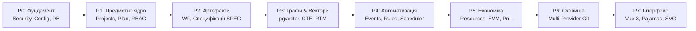

# DELMOS: дорожня карта розбудови платформи (Architecture Roadmap)

Дата: 2026-09-23. Статус: стратегічна та операційна дорожня карта проєкту.  
Ліцензія: Apache 2.0.  
Контекст: [ядро та архітектура](ARCHITECTURE.md), [предметна модель](DOMAIN_MODEL.md),
[план портування](../../PORTING_PLAN.md), [вимоги до системи](../requirements/SYSTEM_REQUIREMENTS.md).

---

## 1. Стратегічний вектор розвитку

Платформа **DELMOS** створюється як універсальна інженерна операційна система (ELM) та система проєктної економіки (Project ERP / PPM).

Головний інженерний пріоритет: **«Глибина наскрізного процесу та надійність даних»** над формальною широтою невиконаних заяв. Платформа розвивається послідовними верифікованими фазами від надійного транзакційного ядра до багатого векторного вебінтерфейсу.

---

## 2. Фази реалізації (Phases P0 – P7)

```mermaid
flowchart LR
    P0[P0: Фундамент<br/>Security, Config, DB] --> P1[P1: Предметне ядро<br/>Projects, Plan, RBAC]
    P1 --> P2[P2: Артефакти<br/>WP, Специфікації SPEC]
    P2 --> P3[P3: Графи & Вектори<br/>pgvector, CTE, RTM]
    P3 --> P4[P4: Автоматизація<br/>Events, Rules, Scheduler]
    P4 --> P5[P5: Економіка<br/>Resources, EVM, PnL]
    P5 --> P6[P6: Сховища<br/>Multi-Provider Git]
    P6 --> P7[P7: Інтерфейс<br/>Vue 3, Pajamas, SVG]
```

---

### Фаза P0. Надійний та відтворюваний фундамент (Core Security & Runtime)
* Ізольована тестова база даних `delmos_test` зі схемною ізоляцією на кожен unit/integration тест.
* Захищена конфігурація: валідація портів, URL, захист від витоку секретів, відсутність паролів у репозиторії.
* Серверні HttpOnly сесії, CSRF-захист, валідація Origin, rate-limiting на авторизаційні ендпоінти.
* Єдиний скрипт повної верифікації якості `make validate` (линтери, компіляція Go, перевірка посилань документації).
* Серіалізація міграцій БД через PostgreSQL Advisory Locks та контроль контрольних сум (SHA-256).

### Фаза P1. Предметне ядро, Scoped RBAC та обов'язковий план
* Сутності `Programme`, `Project`, `ProjectMembership`.
* Реалізація авторизаційного рушія Scoped RBAC з обов'язковою перевіркою правила розподілу обов'язків (SoD).
* Атомарне створення обов'язкового артефакту **`Generic Project Plan`** (`PLAN-001`) при реєстрації нового проєкту (`ProjectPlanBinding`).
* Базовий реєстр 6 типів артефактів ядра (`plan`, `requirement`, `architecture`, `test_spec`, `report`, `record`).
* Версійовані словники ядра та базові класифікатори без ризику зациклень.

### Фаза P2. Артефакти, ревізії та композитні специфікації
* Валідація структурованих метаданих через JSON Schema Draft 2020-12.
* Незмінні ревізії артефактів (`work_product_revisions`) із розрахунком детермінованого `payload_hash` та `content_hash`.
* Реалізація моделі **композитної специфікації** (розділи, впорядковані входження `occurrences`, незмінні маніфести).
* Проходження повного набору 10 сценаріїв приймання композиції (**SPEC-01..10**).

### Фаза P3. Векторні дані та рекурсивні графи в PostgreSQL
* Підключення нативного розширення `pgvector` та створення таблиці `wp_embeddings` із HNSW-індексами.
* Гібридний семантичний пошук схожих вимог та тестів в одному SQL-запиті з фільтрацією прав і класифікації секретності.
* Реляційна таблиця `trace_links` із рекурсивним обходом через `WITH RECURSIVE` та нативним захистом від зациклень `CYCLE target_id SET is_cycle USING path`.
* Автоматичне каскадне поширення прапорця підозрілості (`is_suspect = true`) при зміні джерела (Change Impact Analysis).
* Проходження сценаріїв приймання **VEC-01..03** та **GRP-01..03**.

### Фаза P4. Події, тригери, правила та планувальник
* Реєстр сутностей автоматизації: `event_definitions`, `trigger_definitions`, `rule_definitions`.
* Секундний планувальник завдань із захистом від повторних спрацьовувань (`ScheduleOccurrence`).
* Надійна черга повідомлень у PostgreSQL на основі патерну Transactional Outbox із механізмом оренди (Lease Fencing).
* Декларативний рушій правил з підтримкою блокуючих дій (`veto`) та аудиторських попереджень (`advisory`).

### Фаза P5. Проєктна економіка та облік ресурсів
* Модуль `management.resources`: облік відпрацьованого часу (`WorkRecord`), планування місткості (`ResourceAllocation`), виробничі календарі (`WorkingCalendar`).
* Модуль `management.economics`: базовий кошторис (`CostBaseline`), облік прямих трудовитрат (`LaborRate`) та витрат (`ExpenseRecord`, CapEx vs OpEx).
* Розрахунок показників Earned Value Management ($PV, AC, EV, CPI, SPI, EAC$) та комерційного валового прибутку (P&L).

### Фаза P6. Мультипровайдерне сховище (Repository & Tracker Adapters)
* Реалізація абстрактного інтерфейсу `RepositoryProvider`:
  * Внутрішнє автономне сховище DELMOS (PostgreSQL / Local Git);
  * Чистий віддалений Git по SSH/HTTPS;
  * Адаптери для корпоративних платформ: GitHub, GitLab, Azure DevOps, Bitbucket, Forgejo/Gitea.
* Безпечна робота через REST API провайдерів без обов'язкового клонування репозиторіїв на диск.

### Фаза P7. Вебінтерфейс та векторна графіка (UI & Vector Visualization)
Базова оболонка, доступність і Guided UI впроваджуються разом із робочими сценаріями P0–P6, а не відкладаються до P7. Критерії для кожного етапу наведені в [карті Web GUI](gui/README.md); P7 завершує повноту інтерфейсу та складні візуалізації.
* Повнофункціональний SPA-інтерфейс на базі Vue 3 та токенів дизайн-системи GitLab Pajamas.
* Інтерактивне полотно візуалізації матриці RTM та дерев залежностей на базі **SVG** (компонент Vue Flow).
* Апаратне масштабування, панорамування, міні-мапа та колірне кодування рівнів ASIL і статусів.
* Декларативне вбудовування діаграм Mermaid та прямий експорт графічних звітів у векторні формати SVG і PDF для сертифікаційних аудитів (ASPICE, ISO 26262).

### 2.1. Пріоритетні управлінські зрізи за серією ISO 21500

Нормативна основа термінів і реалізованих практик визначена в
[ADR-011](decisions/ADR-011-iso-21500-series-normative-base.md). Українські назви
стандартів звіряють із [оглядом серії на PMDoc.ua](https://pmdoc.ua/iso/), а
терміни — з ISO/TR 21506. Цей план **не заявляє відповідність** стандартам:
вони надають настанови, а модель даних, API, правила переходів і перевірки
нижче є рішеннями DELMOS. PMBOK і SWEBOK використовуються лише довідково.

| Черга | Опора | Наявний стан | Наступний перевірюваний зріз |
| --- | --- | --- | --- |
| **G0 — безпечний вертикальний процес** | ISO 21502:2020, ISO 21505:2017 | Є версійований `PLAN-001`, незалежні Review/Approval, `plan.apply`, фазові шлюзи та адміністративний GUI для проєктних ролей. Ізольовані DB-тести auth/project/server проходять із `-race`; авторизований браузерний сценарій ще не перевірено. | Провести в браузері шлях ПМ → рецензент → погоджувач → введення в дію з перевіркою exact revision/hash, відкликаних прав, veto, аудиту та відновлення після зміни плану. До HTTPS операції через публічний HTTP не вважати готовими для реального погодження. |
| **G1 — рішення про проєкт і врядування** | ISO 21500:2021, ISO 21502:2020, ISO 21505:2017 | `objectives`, `scope_items`, ролі, фази та `change_control_required` у маніфесті; ризики й рішення належать окремим реєстрам. Немає явного спонсора, очікуваних вигод, повноважень органу врядування й маршруту затвердження змін. | Визначити окремі типізовані посилання з `PLAN-001` на мандат/спонсора, цілі й критерії вигод, реєстри ризиків і рішень. Розвести автора плану, власника рішення та незалежного погоджувача; перевірити, що оперативна зміна ризику не переписує план. Не вводити глобальне `programme_id` без контракту програми. |
| **G2 — ієрархічна структура робіт** | ISO 21511:2018 | `phase_deliverables` і фази дають прив'язку результатів, але **не утворюють повної ієрархічної структури робіт**. | Погодити контракт `work_breakdown_structure` зі стабільними ключами вузлів, батьківським зв'язком, результатом, відповідальним і версією базису; додати інваріанти унікальності, заборони циклів і чужих проєктів. Перевірити декомпозицію, зміну затвердженого базису та посилання з результатів плану без дублювання артефактів. |
| **G3 — узгоджений розклад, кошторис і факти** | ISO 21502:2020, ISO 21508:2018 | Є окремі `CostBaseline`, записи праці/витрат та обчислення PV/AC/EV; зв'язок із фазами і результатами є, із затвердженою WBS — ще ні. | Зв'язати версії WBS, розкладу й кошторису через явний затверджений плановий базис; визначити правило зміни базису та часову розкладку PV. Перевірити, що EV спирається на прийнятий результат, AC — на датовані факти, а індекси з нульовим знаменником лишаються невизначеними, не нулем. |
| **G4 — впровадження й контроль управління здобутою цінністю** | ISO 21512:2024 разом з ISO 21508:2018 | Окремі метрики існують, але немає зафіксованої політики їх застосування до різних класів проєктів. | Задокументувати рішення про застосовність методу, календар звітності, якість вхідних даних, відповідальних за базис та коригувальні дії; перевірити відтворюваний звіт на дату зрізу й аудиторський слід. Не нав'язувати EVM проєктам, для яких модуль економіки не активний. |
| **G5 — програми й портфелі** | ISO 21503:2022, ISO 21504:2022, ISO 21505:2017 | `Project` є робочою межею; окремої предметної моделі `Programme`/`Portfolio` та рішень їхнього врядування немає. | Після стабілізації G0–G4 окремо вивести вимоги до групування проєктів, управління вигодами та пріоритетами, міжпроєктних залежностей і повноважень. Перед реалізацією погодити розширення ADR-011 та тести ізоляції прав між проєктом, програмою й портфелем. |

На кожному зрізі потрібні: зіставлення термінів з ISO/TR 21506, одна узгоджена
версія контракту в API/БД/GUI, негативні тести інваріантів і UAT людини-ПМ.
Звіти, ризики, фактичні витрати та GateDecision зберігаються в окремих
сутностях; `PLAN-001` містить правила й типізовані посилання, а не копії фактів.
Пов'язана межа маніфесту описана в
[CORE-CONTRACT-003](../specifications/CORE-CONTRACT-003-GENERIC-PLAN-DOMAIN-AND-AUTOMATION.md).

---

## 3. Відповідність фаз і релізів (Semantic Versioning)

Фази P0–P7 описують **технічну послідовність**, а версії — **поставлену користувачеві цінність**. Обсяг `v1.0.0` визначено в [політиці версіонування, розділ 3](../VERSIONING.md): вхід адміністратора, CRUD проєкту, план проєкту, CRUD базового Work Product і просте Git-сховище. Тому перший мажорний реліз бере не всі фази підряд, а вертикальний зріз через P0–P2 плюс мінімальні частини P6 і P7.

| Версія | Фаза(и) | Поставлена можливість | Статус |
| --- | --- | --- | --- |
| `v0.1.0` | P0 | Збірка, конфігурація, міграції, тестова БД, `make validate`, `/healthz` | Реалізовано |
| `v0.2.0` | P1 (частково) | Облікові записи, вхід адміністратора, сесії, Scoped RBAC | Реалізовано |
| `v0.3.0` | P1 | CRUD `Project` та атомарний `Generic Project Plan` (`PLAN-001`) | Реалізовано |
| `v0.4.0` | P2 (частково) | CRUD Work Product 6 типів ядра з незмінними ревізіями та `payload_hash` | Реалізовано |
| `v0.5.0` | P6 (частково) | `RepositoryProvider`: чистий Git (локальний bare / SSH / HTTPS) | Реалізовано (bare/HTTPS; SSH — наступна ітерація) |
| `v0.6.0` | P7 (частково) | Мінімальний Web GUI для наскрізного сценарію `alpha` | Реалізовано (без дизайн-системи Pajamas) |
| **`v1.0.0`** | — | Стабілізація зрізу: контрактні тести, UAT, інсталяція, upgrade/rollback, заморожений REST-контракт | Ціль MVP |
| `v1.x` | P2, P3, P4 | Композитні специфікації (SPEC-01..10), `pgvector` та граф трасованості, події/правила/планувальник | Після MVP |
| `v2.x` | P5, P6, P7 | Проєктна економіка та EVM, адаптери зовнішніх платформ, повний UI із SVG-візуалізацією | Після MVP |

Перехід між версіями `v0.y.z` не дає гарантій сумісності контрактів — ці гарантії набувають чинності з `v1.0.0`.
