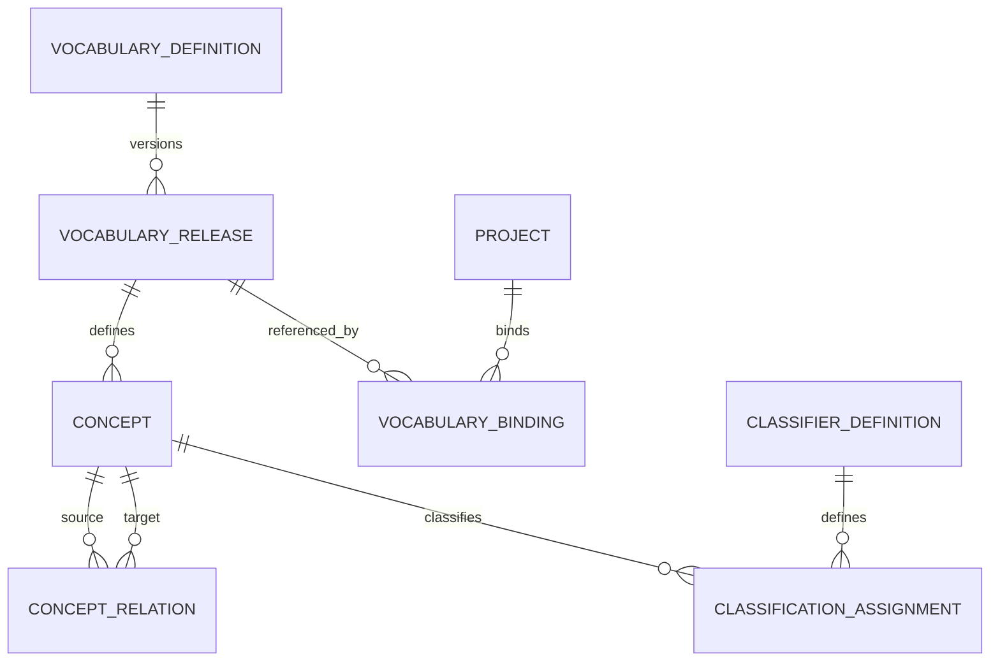

# DELMOS: таксономія, словники та довідкові дані

Дата: 2026-09-23. Статус: цільова нормативна модель класифікації та довідників.  
Ліцензія: Apache 2.0.  
Контекст: [предметна модель](DOMAIN_MODEL.md), [Item і Content](ITEMS_AND_CONTENT.md),
[Work Products та специфікації](WORK_PRODUCTS.md), [права доступу](ACCESS_CONTROL.md),
[модульна система](MODULES.md).

---

## 1. Концепція класифікації та довідників

У платформі **DELMOS** кожна вісь інформаційної моделі виконує власну функцію:
* **Типізація (Type Definition):** відповідає на питання *«Що це за сутність за своєю природою?»* (вимога, архітектурний компонент, тест-план).
* **Схема метаданих (JSON Schema):** визначає структуру обов'язкових та опціональних полів.
* **Таксономія (Taxonomy & Vocabularies):** відповідає на питання *«До яких контрольованих інженерних понять і категорій належить об'єкт?»* (підсистема, фаза життєвого циклу, дисципліна).
* **Авторизація (Access Control):** визначає, хто і які операції має право виконувати.

### Правило ізоляції:
Таксономічний тег, категорія словника чи мітка в профілі користувача (наприклад, `role: Architect` або `team: Safety`) **ніколи не створюють автоматичних прав доступу** і не є самостійними вхідними даними для системи безпеки (RBAC).

---

## 2. Структурні режими довідників

| Режим | Структурні обмеження | Застосування в DELMOS |
| --- | --- | --- |
| **Flat (Плоский список)** | Елементи не мають ієрархічних зв'язків батько-дитина (`broader`). Порядок відображення не означає переваги чи рангу. | Словники статусів, перелік валют (`EUR`, `USD`), шкали оцінок, типи ребер зв'язку. |
| **Tree / Forest (Дерево / Ліс)** | Кожен вузол має не більше одного батька (`broader parent`). Зациклення та посилання на себе суворо заборонені. | Структура компонентів автомобіля (WBS), ієрархія підсистем. |
| **Polyhierarchy (DAG)** | Орієнтований ациклічний граф: вузол може мати кількох батьківських категорій, але зациклення заборонені. | Багатовимірна класифікація вимог (наприклад, функція належить одночасно до `Powertrain` та `Safety Critical`). |
| **Semantic Graph** | Складний асоціативний граф понять із типізованими ребрами (`related`, `exact_match`, `close_match`). | Термінологічні тезауруси галузевих стандартів (ISO, IEC, IEEE). |

---

## 3. Сутності моделі довідкових даних

* **VocabularyDefinition:** Опис словника з унікальним простором імен (`namespace:key`), назвою, власником та режимом структури (Flat, Tree, DAG).
* **VocabularyRelease:** Незмінна версія словника (реліз). Зміна назви терміна створює нову версію релізу, зберігаючи стабільні ідентифікатори концептів (`concept_id`).
* **Concept (Термін):** Стабільний ідентифікатор поняття з описом, синонімами та локалізованими назвами.
* **ClassifierDefinition:** Декларація поля класифікації для певного типу артефакту (наприклад, поле `subsystem_ref` у типі `requirement` із прив'язкою до словника систем).
* **ClassificationAssignment:** Факт призначення терміна конкретній ревізії артефакту з фіксацією автора та часу.

---

## 4. Контроль цілісності та захист від зациклень у PostgreSQL

Усі ієрархічні та поліієрархічні словники валідуються на рівні бази даних:
1. **Захист від циклів:** Перевірка ациклічності виконується під час додавання зв'язку `broader` через рекурсивний SQL-запит із використанням `CYCLE target_id SET is_cycle USING path`. Будь-яка спроба замкнути дерево у петлю негайно відхиляється.
2. **Дедуплікація агрегатів:** Під час розрахунку метрик або звітів за категоріями поліієрархії один і той самий артефакт, що має двох батьків, дедуплікується (`COUNT(DISTINCT wp_id)`), запобігаючи подвійному обліку трудовитрат чи вимог.
3. **Незмінність історичних бейзлайнів:** Деактивація терміна в новому релізі словника забороняє його вибір для нових вимог, але не порушує цілісності та відображення старих ревізій у раніше збережених бейзлайнах.
