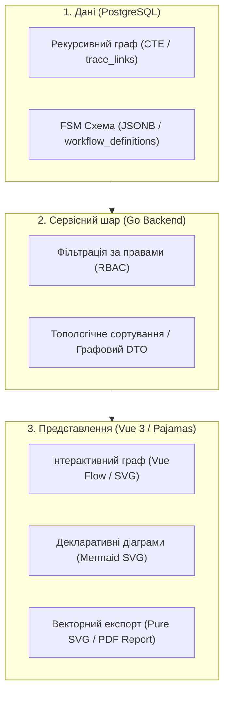

# DELMOS: векторні та графові моделі даних у PostgreSQL і векторна візуалізація

Дата: 2026-09-23. Статус: концептуальне та архітектурне рішення для моделювання.  
Ліцензія: Apache 2.0.  
Контекст: [ядро та архітектура](ARCHITECTURE.md), [предметна модель](DOMAIN_MODEL.md),
[Work Products та специфікації](WORK_PRODUCTS.md), [таксономія та довідкові дані](TAXONOMY.md),
[вимоги до системи](../requirements/SYSTEM_REQUIREMENTS.md).

---

## 1. Вступ та бізнес-обґрунтування

В інженерних системах керування життєвим циклом розробки (ELM/ALM) та забезпечення відповідності суворим стандартам функціональної безпеки й кібербезпеки (ISO 26262, ASPICE 4.0, ISO 21434, IEC 62304) критичними є два класи завдань:
1. **Семантичний аналіз тексту:** виявлення схожих або суперечливих вимог, дедуплікація тест-кейсів, автоматизована підказка зв'язків трасованості (Smart Link Suggestion).
2. **Топологічний аналіз зв'язків:** побудова наскрізних ланцюжків трасованості (RTM), аналіз впливу змін (Change Impact Analysis), виявлення зациклень у розкладах (DAG) та каскадне поширення прапорця підозрілості (`suspect`).

Поширеною помилкою є введення в інфраструктуру окремих спеціалізованих СУБД (Neo4j для графів або Pinecone/Milvus/Qdrant для векторів). Для DELMOS такий підхід відхилено: він призводить до фрагментації транзакцій, розсинхронізації прав доступу та суттєвого ускладнення автономного розгортання на цільових серверах Ubuntu без сторонніх контейнерів.

**Архітектурне рішення DELMOS:** Використовувати **PostgreSQL як єдину платформу** для реляційних, графових і векторних даних.

### Чому PostgreSQL без окремих спеціалізованих баз

| Критерій | Окремі БД (Neo4j + Milvus + PG) | Єдиний PostgreSQL (ACID + pgvector + CTE) |
| --- | --- | --- |
| **Транзакційна цілісність (ACID)** | Відсутня. Помилка запису в одну з БД залишає систему в розсинхронізованому стані. | Повна. Оновлення ревізії WP, оновлення ребер графа та збереження вектора відбуваються в одній транзакції. |
| **Керування доступом (RBAC/ABAC)** | Необхідно дублювати перевірку прав, міток секретності та проектних меж у трьох різних сервісах. | Єдиний SQL-запит автоматично поєднує векторну відстань, обхід графа та обмеження доступу (`WHERE project_id = $1 AND classification <= $2`). |
| **Експлуатація та надійність** | Потребує підтримки трьох процесів, моніторингу, резервного копіювання різними утилітами. | Стандартний `pg_dump` бекапить одночасно реляційні таблиці, векторні індекси та зв'язки. |
| **Ресурси та стек** | Додаткові сервіси вимагають пам'яті (JVM для Neo4j, окремі сервіси векторів). | Мінімальний накладний овергед у межах одного нативного демона `postgresql.service`. |

---

## 2. Векторні дані та розширення `pgvector`

У DELMOS векторне представлення забезпечується нативним розширенням `pgvector`.

### 2.1. Модель зберігання та прив'язка до ревізій

Векторне представлення (embedding) є похідним артефактом від конкретного змісту.
Оскільки Work Product змінюється через створення незмінних ревізій (`work_product_revisions`), вектор прив'язується **до точної ревізії та конкретної моделі генерації**:

```sql
CREATE TABLE wp_embeddings (
    id UUID PRIMARY KEY DEFAULT gen_random_uuid(),
    work_product_id UUID NOT NULL REFERENCES work_products(id) ON DELETE CASCADE,
    revision_id UUID NOT NULL REFERENCES work_product_revisions(id) ON DELETE CASCADE,
    model_name VARCHAR(64) NOT NULL,          -- наприклад, 'text-embedding-3-small' або локальна 'bge-m3'
    model_version VARCHAR(32) NOT NULL,       -- версія моделі для контролю сумісності векторних просторів
    dimensions INT NOT NULL,                  -- наприклад, 1536 або 1024
    embedding vector(1536) NOT NULL,
    created_at TIMESTAMPTZ NOT NULL DEFAULT clock_timestamp(),
    CONSTRAINT uq_wp_embedding_rev_model UNIQUE (revision_id, model_name, model_version)
);

-- HNSW індекс для швидкого пошуку за косинусною відстанню
CREATE INDEX idx_wp_embeddings_hnsw ON wp_embeddings 
USING hnsw (embedding vector_cosine_ops)
WITH (m = 16, ef_construction = 64);
```

### 2.2. Життєвий цикл векторів
1. **Асинхронний розрахунок:** При фіксації нової ревізії WP (`wp.revision_committed`) генерується подія, яку підхоплює фоновий воркер через надійну чергу (outbox). Воркер надсилає текст до сервісу ембедінгів і записує вектор.
2. **Контроль застарівання при зміні моделі:** Якщо системний адміністратор змінює використовувану модель ембедінгів, старі вектори залишаються прив'язаними до попередньої моделі; нові ревізії маркуються новим `model_name`. Пошук виконується тільки серед векторів однакового простору (`WHERE model_name = $current_model`).
3. **Повна детермінованість:** Вектор обчислюється від нормалізованого тексту: `title + "\n\n" + body + "\n\n" + canonical_metadata`.

### 2.3. Семантичний пошук та дедуплікація вимог і тестів

#### А. Пошук схожих вимог (Duplicate & Conflict Detection)
Під час написання нової вимоги інженер отримує попередження про наявність семантично схожих пунктів у межах проєкту або всієї програми:

```sql
-- Гібридний пошук: семантична схожість + фільтри прав і проєктного скоупу
SELECT 
    wp.id,
    wp.code,
    wpr.title,
    1 - (e.embedding <=> $query_vector) AS cosine_similarity,
    wp.status
FROM wp_embeddings e
JOIN work_product_revisions wpr ON wpr.id = e.revision_id
JOIN work_products wp ON wp.id = e.work_product_id
WHERE wp.project_id = $1
  AND wp.type = 'requirement'
  AND e.model_name = $current_model
  AND 1 - (e.embedding <=> $query_vector) >= 0.82 -- поріг високої схожості
  AND wp.id != $current_wp_id
ORDER BY e.embedding <=> $query_vector
LIMIT 10;
```

#### Б. Пошук релевантних тестів та оптимізація покриття
* **Рекомендація тест-кейсів:** При створенні вимоги система автоматично ранжує існуючі `test_spec` за семантичною близькістю до змісту вимоги і пропонує інженеру пов'язати їх одним кліком (`Smart Traceability Link`).
* **Виявлення надлишкових тестів:** Пошук тест-кейсів із косинусною подібністю > 0.95 сигналізує про потенційне дублювання тестів різними інженерними командами.

---

## 3. Графові структури в PostgreSQL

DELMOS не потребує графової мови Cypher чи окремої БД: нативний SQL у PostgreSQL підтримує потужні рекурсивні запити (`WITH RECURSIVE`), а починаючи з версії 14 має нативний синтаксис контролю зациклень `CYCLE`.

### 3.1. Реляційна модель графа зв'язків із версіонуванням

Граф зв'язків зберігається в реляційній таблиці `trace_links`:

```sql
CREATE TABLE trace_links (
    id UUID PRIMARY KEY DEFAULT gen_random_uuid(),
    project_id UUID NOT NULL REFERENCES projects(id) ON DELETE CASCADE,
    source_id UUID NOT NULL REFERENCES work_products(id) ON DELETE CASCADE,
    source_revision_id UUID REFERENCES work_product_revisions(id) ON DELETE RESTRICT,
    target_id UUID NOT NULL REFERENCES work_products(id) ON DELETE CASCADE,
    target_revision_id UUID REFERENCES work_product_revisions(id) ON DELETE RESTRICT,
    relation_kind VARCHAR(64) NOT NULL, -- 'verifies', 'satisfies', 'refines', 'derives_from'
    is_suspect BOOLEAN NOT NULL DEFAULT false,
    created_at TIMESTAMPTZ NOT NULL DEFAULT clock_timestamp(),
    CONSTRAINT uq_trace_link UNIQUE (source_id, target_id, relation_kind)
);

CREATE INDEX idx_trace_source ON trace_links(source_id, target_id);
CREATE INDEX idx_trace_target ON trace_links(target_id, source_id);
```

### 3.2. Наскрізна простежуваність (RTM) через `WITH RECURSIVE` та `CYCLE`

Отримання повного ланцюжка залежностей від стейкхолдерської вимоги до тестового прогону виконується одним запитом із захистом від нескінченних циклів:

```sql
WITH RECURSIVE trace_tree AS (
    -- Базовий випадок (корінь аналізу)
    SELECT 
        tl.source_id,
        tl.target_id,
        tl.relation_kind,
        tl.is_suspect,
        1 AS depth,
        ARRAY[tl.source_id, tl.target_id] AS path
    FROM trace_links tl
    WHERE tl.source_id = $initial_requirement_id

    UNION ALL

    -- Рекурсивний крок
    SELECT 
        child.source_id,
        child.target_id,
        child.relation_kind,
        child.is_suspect,
        parent.depth + 1,
        parent.path || child.target_id
    FROM trace_links child
    JOIN trace_tree parent ON child.source_id = parent.target_id
    WHERE parent.depth < 10
)
CYCLE target_id SET is_cycle USING cycle_path
SELECT 
    tt.depth,
    wp_src.code AS source_code,
    wp_tgt.code AS target_code,
    wp_tgt.type AS target_type,
    tt.relation_kind,
    tt.is_suspect,
    tt.is_cycle
FROM trace_tree tt
JOIN work_products wp_src ON wp_src.id = tt.source_id
JOIN work_products wp_tgt ON wp_tgt.id = tt.target_id;
```

### 3.3. Аналіз впливу змін (Change Impact Analysis) та `suspect links`

Коли фіксується нова ревізія артефакту $A$, ядро через рекурсивний запит знаходить усі прямі та непрямі артефакти, що спиралися на попередню версію $A$, і позначає вхідні ребра прапорцем `is_suspect = true`.
* Зміна джерела не робить залежні артефакти невалідними автоматично.
* Вона формує список аудиту для відповідальних інженерів («переглянути тест TC-04 через оновлення вимоги REQ-01»).
* Зняття прапорця `suspect` відбувається за явною дією рецензента після підтвердження відповідності.

### 3.4. Ієрархічні структури через `ltree`

Для ієрархій розділів композитного документа (Специфікації) та структури декомпозиції робіт (WBS) використовується вбудоване розширення `ltree`:
* Кожен вузол має шлях виду `Top.SYS1.ModuleA.Req1`.
* Дозволяє за один B-tree/GiST індексний пошук знайти всіх нащадків (`path <@ 'Top.SYS1'`) або всіх предків (`path @> 'Top.SYS1.ModuleA'`).

---

## 4. Складні гібридні моделі: Graph-RAG

Поєднання векторного індексу та рекурсивного графа в одній базі даних уможливлює архітектуру **Graph-RAG (Graph-augmented Retrieval-Augmented Generation)**:
1. **Етап 1 (Векторне фокусування):** За запитом інженера через `pgvector` знаходиться топ-3 найближчих вимоги.
2. **Етап 2 (Графове розгортання контексту):** Для знайдених вимог рекурсивний SQL-запит миттєво підтягує батьківські цілі безпеки (Safety Goals), пов'язані архітектурні блоки та тестові специфікації.
3. **Етап 3 (Формування відповіді):** Контекст передається інженеру або моделі аналізу з повною топологією системи без стороннього інформаційного шуму.

---

## 5. Візуалізація графів засобами векторної графіки (Vector Graphics)

DELMOS спирається на векторну графіку (**SVG**) як для інтерактивного інтерфейсу користувача, так і для звітів, що експортуються.

### 5.1. Інженерні вимоги до візуалізації
* **Матриця простежуваності (RTM):** граф зв'язків між різними типами артефактів.
* **Дерево впливу змін (Impact Tree):** орієнтований граф, що підсвічує ланцюжки з `is_suspect = true`.
* **Життєвий цикл (FSM Workflow):** діаграма станів та дозволених переходів артефакту.
* **Граф фаз і віх (Roadmap DAG):** контроль розкладу та відсутності взаємних блокувань.

### 5.2. Технологічний стек векторного рендерингу в DELMOS



1. **Інтерактивна робота у браузері (`Vue Flow` / SVG):**
   * Легковаговий компонент на базі SVG для Vue 3.
   * Апаратне масштабування та панорамування (zoom, pan).
   * Інтерактивні вузли з дизайном GitLab Pajamas (бейджи статусів, іконки типів WP, колірне кодування ASIL).
   * Міні-мапа (minimap) для швидкої навігації великими специфікаціями (1000+ елементів).
   * Динамічне підсвічування шляхів: клік на вузол підсвічує всі прямі та непрямі зв'язки.
2. **Декларативне вбудовування в документацію (Mermaid SVG):**
   * Для текстових описів, протоколів і Markdown-представлень ядро та фронтенд підтримують автоматичну генерацію розмітки Mermaid (`graph LR`, `stateDiagram-v2`).
   * Рендериться у браузері як чистий SVG.
3. **Експорт для офіційного аудиту (Vector Export):**
   * Для сертифікації (ASPICE, ISO 26262) граф простежуваності експортується як векторний файл (**SVG**) або векторний PDF.
   * Зберігає 100% читабельність тексту при довільному збільшенні аудитором.

### 5.3. Безпека та ізоляція при графовій візуалізації
* **Security Truncation:** Якщо користувач не має доступу до певного проєкту чи засекреченого артефакту, бекенд вилучає його з графової видачі на етапі виконання SQL.
* **Layout Throttling:** При вибірці понад 500 вузлів інтерфейс пропонує фільтрацію за підсистемами або обмежує глибину трасування, запобігаючи перевантаженню DOM браузера.

---

## 6. Формування та збереження схем Workflow

Життєвий цикл артефактів моделюється як **скінченний автомат (FSM)**.

### 6.1. Збереження схеми в PostgreSQL

```sql
CREATE TABLE workflow_definitions (
    id UUID PRIMARY KEY DEFAULT gen_random_uuid(),
    key VARCHAR(64) NOT NULL,              -- наприклад, 'core:standard_wp_workflow'
    version VARCHAR(32) NOT NULL,          -- наприклад, '1.0.0'
    name VARCHAR(255) NOT NULL,
    target_family VARCHAR(32) NOT NULL,    -- 'work_product', 'work_item'
    definition JSONB NOT NULL,             -- схема FSM: states, transitions, guards, actions
    is_published BOOLEAN NOT NULL DEFAULT false,
    created_at TIMESTAMPTZ NOT NULL DEFAULT clock_timestamp(),
    CONSTRAINT uq_workflow_key_version UNIQUE (key, version)
);
```

### 6.2. Приклад JSONB-опису графа FSM

```json
{
  "initial_state": "draft",
  "states": [
    { "id": "draft", "label": "Чернетка", "category": "draft" },
    { "id": "in_review", "label": "На рецензуванні", "category": "review" },
    { "id": "approved", "label": "Затверджено", "category": "approved" },
    { "id": "obsolete", "label": "Застаріло", "category": "obsolete" }
  ],
  "transitions": [
    {
      "id": "submit_for_review",
      "from": "draft",
      "to": "in_review",
      "action_name": "Подати на погодження",
      "guards": [
        { "type": "schema_valid" },
        { "type": "field_not_empty", "field": "title" }
      ]
    },
    {
      "id": "approve",
      "from": "in_review",
      "to": "approved",
      "action_name": "Затвердити",
      "guards": [
        { "type": "permission", "permission": "wp.approve" },
        { "type": "sod_independent_approver" },
        { "type": "min_approvals", "count": 1 }
      ],
      "effects": [
        { "type": "emit_event", "event": "wp.approved" }
      ]
    },
    {
      "id": "reject",
      "from": "in_review",
      "to": "draft",
      "action_name": "Повернути на доопрацювання"
    },
    {
      "id": "retire",
      "from": "approved",
      "to": "obsolete",
      "action_name": "Вивести з експлуатації",
      "guards": [
        { "type": "permission", "permission": "wp.retire" }
      ]
    }
  ]
}
```

---

## 7. Сценарії приймання та перевірки (VEC, GRP, VIZ)

Статус: **нормативний контракт для майбутніх інтеграційних тестів**.

| ID | Область | Дія / Сценарій | Очікуваний результат |
| --- | --- | --- | --- |
| **VEC-01** | `pgvector` | Збереження ревізії вимоги з розрахунком вектора | Вектор прив'язаний до точної пари `(work_product_id, revision_id)`. Пошук знаходить релевантний пункт за косинусною відстанню. |
| **VEC-02** | Гібридний пошук | Пошук схожих вимог користувачем з обмеженими правами | Запит в одному SQL фільтрує вектори за правами `project_id` та `classification`. Недоступні документи не потрапляють у видачу. |
| **VEC-03** | Зміна моделі | Зміна активної моделі ембедінгів | Запити семантичного пошуку використовують вектори лише актуальної моделі; старі вектори залишаються збереженими без порушення цілісності. |
| **GRP-01** | Граф RTM | Побудова ланцюжка простежуваності через `WITH RECURSIVE` | Повертається повний шлях зв'язків довільної глибини з типами ребер та статусами актуальності. |
| **GRP-02** | Контроль зациклень | Спроба створити циклічний зв'язок або обхід графа з циклом | Запит із `CYCLE ... SET is_cycle` коректно завершується без зависання, позначаючи циклічне ребро. |
| **GRP-03** | Change Impact | Зміна джерельної вимоги та перевірка залежних тестів | Усі нащадки в графі отримують прапорець `is_suspect = true`. Створюється аудиторський список перегляду. |
| **VIZ-01** | Векторна графіка | Рендеринг графа трасованості на 300+ елементів через SVG | Граф коректно малюється в SVG, підтримує масштабування/панорамування без втрати чіткості, підсвічує активні шляхи. |
| **VIZ-02** | Експорт графа | Експорт матриці трасованості у файл SVG | Отриманий SVG валідний, відкривається автономними переглядачами, містить векторні тексти та зв'язки без растрових артефактів. |
