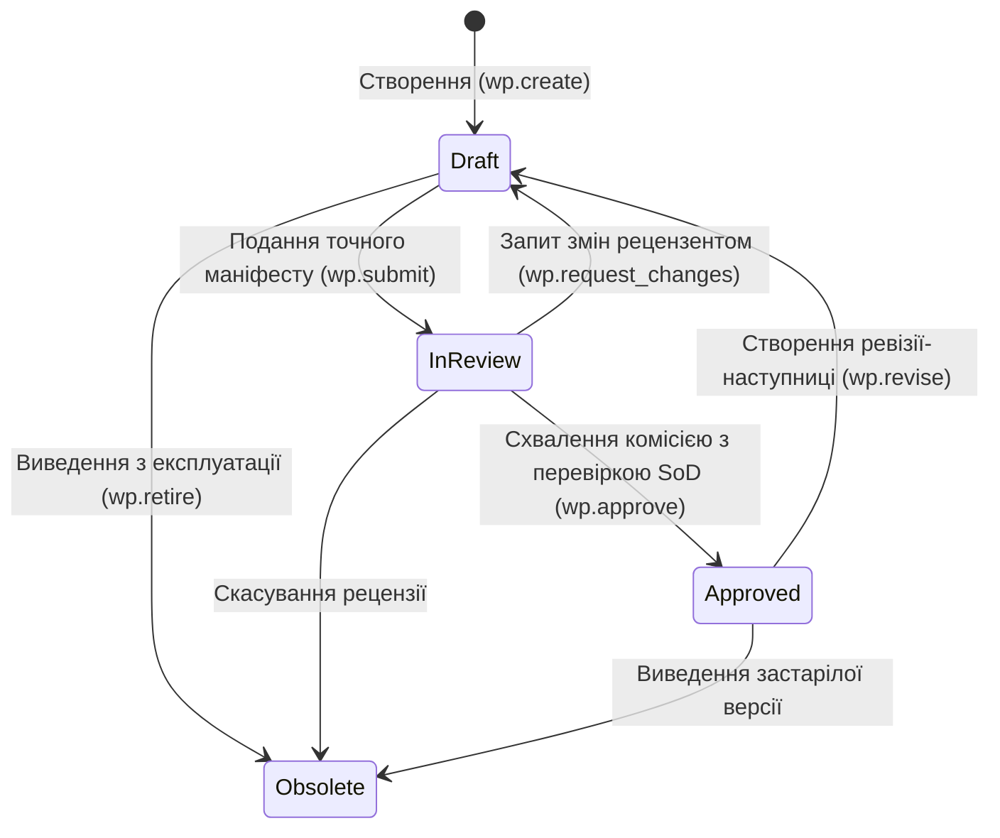
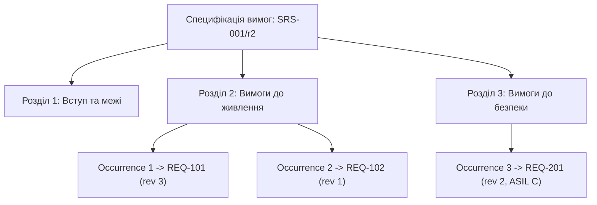

# DELMOS: типи, властивості, переходи Work Products та специфікації

Дата: 2026-09-23. Статус: нормативний архітектурний контракт артефактів та специфікацій.  
Ліцензія: Apache 2.0.  
Контекст: [предметна модель](DOMAIN_MODEL.md), [проєкт і сховища](PROJECT_MODEL.md),
[права доступу](ACCESS_CONTROL.md), [модульна система](MODULES.md),
[вектори та графи](VECTOR_AND_GRAPH_DATA.md),
[вимоги до системи](../requirements/SYSTEM_REQUIREMENTS.md).

---

## 1. Концепція Work Product, ревізії та схеми

**Work Product (WP)** має стабільну ідентичність (UUID) і є результатом інженерної або аналітичної діяльності.

* Завдання (Task / Work Item) описує діяльність; Work Product описує її відчутний результат.
* Work Product може бути планом, атомарною вимогою, специфікацією тесту, архітектурним описом, звітом або формальним рішенням.
* Будь-яка зміна змісту артефакту породжує нову незмінну ревізію (**`WorkProductRevision`**).
* Погодження, аудит та включення до бейзлайнів завжди посилаються на конкретну ревізію та її незмінний хеш корисного навантаження (`payload_hash`).

---

## 2. Базові типи артефактів ядра

Ядро платформи DELMOS надає шість базових типів артефактів:

| `type` | Призначення | Основні властивості | Умова переходу в `approved` |
| --- | --- | --- | --- |
| `plan` | Цілі, обсяг, розклад, ресурси, бюджет та конфігурація проєкту | purpose, scope, objectives, deliverables, schedule, budget, governing_refs | Узгоджені дати, WBS, межі та ресурси; для проєкту — `Generic Project Plan` |
| `requirement` | Перевірюване зобов'язання, функціональна чи нефункціональна вимога | statement, rationale, source_refs, acceptance_criteria, verification_method | Однозначне формулювання, джерело, критерії приймання та метод верифікації |
| `architecture` | Системна, апаратна (HW) чи програмна (SW) структура | scope, elements, interfaces, constraints, decisions, rationale | Визначені межі, інтерфейси, пряме трасування до батьківських вимог |
| `test_spec` | Опис процедури перевірки (тест-кейс, сценарій випробувань) | objective, preconditions, inputs, steps, expected_results, verifies_refs | Відтворювані кроки та очікувані результати; відсутність фіктивного outcome |
| `report` | Результати виконання робіт, протоколи випробувань, звіти R&D | subject_revision_refs, method, environment_ref, observations, conclusion | Точні посилання на перевірені ревізії артефактів та середовище випробувань |
| `record` | Формальний запис рішення, рецензії (Review) чи аудиту | record_kind, occurred_at, participants, subject_refs, decision, rationale | Підтверджений склад учасників, кворум, незалежність рецензентів (SoD) |

Модулі розширюють ці типи через механізм профілів (наприклад, `profile: iso26262:safety_goal` поверх `requirement` або `profile: economics:cost_baseline` поверх `record`).

---

## 3. Спільні поля та інваріанти збереження

| Поле / група | Тип і обов'язковість | Мутабельність / Власник |
| --- | --- | --- |
| `id`, `project_id` | UUID; обов'язкові | Незмінні після створення |
| `code` | Стабільний бізнес-ключ у межах проєкту | Зміна лише через спеціальну міграційну команду |
| `type`, `profile` | Реєстраційні ключі типу та профілю | Визначають застосовну JSON Schema валідації |
| `title`, `body` | Заголовок і текст Markdown | Зміна породжує нову ревізію `WorkProductRevision` |
| `status` | `draft`, `in_review`, `approved`, `obsolete` | Керується виключно FSM-рушієм workflow; пряме редагування заборонене |
| `classification` | Рівень конфіденційності (`internal`, `restricted`) | Зниження грифу вимагає окремого погодження безпеки |
| `metadata` | Структуровані дані у форматі JSONB | Валідуються схемою типу/профілю (JSON Schema Draft 2020-12) |
| `payload_hash` | Криптографічний хеш SHA-256 корисного навантаження | Обчислюється автоматично від канонічного представлення ревізії |
| `content_hash` | Хеш вихідного вмісту | Забезпечує детерміновану перевірку побітової цілісності |
| `row_version` | Токен оптимістичного блокування | Запобігає втраті змін при паралельному редагуванні |

---

## 4. Граф життєвого циклу артефакту (FSM Workflow)

### Інваріанти переходів:
1. Перехід `Approved -> Draft` створює **нову ревізію** артефакту; він ніколи не змінює статус раніше затвердженого знімка.
2. `wp.approve` вимагає перевірки правила розподілу обов'язків (SoD): автор ревізії не може бути її єдиним незалежним затверджувачем.
3. Зміна затвердженого артефакту генерує подію `wp.revision_committed`, що запускає поширення прапорця підозрілості (`is_suspect = true`) по графу залежних зв'язків трасованості.
4. Перед `wp.approve` потрібний щонайменше один позитивний `wp.review` і один незалежний від автора Approval на той самий `revision_id`/`payload_hash`. Рецензія не змінює статус WP; правила призначення, суміщення ролей та повтору визначені в [ADR-009](decisions/ADR-009-core-review-and-approval-policy.md).
5. `wp.request_changes` повертає з `in_review` до `draft` із мотивованим рішенням; стан `rejected` у базовій FSM не існує. Технічний конфлікт версій не є рецензійним рішенням і не змінює стан.

---

## 5. Специфікація та композитний документ

Специфікація є керованим складеним Work Product, що визначає вимоги, процедури випробувань, інтерфейси або технічні характеристики системи.

Композитний документ — це механізм побудови цілісного документа зі структури розділів, пояснювального тексту та посилань на самостійні керовані елементи (атомарні вимоги чи тест-кейси).

### 5.1. Склад та ідентичність композиції

| Поняття | Контракт у DELMOS |
| --- | --- |
| **Specification** | Work Product із власною ідентичністю, типом, профілем, схемою та життєвим циклом погодження. |
| **Specification Element** | Окремий Work Product (вимога, тест-кейс) із власними полями, ревізіями, зв'язками трасованості та життєвим циклом. |
| **Document Structure** | Дерево розділів і впорядкованих позицій (occurrences); кожен розділ має локальний стабільний ключ. |
| **Occurrence** | Входження елемента: унікальний `occurrence_id`, батьківський розділ, порядковий номер, посилання на цільовий `wp_id` та конкретний `revision_id`. |
| **Composition Manifest** | Незмінний аудиторський маніфест конкретної ревізії специфікації: структура, порядок, точні ревізії та хеші елементів. |

### 5.2. Правила версіонування, погодження та повторного використання
1. **Незмінність маніфесту:** Кожна збережена ревізія специфікації містить точний зріз ревізій усіх включених елементів.
2. **Незалежність погоджень:** Затвердження специфікації не погоджує автоматично її елементи; погодження окремих вимог не означає затвердження всієї специфікації.
3. **Повторне використання без копіювання:** Одна й та сама вимога може входити до кількох різних специфікацій; зміна вимоги в одній специфікації не змінює зафіксовані історичні ревізії в інших.
4. **Контроль доступу:** Читання чи експорт специфікації перевіряє права користувача на кожен включений елемент; за наявності недоступного засекреченого елемента повний експорт блокується.
5. **Захист від видалення:** Видалення позиції зі специфікації або архівація документа не видаляє саму вимогу чи тест-кейс із бази даних.

---

## 6. Сценарії приймання композитних специфікацій (SPEC-01..10)

Статус: **нормативний контракт для інтеграційного тестування ядра**.

| ID | Область | Дія та передумова | Очікуваний результат |
| --- | --- | --- | --- |
| **SPEC-01** | Створення | Створення специфікації вимог (SRS) із розділами та прив'язкою елементів | Створено складений WP із власним ID; елементи зберегли власну ідентичність; цілісне дерево розділів. |
| **SPEC-02** | Повторне використання | Включення однієї вимоги `REQ-001/r2` до двох різних специфікацій | Єдиний цільовий WP, різні `occurrence_id`; відсутність дублювання записів у базі; коректний підрахунок метрик покриття. |
| **SPEC-03** | Ізоляція ревізій | Створення нової ревізії вимоги `REQ-001/r3` після затвердження специфікації `SRS/r1` | Маніфест і хеш `SRS/r1` залишаються абсолютно незмінними; оновлена вимога відображається в аналізі впливу, але не підставляється автоматично. |
| **SPEC-04** | Оновлення маніфесту | Оновлення закріпленої ревізії вимоги або зміна порядку розділів у специфікації | Створюється нова ревізія специфікації з новим `payload_hash`; погодження попередньої версії не переноситься. |
| **SPEC-05** | Незалежне SoD | Спроба затвердити специфікацію, якщо автор виступає єдиним затверджувачем | Дія блокується правилом SoD; схвалення специфікації не змінює статуси окремих вимог. |
| **SPEC-06** | Права доступу | Користувач переглядає специфікацію, але не має доступу до однієї із засекречених вимог | Повний експорт документа блокується; у перегляді відображається відмітка обмеження без витоку тексту. |
| **SPEC-07** | Захист видалення | Видалення розділу зі специфікації або архівація специфікації | Включені елементи залишаються неушкодженими в системі; спроба фізичного видалення елемента з ревізії відхиляється. |
| **SPEC-08** | Конкурентність | Паралельне збереження маніфесту двома інженерами з однаковою версією `row_version` | Оптимістичне блокування відхиляє один із запитів із конфліктом версій; відсутність пошкодження дерева. |
| **SPEC-09** | Захист від циклів | Спроба включити специфікацію саму в себе або створити циклічне вкладення розділів | Валідатор графа блокує операцію; збереження структури відкочується в транзакції. |
| **SPEC-10** | Відтворюваність | Відкриття старої ревізії специфікації після створення десятків нових версій вимог | Початкова структура, текст і точні ревізії елементів відтворюються з маніфесту на 100% точно. |
