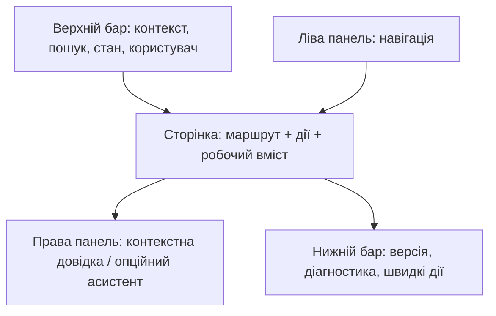

# DELMOS: оболонка Web GUI (Core Shell)

Дата: 2026-09-23. Статус: цільовий контракт Core GUI; не твердження про готову реалізацію.
Ліцензія: Apache 2.0.
Контекст: [огляд GUI](README.md), [архітектура](../ARCHITECTURE.md), [модель доступу](../ACCESS_CONTROL.md).

---

## 1. Межа відповідальності

Одна реалізація `AppShell` володіє постійними областями, маршрутизатором, станом доступу, повідомленнями й фокусом. Модуль може реєструвати маршрут, елемент навігації та контекст правої панелі, але не створює власний глобальний header/footer/sidebar. Публічні сторінки входу використовують мінімальну оболонку без проєктної навігації. Не переносити паралельні варіанти одних і тих самих компонентів як дві незалежні оболонки.

## 2. Верхній бар і контекст

| Зона | Призначення | Правило |
| --- | --- | --- |
| Ідентичність | Назва продукту, перемикач програми/проєкту, відкриття навігації | Активний контекст видно без UUID; перехід між контекстами не змінює права мовчки. |
| Орієнтація | Пошук у доступному контексті, breadcrumb або короткий заголовок | Не показувати фіктивний глобальний пошук: спочатку проєктний, потім глобальний після появи індексу та політики доступу. |
| Стан і дії | Лише важливі агреговані збої/деградація, повідомлення, профіль і налаштування | Не перетворювати верхній бар на панель кожної інтеграції; деталі за запитом. Перевірка стану має захист від паралельних повторів і обмеження частоти. |

Кожне повідомлення про стан містить текстовий стан (`Готово`, `Немає зв'язку`, `Перевіряється`), час останньої перевірки та доступний шлях до діагностики. Відсутня інтеграція не означає недоступність локального ядра. Меню користувача містить профіль, налаштування вигляду, мову, вихід; сесія й права залишаються серверними, не зберігаються в `localStorage`.

## 3. Ліва навігація

Навігація залежить від контексту: система, програма, проєкт. У проєкті стабільні групи ядра (огляд, план, робота/артефакти, трасованість); активовані модулі додають елементи у визначених групах. Два рівні вкладення максимум; короткі назви, видимий активний маршрут і автоматичне розкриття його батьківської групи. При відсутності прав або вимкненому модулі навігація не обіцяє недоступну дію; явне посилання на стан доступу може лишатися у налаштуваннях.

Розгорнута/згорнута панель, підказки для значків у згорнутому стані та збереження несекретного вибору користувача потрібні. На вузьких екранах панель стає накладною: відкриття кнопкою, закриття Escape/кліком на тлі, повернення фокусу на кнопку; вміст сторінки не змінює ширину під накладкою. Ширина і поріг перемикання визначаються перевіркою реального вмісту на вузьких/широких екранах, а не копіюються як сталі числа.

## 4. Основна область

Шаблони `list`, `detail/edit`, `dashboard`, `wizard` мають спільні breadcrumb, заголовок, головну дію та модель станів. Для кожного запису — стабільна URL-адреса; пошук, фільтри, сортування і вкладка, що впливають на зміст, відновлюються з URL після reload/back/forward. Створення, редагування, імпорт, погодження, налаштування й багатокрокова робота мають адресні маршрути, не модальні вікна. Модальне підтвердження дозволено для руйнівної дії або виходу з незбереженими змінами, але не для обходу серверної заборони.

Прокручується робоча область, не весь viewport разом з панелями; фіксована нижня панель дій форми не перекриває останнє поле на мобільному. Перехід маршруту переміщує фокус до заголовка основного вмісту; є посилання «Перейти до вмісту» й послідовний порядок заголовків.

## 5. Права панель

Контекстна довідка доступна **офлайн**, без зовнішнього сервісу. Вона знає маршрут і обраний запис, дозволяє шукати по допомозі та відповідає на питання «для чого», «що потрібно до початку», «що зробити далі». Асистент є окремим режимом, який не замінює обов'язкову локальну довідку: якщо його немає, інтерфейс залишається повноцінним. Панель може вміщувати допоміжні інструменти поточного маршруту; модуль передає зміст через [контракт внесків](MODULE_UI_CONTRIBUTIONS.md), а не керує DOM оболонки.

У вузькому viewport права панель відкривається поверх сторінки з керованим фокусом; після закриття фокус повертається на тригер. Зміна маршруту оновлює тему допомоги, але не стирає чернетку користувача без підтвердження. Для короткого пояснення одного поля перевагу має текст біля поля або popover, не вся права панель.

## 6. Нижній статус-бар

Нижній бар дає компактну діагностику, не дублює верхній: версія UI/API, кількість невирішених помилок і попереджень сторінки, копіювання **безпечного** контексту підтримки (URL, версії, correlation ID), виклик довідки зі скорочень. Час/таймзона можливі як необов'язкові дані; частий live clock не є обов'язковим і не має створювати зайвих `aria-live` оголошень. Кнопка копіювання ніколи не включає токени, секрети, сирі логи чи `restricted` вміст. Тривога в нижньому барі веде до місця помилки, а не лише показує лічильник.

На мобільному пріоритет: повідомлення про збій і шлях до дії; другорядні версія/час/скорочення переносяться до меню, не урізають основний контент. Кольори й значки доповнюються текстом і доступною назвою.

## 7. Комбінації клавіш, налаштування й адаптивність

Швидкі клавіші для панелей і довідки реєструються централізовано, конфлікти відхиляються; команди не працюють у полях вводу, `contenteditable` чи під час IME. Довідка зі скорочень доступна з інтерфейсу і з клавіатури, а інтерфейс лишається повністю керованим без скорочень. Налаштування вигляду, мови та щільності можуть зберігатися як вподобання користувача, але не як джерело прав/сесії.

Перевіряти десктоп/планшет/мобільний розмір, збільшення до 200%, світлу/темну тему, клавіатуру й screen reader. Рух залежить від `prefers-reduced-motion`; наведення не є єдиним способом побачити підказку. Структуру і дизайн-токени звіряти з [правилами Pajamas](DESIGN_SYSTEM.md), не повторювати наявні жорстко задані кольори/тіні.

## 8. Операційна перевірка

Мінімальні acceptance-перевірки оболонки: прямий вхід на URL запису з reload; back/forward з відновленням фільтрів; зміна проєкту без витоку навігації/прав; деградація зовнішнього провайдера без втрати локальної довідки; вузький екран з двома панелями; клавіатурний доступ і повернення фокусу; редагування з незбереженими змінами; копіювання діагностики без секретів.