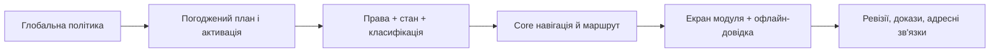

# DELMOS: контракт UI-внесків модулів

Дата: 2026-09-23. Статус: цільовий контракт для реалізації; не реалізований програмний інтерфейс.
Ліцензія: Apache 2.0.
Контекст: [модульна система](../MODULES.md), [керування планом](../PROJECT_PLAN_ENGINE.md), [права доступу](../ACCESS_CONTROL.md), [оболонка](CORE_SHELL.md), [Guided UI](GUIDED_EXPERIENCE.md).

---

## 1. Три рівні відповідальності

| Рівень | Власність | Приклад |
| --- | --- | --- |
| Core GUI | Маршрутизатор, shell, зони навігації, права, guided-help engine, системні стани, сповіщення, компоненти форм/таблиць/графіків | Огляд проєкту, `WorkProduct` detail/editor, незмінні ревізії. |
| Горизонтальний модуль | Робочий екран з перевикористовуваними патернами без прив'язки до індустрії | `tooling.rtm_matrix`, `tooling.test_execution`, майбутній релізний планувальник. |
| Галузевий модуль | Поля, шкали, види доказів, workflow/дашборд лише за активним стандартом | `compliance.aspice`, `compliance.iso26262`, `compliance.iso21434`; [інші галузі](../../compliance/domains/README.md) — тільки плани. |

`ModuleDefinition/ModuleRelease` визначає зареєстровані внески. `ModuleSystemPolicy` дозволяє їх інсталяції, а `ModuleActivation` набуває чинності для проєкту **після** погодженого `plan.apply`. Наявність зібраного компонента у frontend не є правом бачити його чи використовувати. Вимкнення зберігає історичні адресні докази: маршрут перегляду лишається доступним лише за правом на читання, а дії редагування/нового створення відключаються; видалення маршруту не може ламати посилання бейзлайнів.

## 2. Опис внеску

Реєстр модулів постачає **декларацію**, Core валідовує її на старті та перед показом. Схема полів нижче є цільовим прикладом, не поточним TypeScript API:

```ts
type UiContribution = {
  moduleId: string;
  routeKey: string;
  path: string;
  navGroup: 'project' | 'work' | 'verification' | 'compliance' | 'management';
  navLabel: string;
  requiredPermission: string;
  featureKey: string;
  pageKind: 'list' | 'detail' | 'editor' | 'dashboard' | 'workflow';
  helpTopic: string;
  emptyStateKey: string;
  nextSteps: Array<{ routeKey: string; requiredPermission: string }>;
  component: () => Promise<unknown>;
};
```

Обов'язкові інваріанти: унікальні `routeKey/path`, URL без внутрішньої назви постачальника, пункт навігації максимум на другому рівні, доступна офлайн-довідка, мінімум `loading/empty/error/forbidden`, локалізовані назви та server-side перевірка дозволів на кожну команду. `featureKey` означає застосовану версію модуля й відповідний capability, не просто frontend feature flag. Порядок і група меню визначаються Core; модуль не може вставити власний app header, повідомлення в системну зону чи обійти перевірку активації. Для URL з фільтрами стан серіалізується у query-параметри і відновлюється при reload.

## 3. Правила роботи з полями та діями

`WPTypeProvider` і `PropertyExtensionProvider` постачають тип/JSON Schema/поля й help-тексти, але ядро лишається власником `id`, `project_id`, `code`, `status`, `row_version`, ревізій, погодження та SoD. Екран редагування базового типу не розгалужується на форми для кожного стандарту: секції модулів додаються за профілем, показуються лише якщо потрібні, а JSON Schema і серверна валідація мають однаковий результат. Роль, стан артефакту й рівень секретності фільтрують і поля, і підказки. При деактивації поля лишаються в історичних ревізіях read-only.

`PlanSectionProvider`, `DictionaryProvider`, `MilestoneProvider`, `TriggerRuleProvider` та `MetricProvider` дають конфігураційні розділи плану, словники, віхи, правила і показники. UI пояснює, чому поле/віха існує і які докази потрібні; редагування плану проходить review/apply, а не автоматично міняє чинний процес. Значення правил/допустимих enum-ів визначає версія активованого модуля, не захардкоджений колір бейджа. У виняткових випадках (Waiver) потрібен окремий workflow і посилання на рішення.

## 4. Навігація між модулями



Спільний екран може поєднувати дозволені внески кількох модулів (наприклад, вимога + безпека + трасованість). Подвійні пункти меню, конфлікт ідентифікаторів чи конкуруючі primary actions відхиляються під час реєстрації. Після зміни плану/ролі видимі пункти переглядаються без витоку назв прихованих записів. Неактивний модуль може показати зрозумілу сторінку налаштування лише користувачу з правом активації, іншим — причину недоступності без фальшивого CTA.

## 5. Адаптація аналізу й AI

AI/аналітика є **опційним** модулем, не частиною обов'язкового Core; Core володіє правою панеллю, офлайн-довідкою, дозволами й безпечним відображенням Markdown. Асистент показує джерела як точні посилання на артефакт/ревізію; недоступні джерела не розкриваються. Виконання дієвої пропозиції (створити/змінити/видалити/застосувати) вимагає попереднього перегляду змін, прав користувача, явної згоди й серверного аудиту. Потоковий текст санітизується; зовнішні посилання відрізняються від внутрішніх. Якщо AI не налаштовано чи недоступний — звичайні процеси та довідка продовжують працювати.

## 6. Критерії приймання внеску

- Режим модуля: глобально заблокований, доступний але неактивований, активний, призупинений, архівний — кожен має перевірені навігацію й deeplink.
- Для новачка є текст «навіщо/що треба/що далі» і потрібний контекст inline, а глибша допомога працює офлайн.
- Доступна лише дозволена дія; сервер повторно перевіряє права й SoD, включно з прямим URL та старою вкладкою після зміни ролі.
- Мобільний, keyboard, focus, screen reader, light/dark, `prefers-reduced-motion` проходять разом зі станами `loading/empty/error`.
- Сторінка має автоматичний сценарій smoke/UAT; модуль не знищує сторінки історичних доказів після деактивації.

Перелік запланованих екранів та їхніх власників — у [карті GUI-сценаріїв](SCREEN_CATALOG.md).