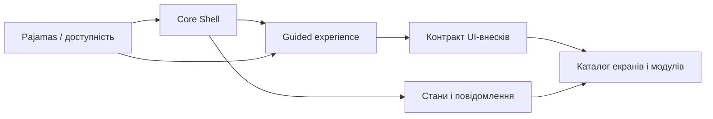

# DELMOS: керований вебінтерфейс (Guided UI)

Дата: 2026-09-23. Статус: цільова архітектура інтерфейсу; реалізація поетапна.
Ліцензія: Apache 2.0.
Контекст: [архітектура](../ARCHITECTURE.md), [модульна система](../MODULES.md), [сценарії користувачів](../../use-cases/PROJECT_MANAGER.md).

---

## Принцип відповідальності

**Core GUI** відповідає за навігаційну оболонку, статус, повідомлення, доступність, стан сторінок і спільний контракт підказок. **Модулі** реєструють маршрути, назви дій, пояснення користі, передумови, докази та наступні кроки своїх сценаріїв; вони не змінюють оболонку напряму. Кожна сторінка пояснює новому користувачеві, що тут можна зробити, навіщо це потрібно й який найближчий доречний крок, але не повторює очевидні підписи контролів.

Цей каталог описує запланований інтерфейс, а не стверджує, що всі екрани вже реалізовані.

## Документи та власники

| Документ | Власник | Що вирішує |
| --- | --- | --- |
| [CORE_SHELL.md](CORE_SHELL.md) | Core GUI | Верхній/нижній бари, ліва і права панелі, навігація, responsive, клавіатура, deeplinks. |
| [GUIDED_EXPERIENCE.md](GUIDED_EXPERIENCE.md) | Core GUI + тексти модулів | Як пояснити новачку мету, передумови, дію, блокування і наступний крок на самій сторінці. |
| [STATES_AND_FEEDBACK.md](STATES_AND_FEEDBACK.md) | Core GUI | Loading/empty/error/forbidden, повідомлення, сповіщення, dirty state, погодження й SoD. |
| [DESIGN_SYSTEM.md](DESIGN_SYSTEM.md) | Спільний дизайн-шар | Актуальні Pajamas патерни, Vue 3 сумісність, компоненти, доступність, дизайн-токени. |
| [BRANDING.md](BRANDING.md) | Власний бренд DELMOS | Вимоги до знака, wordmark, активів і їх правового статусу без вигаданого готового логотипу. |
| [COMPONENT_SPECIFICATIONS.md](COMPONENT_SPECIFICATIONS.md) | Core GUI / елементи | Складені елементи оболонки й робочих сторінок, власники, стани та критерії доступності. |
| [LOCALIZATION.md](LOCALIZATION.md) | Core GUI / модулі / контент | Переклад UI і допомоги, локальні формати та межа з незмінними ревізіями інженерних документів. |
| [UI_CONTENT.md](UI_CONTENT.md) | Спільний редакційний шар | Тон, термінологія, тексти дій, передумов, помилок і наступних кроків. |
| [MODULE_UI_CONTRIBUTIONS.md](MODULE_UI_CONTRIBUTIONS.md) | Межа Core ↔ модулі | Контракт маршруту/навігації/довідки, активація, права, секції форм, AI. |
| [SCREEN_CATALOG.md](SCREEN_CATALOG.md) | Core / горизонтальні / галузеві | Карта всіх 14 досліджених спеціалізованих екранних сценаріїв із власником і guided-поведінкою. |
| [UX_DELIVERABLES.md](UX_DELIVERABLES.md) | Дизайн-процес | Що ще дослідити й створити: journeys, sitemap, wireflows, макети, прототипи, usability-тести та handoff. |

## Правила застосування

1. Будь-який новий маршрут спершу отримує власника Core або конкретного активованого модуля, стабільну адресу, модель прав, локальну довідку і стани завантаження/відмови.
2. UI не вигадує бізнес-правила. Обов'язковість полів і оцінок надходить із відповідних [SWR](../../requirements/software/README.md), [модульного контракту](../MODULES.md) та активної версії схеми; сервер є джерелом істини для дозволів, SoD і підписів.
3. Guided-тексти пояснюють мету в точці рішення, але не перетворюють кожну сторінку на навчальну статтю. Критичні причини відмови залишаються видимими, необов'язкова довідка доступна офлайн.
4. Зовнішні приклади дизайну та реалізації є джерелом патернів, не кодом для сліпого копіювання: зберігаємо корисний досвід панелей/статусів/підказок, але не специфічні інтеграції, фіксовані палітри, недоступні API компонентів чи ослаблення правил безпеки.
5. Власний бренд, переклади й UX-тексти проєктуються разом зі станами сторінки; зміна локалі відображення не змінює затверджених ревізій артефактів. Не вважати brand assets, дослідження або макети готовими, доки не завершено критерії з [реєстру UX-артефактів](UX_DELIVERABLES.md).

## Послідовність реалізації та перевірки

| Фаза | Що має запрацювати | Демонстраційний доказ |
| --- | --- | --- |
| P0–P1 | Єдина доступна оболонка, локальна допомога, активний контекст, система дозволів, роутинг, адаптивні панелі | Прямий URL проєкту, мобільний екран, керування лише клавіатурою, локальна допомога без інтернету. |
| P2 | Сторінки плану й Work Product, типізовані поля, ревізії, перевірки, dirty state | Новачок створює проєкт/план, вимогу, повертається до ревізії за адресою. |
| P3–P4 | Трасованість/метрики, повідомлення про правила та чергу | Адресний фільтр, зрозуміла причина veto, шлях виправлення, таблиця поряд із графіком. |
| P5–P6 | Ресурси, витрати, статус зовнішніх сховищ | Зовнішній сервіс недоступний, але локальний workflow і довідка працюють. |
| P7 | Повне візуальне покриття модулів та UI-регресія | Скриншоти light/dark desktop/mobile, keyboard/screen reader і UAT за ролями. |

Не чекати P7, щоб почати дизайн і тести: кожна фаза реалізує власні екранні стани та доступність одночасно з відповідною функцією. [Дорожня карта](../ROADMAP.md) задає порядок доменних можливостей, а цей документ — критерії UX на кожному етапі.