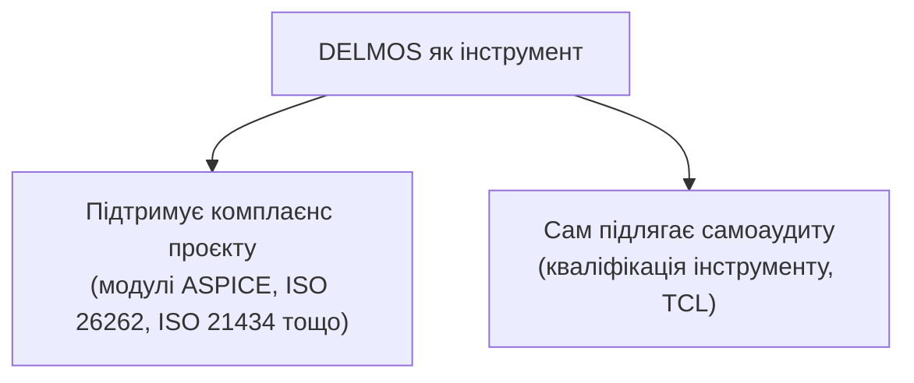

# DELMOS: комплаєнс та відповідність стандартам (Compliance)

Дата: 2026-09-23. Статус: нормативний реєстр документації з відповідності стандартам.
Ліцензія: Apache 2.0.
Контекст: [MEMO-002: стратегія кваліфікації інструменту та комплаєнсу](../memos/MEMO-002-tool-qualification-and-compliance-strategy.md),
[архітектура тайлорингу модулів](../architecture/decisions/ADR-004-two-tier-module-governance-generic-plan.md).

---

## 1. Область застосування

DELMOS виступає у двох ролях одночасно:

1. **Як інструмент підтримки комплаєнсу проєкту** — опційні модулі (`compliance.aspice`, `compliance.iso26262` тощо) додають до проєктного плану обов'язкові розділи, поля та правила трасованості відповідно до обраного стандарту.
2. **Як об'єкт самоаудиту (Tool Qualification)** — сам процес розробки DELMOS та достовірність його автоматизованих перевірок (наприклад, рушій правил) підлягають формальній оцінці рівня довіри до інструменту.

## 2. Мапування стандартів

| Стандарт | Де покрито |
| --- | --- |
| ASPICE 4.0 (SYS.1–5, SWE.1–6) | Опційний модуль `compliance.aspice`; методологія вимог у [docs/requirements/README.md](../requirements/README.md) |
| ISO 26262 (Функціональна безпека) | Опційний модуль `compliance.iso26262`; кваліфікація інструменту — [MEMO-002](../memos/MEMO-002-tool-qualification-and-compliance-strategy.md) |
| ISO 21434 (Кібербезпека) | Опційний модуль `compliance.iso21434` (заплановано, дорожня карта [ROADMAP.md](../architecture/ROADMAP.md)) |
| Кваліфікація інструменту (TCL/TQL-подібна модель) | [STANDARD_MAPPING_TEMPLATE.md](STANDARD_MAPPING_TEMPLATE.md), [MEMO-002](../memos/MEMO-002-tool-qualification-and-compliance-strategy.md) |

## 3. Документи

| Документ | Призначення |
| --- | --- |
| [STANDARD_MAPPING_TEMPLATE.md](STANDARD_MAPPING_TEMPLATE.md) | Порожній шаблон таблиці «Стандарт → Базова практика → Можливість DELMOS → Доказ» для заповнення під час активації нового галузевого модуля |
| [domains/README.md](domains/README.md) | Реєстр напрямків розширення комплаєнсу за галузевими доменами (Domain Areas) |

## 4. Домени комплаєнсу (Domain Areas)

Крім наскрізного мапування стандартів (розділ 2), кожен галузевий домен, де існує усталена практика комплаєнсу для HW/SW-проєктів, має власний файл напрямку розширення в [domains/](domains/README.md):

| Домен | Файл |
| --- | --- |
| Automotive | [domains/AUTOMOTIVE.md](domains/AUTOMOTIVE.md) |
| Aviation & Aerospace | [domains/AVIATION.md](domains/AVIATION.md) |
| Medicine | [domains/MEDICAL.md](domains/MEDICAL.md) |
| Marine & Offshore | [domains/MARINE.md](domains/MARINE.md) |
| Military & Defense | [domains/MILITARY_DEFENSE.md](domains/MILITARY_DEFENSE.md) |
| Financial Services | [domains/FINANCIAL.md](domains/FINANCIAL.md) |
| Railway | [domains/RAILWAY.md](domains/RAILWAY.md) |
| Industrial Automation & Machinery | [domains/INDUSTRIAL_AUTOMATION.md](domains/INDUSTRIAL_AUTOMATION.md) |
| Space | [domains/SPACE.md](domains/SPACE.md) |
| Nuclear Energy | [domains/NUCLEAR_ENERGY.md](domains/NUCLEAR_ENERGY.md) |
| Power Generation & Distribution | [domains/POWER_GENERATION_DISTRIBUTION.md](domains/POWER_GENERATION_DISTRIBUTION.md) |
| Public Safety | [domains/PUBLIC_SAFETY.md](domains/PUBLIC_SAFETY.md) |
| IoT & Consumer Cybersecurity | [domains/IOT_CYBERSECURITY.md](domains/IOT_CYBERSECURITY.md) |
| iGaming, Gambling, Lottery & Sports Betting | [domains/GAMING_GAMBLING.md](domains/GAMING_GAMBLING.md) |
| Digital Media | [domains/DIGITAL_MEDIA.md](domains/DIGITAL_MEDIA.md) |
| Home Security | [domains/HOME_SECURITY.md](domains/HOME_SECURITY.md) |
| Telecom | [domains/TELECOM.md](domains/TELECOM.md) |
| Commodity Networks & Wi-Fi | [domains/COMMODITY_NETWORKS_WIFI.md](domains/COMMODITY_NETWORKS_WIFI.md) |
| Consumer Electronics | [domains/CONSUMER_ELECTRONICS.md](domains/CONSUMER_ELECTRONICS.md) |
| Biology Research | [domains/BIOLOGY_RESEARCH.md](domains/BIOLOGY_RESEARCH.md) |
| Pharmaceutical | [domains/PHARMACEUTICAL.md](domains/PHARMACEUTICAL.md) |

## 5. Наскрізні (горизонтальні) стандарти

Ці стандарти не прив'язані до конкретної галузі й застосовуються до будь-якого проєкту DELMOS:

| Стандарт | Файл |
| --- | --- |
| Information Security & Cybersecurity | [domains/INFORMATION_SECURITY_CYBERSECURITY.md](domains/INFORMATION_SECURITY_CYBERSECURITY.md) |
| Personal Data Protection | [domains/PERSONAL_DATA_PROTECTION.md](domains/PERSONAL_DATA_PROTECTION.md) |

## 6. Принцип доказовості

Кожне твердження про відповідність стандарту супроводжується конкретним артефактом-доказом (посилання на `Work Product`, звіт, бейзлайн), а не декларативним твердженням без підтвердження. Це узгоджується з правилом незмінності доказів у [VISION.md, принцип 5](../guides/VISION.md#3-принципи-продукту).
