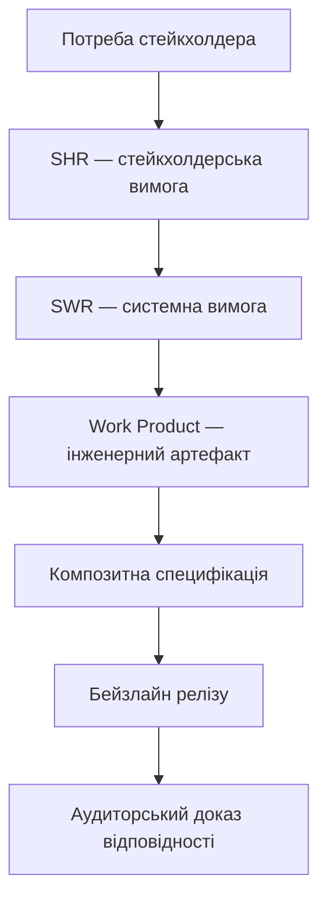
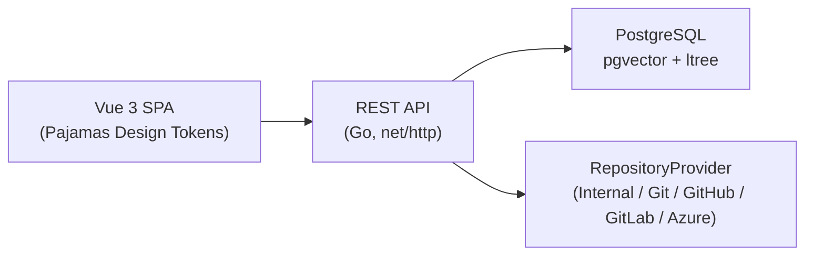

# DELMOS — бачення продукту (Vision)

**Останнє оновлення:** 2026-09-23
**Статус:** Живий документ (Living Vision)
**Ліцензія:** Apache 2.0
**Область застосування:** Продукт DELMOS, документація, беклог та дорожня карта контриб'юторів.

Контекст: [README проєкту](../../README.md), [ядро та архітектура](../architecture/ARCHITECTURE.md),
[SWOT-аналіз](../architecture/SWOT_ANALYSIS.md), [дорожня карта](../architecture/ROADMAP.md).

---

## 1. Заява про бачення (Vision Statement)

DELMOS — це відкрита, незалежна від вендора операційна система інженерного життєвого циклу (ELM) та проєктної економіки (Project ERP/PPM), що зберігає **всі** дані — реляційні, векторні (семантичні) та графові (трасованість) — в єдиній транзакційній базі PostgreSQL. Мета DELMOS: зробити наскрізну простежуваність від бізнес-потреби до випробуваного програмно-апаратного продукту доступною будь-якій інженерній команді без необхідності інтегрувати чотири-п'ять окремих спеціалізованих SaaS-інструментів.

## 2. Чому DELMOS існує

Інженерні команди в регульованих галузях (Automotive, Aerospace, Medical Devices, Robotics, Industrial IoT) сьогодні змушені склеювати разом трекер задач, вікі документації, окрему систему вимог, окремий інструмент трасованості та таблиці Excel для економіки проєкту. Кожна межа між інструментами — це точка втрати простежуваності та додаткові ручні звірки перед аудитом. DELMOS усуває фрагментацію: одна транзакційна модель даних, один механізм авторизації, один незмінний журнал ревізій.

## 3. Принципи продукту

1. **Артефакти понад завданнями (Work Products first).** Виконання задачі не є доказом якості; результат перевіряється як окремий версійований артефакт.
2. **Git-сумісність без прив'язки до вендора.** Дані можуть синхронізуватися із зовнішнім сховищем, але не залежать від жодного конкретного постачальника.
3. **Специфікація через композицію, а не копіювання.** Повторне використання вимог і тестів відбувається через посилання, а не клонування.
4. **Прозора модель авторизації.** Кожна дія перевіряється на сервері; відсутність кнопки в інтерфейсі ніколи не замінює перевірку прав.
5. **Незмінність доказів.** Затверджені ревізії та бейзлайни ніколи не редагуються заднім числом — лише нові ревізії.
6. **Модульність за замовчуванням.** Методологія (Scrum/Waterfall) чи галузевий комплаєнс (ASPICE, ISO 26262) — опційні модулі, а не вбудована догма.
7. **Один запис істини для економіки проєкту.** Бюджет, трудовитрати та EVM-метрики обчислюються з тих самих первинних записів, що й інженерний прогрес.
8. **Наскрізна простежуваність без ручного звірення.** Зв'язок між стейкхолдерською потребою та тестовим доказом обчислюється рекурсивним запитом, а не підтримується вручну в таблиці.
9. **Спостережуваність без витоку секретів.** Повна діагностика експлуатації без розкриття чутливих даних у журналах.
10. **Локальний контроль даних.** Дані інсталяції залишаються на інфраструктурі власника; не вимагається обов'язкова передача даних третій стороні.

## 4. Цільовий досвід за ролями

* **Programme Manager:** зведений огляд статусу кількох проєктів, ризиків залежностей та розподілу ресурсів без ручного збирання звітів.
* **Project Manager:** створення проєкту з автоматичним планом за один крок, контроль бюджету через EVM-показники в реальному часі, керування активацією модулів без залучення розробників.
* **Requirements Engineer:** авторинг вимог і композитних специфікацій з миттєвою валідацією посилань та автоматичним обчисленням хешу цілісності.
* **Architect:** документування архітектурних рішень (ADR) з формальною простежуваністю до вимог і подальшої реалізації.
* **Safety / Cybersecurity / Quality Manager:** активація галузевого комплаєнс-модуля з автоматичним розширенням структури плану та обов'язкових полів, без ручного ведення окремих реєстрів відповідності.
* **Contributor (розробник):** чіткий локальний цикл розробки, єдиний ворота якості (`make validate`), передбачувана структура коду.

## 5. Цільова архітектура (спрощено)

## 6. Теми дорожньої карти

Детальний план фаз P0–P7 наведено в [architecture/ROADMAP.md](../architecture/ROADMAP.md). На верхньому рівні теми розвиваються в такому порядку: **надійний фундамент → предметне ядро → артефакти й специфікації → векторні та графові дані → автоматизація → проєктна економіка → мультипровайдерні сховища → вебінтерфейс**.

## 7. Сигнали успіху

| Сигнал | Як виглядає добре |
| --- | --- |
| Час створення нового проєкту з готовим планом | Секунди, а не години ручного налаштування |
| Простежуваність вимог до тестів | Обчислюється запитом за мілісекунди, без ручної таблиці Excel |
| Цілісність бейзлайну релізу | Жодного розбіжного хешу між заявленим і фактичним станом артефактів |
| Активація галузевого комплаєнсу | Один клік адміністратора + один клік проєктного менеджера, без ручного редагування шаблонів |
| Відновлення після збою | Підтверджений RTO за результатами регулярних навчань (DR Drill) |

## 8. Не-цілі (Non-Goals)

* DELMOS не є заміною повноцінної системи керування версіями коду (Git-хостингу) — платформа інтегрується з наявними сховищами, а не конкурує з ними.
* DELMOS не прагне стати універсальним CRM чи системою бухгалтерського обліку підприємства — модуль економіки обмежений проєктним рівнем (EVM, P&L проєкту).
* DELMOS не нав'язує єдину методологію розробки — Scrum, Waterfall та галузеві стандарти є рівноправними опційними модулями.

## 9. Авторитетні посилання

* [README проєкту](../../README.md)
* [architecture/ARCHITECTURE.md](../architecture/ARCHITECTURE.md)
* [architecture/SWOT_ANALYSIS.md](../architecture/SWOT_ANALYSIS.md)
* [architecture/ROADMAP.md](../architecture/ROADMAP.md)
