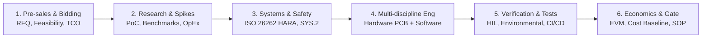

# MEMO-001: Розширення інженерного контуру: Pre-sales, Feasibility, Research, Hardware, Systems та Delivery

- **Дата:** 2026-09-23
- **Автор:** DELMOS Architecture Team
- **Статус:** Стратегічний концептуальний меморандум
- **Контекст:** [SWOT-аналіз](../architecture/SWOT_ANALYSIS.md), [предметна модель](../architecture/DOMAIN_MODEL.md).

---

## 1. Проблема вузької «суто софтверної» орієнтації

Більшість сучасних систем керування розробкою розглядають процес виключно через призму написання коду для ПЗ (Software Engineering). Проте у високотехнологічних галузях (Automotive, Aerospace, MedTech, Robotics) розробка програмного забезпечення становить лише частину загального інженерного виробу.

Спроба ізолювати софт від апаратного забезпечення (Hardware), початкових досліджень (Research / R&D) та комерційної оцінки (Pre-sales) призводить до розриву простежуваності та неконтрольованих фінансових втрат:
* Вимоги замовника в тендерній документації (RFQ/RFP) не доходять до архітекторів у вихідному вигляді;
* Дослідницькі звіти та прототипи губляться на мережевих дисках без прив'язки до ревізій;
* Апаратні обмеження чіпів, теплові режими друкованих плат (PCB) та BOM ведуться окремо від прошивок;
* Бухгалтерія не може розділити інвестиційні капіталізовані витрати (CapEx) та операційні дослідження (OpEx).

---

## 2. Повний контур життєвого циклу в DELMOS

DELMOS долає цей бар'єр, поєднуючи всі етапи створення виробу в єдиний транзакційний простір:

### Етап 1: Pre-sales & Bidding
* Фіксація первинних вимог клієнта (Customer RFQ/RFP) як артефактів типу `requirement`.
* Створення техніко-економічного обґрунтування (`economics:business_case_summary`) з попередньою оцінкою собівартості робіт на основі аналогічних проєктів минулих років (семантичний пошук у базі через `pgvector`).

### Етап 2: Research & Feasibility (Пошуковий R&D)
* Фіксація дослідницьких звітів (`report`) та результатів моделювання.
* Класифікація витрат на пошукові дослідження як **OpEx** (операційні витрати, які списуються в періоді виникнення згідно з міжнародним стандартом бухгалтерського обліку IAS 38).

### Етап 3: Systems & Safety Engineering
* Системне проєктування (ASPICE SYS.1–SYS.3), аналіз загроз та небезпек (HARA / TARA).
* Формування функціональних концепцій безпеки (FSC/TSC) та визначення цілей безпеки (Safety Goals із рівнем ASIL A–D).

### Етап 4: Мультидисциплінарна розробка (HW + SW)
* **Hardware Engineering:** специфікації друкованих плат, схеми електричні принципові, переліки компонентів (BOM), витрати на оснащення та дослідні зразки (стаття `Tooling_NRE` / `Hardware_Prototypes` в `ExpenseRecord`).
* **Software Engineering:** розробка архітектури ПЗ (SWE.2), кодування (SWE.3), прив'язка до репозиторіїв та закриття задач розробниками.
* Класифікація витрат безпосередньої розробки готового комерційного продукту як **CapEx** (капіталізація витрат у нематеріальний актив підприємства).

### Етап 5: Комплексна верифікація та випробування
* Наскрізна верифікація: від модульних unit-тестів до випробувань на апаратно-програмних стендах (HIL — Hardware-in-the-Loop) та кліматичних випробувань заліза.
* Повна двостороння простежуваність у графовій матриці RTM.

### Етап 6: Економічний контроль та вихід у виробництво (SOP)
* Порівняння планового бюджету та фактичних витрат через індекси здобутої цінності ($CPI, SPI$).
* Закриття фінального фазового шлюзу Production Readiness Review (PRR) із фіксацією релізного бейзлайну проєкту.

---

## 3. Висновок для позиціонування платформи

Завдяки розширенню контуру DELMOS виходить за межі суто софтверних ALM-інструментів, позиціонуючись як **повноцінна інженерна операційна система підприємства (ELM + Project ERP)**.
