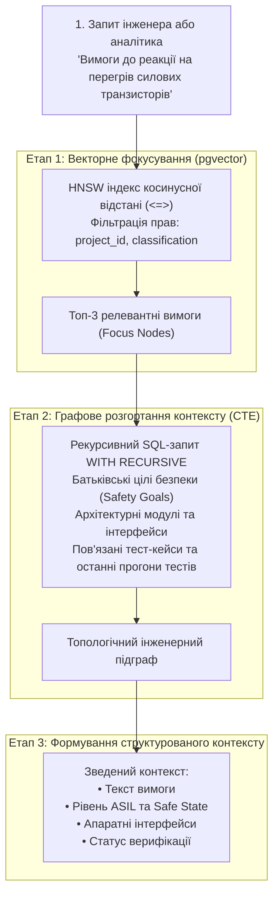

# MEMO-003: Архітектура Graph-RAG у PostgreSQL: поєднання векторних ембедінгів та рекурсивних графів

- **Дата:** 2026-09-23
- **Автор:** DELMOS Architecture Team
- **Статус:** Технічний концептуальний меморандум
- **Контекст:** [вектори та графи](../architecture/VECTOR_AND_GRAPH_DATA.md), [ADR-001](../architecture/decisions/ADR-001-all-in-postgresql-storage.md).

---

## 1. Обмеження класичного RAG у системній інженерії

Звичайний підхід RAG (Retrieval-Augmented Generation), що базується виключно на векторному пошуку найближчих шматків тексту (chunks) за косинусною відстанню, має критичний недолік в інженерних задачах:
* Векторний пошук знаходить схожі за змістом формулювання, але **повністю сліпий до топології інженерної системи**.
* Наприклад, за запитом *«Вимоги до реакції на перегрів інвертора»* класичний векторний пошук поверне схожі речення з різних підсистем, але не покаже:
  - До якої конкретно цілі безпеки (Safety Goal за ISO 26262) належить знайдена вимога;
  - Який апаратний датчик температури вимірює цей сигнал;
  - Який саме тест-кейс призначено для верифікації цього алгоритму;
  - Чи відкрито на цей модуль незакриті критичні дефекти.

---

## 2. Концепція Graph-RAG у DELMOS

**Graph-RAG (Graph-augmented Retrieval-Augmented Generation)** — це гібридний підхід, що комбінує векторний семантичний пошук та рекурсивний топологічний обхід графа зв'язків.

Завдяки нативній підтримці `pgvector` та рекурсивних CTE у PostgreSQL, у DELMOS Graph-RAG реалізується **в межах єдиної транзакційної бази даних**:



---

## 3. Приклад гібридного SQL-запиту Graph-RAG

```sql
WITH RECURSIVE 
-- 1. Знаходимо найближчі вимоги за вектором через pgvector з перевіркою прав доступу
seed_requirements AS (
    SELECT 
        wp.id,
        wp.code,
        wpr.title,
        wpr.body,
        1 - (e.embedding <=> $query_embedding) AS similarity
    FROM wp_embeddings e
    JOIN work_products wp ON wp.id = e.work_product_id
    JOIN work_product_revisions wpr ON wpr.id = e.revision_id
    WHERE wp.project_id = $project_id
      AND wp.type = 'requirement'
      AND wp.status = 'approved'
      AND wp.classification <= $user_clearance
      AND e.model_name = $current_embedding_model
    ORDER BY e.embedding <=> $query_embedding
    LIMIT 3
),
-- 2. Рекурсивно розгортаємо граф зв'язків углиб на 2 кроки (цілі безпеки, архітектура, тести)
graph_context AS (
    SELECT 
        sr.id AS seed_id,
        tl.target_id,
        tl.relation_kind,
        1 AS depth
    FROM seed_requirements sr
    JOIN trace_links tl ON tl.source_id = sr.id

    UNION ALL

    SELECT 
        gc.seed_id,
        tl.target_id,
        tl.relation_kind,
        gc.depth + 1
    FROM graph_context gc
    JOIN trace_links tl ON tl.source_id = gc.target_id
    WHERE gc.depth < 2
)
CYCLE target_id SET is_cycle USING path
-- 3. Збираємо фінальний контекст разом із метаданими зв'язаних артефактів
SELECT 
    sr.code AS requirement_code,
    sr.title AS requirement_title,
    sr.body AS requirement_body,
    wp_rel.code AS related_artifact_code,
    wp_rel.type AS related_artifact_type,
    gc.relation_kind,
    wpr_rel.title AS related_artifact_title
FROM graph_context gc
JOIN seed_requirements sr ON sr.id = gc.seed_id
JOIN work_products wp_rel ON wp_rel.id = gc.target_id
JOIN work_product_revisions wpr_rel ON wpr_rel.id = wp_rel.current_approved_revision_id;
```

---

## 4. Інженерні переваги підходу

1. **Відсутність галюцинацій щодо структури системи:** Модель аналізу отримує не ізольований текст, а точну топологічну схему підсистеми з її рівнями ASIL та зв'язаними тестами.
2. **Абсолютна безпека даних:** Увесь процес відбувається всередині єдиної бази даних PostgreSQL без передачі графів зв'язків на сторонні хмарні сервіси.
3. **Smart Link Suggestion:** Алгоритм використовується не лише для відповідей на запитання, а й для підказки інженерам зв'язків трасування при створенні нових вимог.
