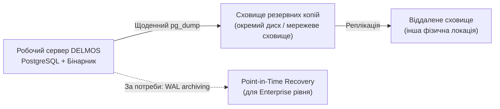

# DELMOS: план аварійного відновлення (Disaster Recovery)

Дата: 2026-09-23. Статус: нормативний план аварійного відновлення.
Ліцензія: Apache 2.0.
Контекст: [резервне копіювання та відновлення](BACKUP_AND_RESTORE.md), [операційний посібник](RUNBOOK.md).

---

## 1. Цілі відновлення (RPO / RTO)

| Рівень інсталяції | Recovery Point Objective (RPO) | Recovery Time Objective (RTO) |
| --- | --- | --- |
| PoC / R&D | До 24 годин (останнє щоденне резервне копіювання) | До 4 годин |
| Стандартна проєктна команда | До 4 годин (при частішому резервному копіюванні) | До 2 годин |
| Enterprise / Корпоративна інсталяція | До 1 години (безперервна архівація WAL PostgreSQL) | До 30 хвилин |

Конкретні числові значення RPO/RTO узгоджуються окремо для кожної інсталяції залежно від критичності проєктів (наприклад, активна розробка систем рівня ASIL D вимагає найсуворіших параметрів).

## 2. Архітектура резервування

## 3. Регулярне навчання з відновлення (DR Drill)

1. **Періодичність:** щомісяця для стандартних інсталяцій; щотижня для Enterprise.
2. **Процедура:**
   * Обрати випадкову резервну копію за останній тиждень.
   * Виконати повне відновлення в ізольоване тестове середовище (окремий сервер або тимчасова база даних).
   * Перевірити коректність відновлених даних: кількість проєктів, специфікацій, ревізій та бейзлайнів.
   * Зафіксувати час, витрачений на повне відновлення (для контролю відповідності RTO).
3. **Документування результату:** дата навчання, витрачений час, виявлені проблеми та коригувальні дії.

## 4. Процедура повного аварійного відновлення

### 4.1. Оцінка масштабу збою

| Сценарій | Вплив | Шлях відновлення |
| --- | --- | --- |
| Пошкодження бази даних (логічне) | Втрата певних записів або цілісності схеми | Відновлення з останньої резервної копії |
| Втрата всього диска / сервера | Повна недоступність платформи | Розгортання нового сервера + відновлення резервної копії |
| Помилкове видалення критичних даних адміністратором | Втрата конкретних артефактів чи бейзлайнів | Point-in-Time Recovery (якщо доступний) або відновлення з найближчої попередньої копії |
| Компрометація безпеки (Security Incident) | Потенційна втрата довіри до цілісності даних | Ізоляція сервера, аудит журналів, відновлення з копії, зробленої до інциденту |

### 4.2. Відновлення з резервної копії

Виконати процедуру, описану в [BACKUP_AND_RESTORE.md](BACKUP_AND_RESTORE.md), розділ 3, спрямовуючи відновлення безпосередньо у промислову базу даних лише після підтвердження факту втрати робочої інсталяції.

### 4.3. Перевірка журналу аудиту після відновлення

Після відновлення обов'язково перевіряється цілісність журналу аудиту безпеки (`audit_events`) та відповідність останнього зафіксованого бейзлайну очікуваному стану проєктів.

## 5. Контакти та ескалація

| Рівень | Контакт | Коли звертатися |
| --- | --- | --- |
| Рівень 1 | Черговий Host Operator | Перше виявлення недоступності сервісу |
| Рівень 2 | System Administrator платформи | Підтверджена втрата даних або необхідність повного відновлення |
| Рівень 3 | Керівник інженерної програми (Programme Manager) | Відновлення перевищує узгоджений RTO або зачіпає кілька проєктів |

## 6. Дивіться також

* [BACKUP_AND_RESTORE.md](BACKUP_AND_RESTORE.md) — технічні процедури створення та перевірки резервних копій.
* [RUNBOOK.md](RUNBOOK.md) — щоденні операційні процедури та дерево діагностики.
