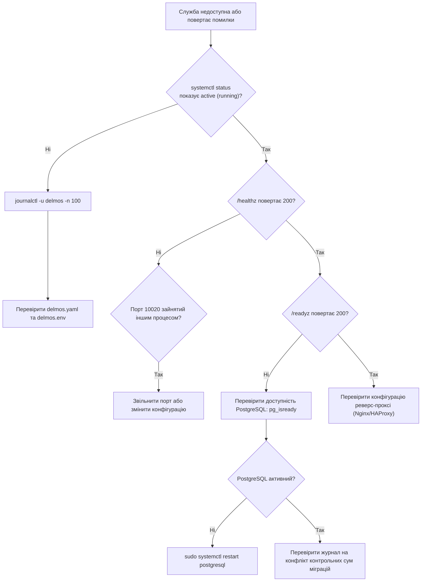

# DELMOS: операційний посібник (Runbook)

Дата: 2026-09-23. Статус: нормативний посібник з експлуатації служби.
Ліцензія: Apache 2.0.
Контекст: [ядро та архітектура](../architecture/ARCHITECTURE.md), [вимоги до середовища](../requirements/SYSTEM_REQUIREMENTS.md).

---

## 1. Керування процесом служби (Linux / systemd)

| Дія | Команда |
| --- | --- |
| Запустити службу | `sudo systemctl start delmos` |
| Зупинити службу | `sudo systemctl stop delmos` |
| Перезапустити службу | `sudo systemctl restart delmos` |
| Перевірити статус | `sudo systemctl status delmos` |
| Переглянути журнал у реальному часі | `sudo journalctl -u delmos -f` |
| Увімкнути автозапуск при старті ОС | `sudo systemctl enable delmos` |

## 2. Діагностичні ендпоінти

* **`GET /healthz`** — перевірка живучості процесу (Liveness). Відповідь `200 OK` означає, що процес запущений і приймає HTTP-з'єднання.
* **`GET /readyz`** — перевірка готовності (Readiness). Відповідь `200 OK` гарантує успішний пінг PostgreSQL та цілісність схеми даних. Відповідь `503 Service Unavailable` сигналізує реверс-проксі не спрямовувати трафік на цей інстанс.

## 3. Дерево діагностики несправностей (Triage Decision Tree)

## 4. Типові несправності та їх усунення

| Симптом | Ймовірна причина | Виправлення |
| --- | --- | --- |
| Служба миттєво завершується після старту | Помилка валідації конфігурації (`delmos.yaml`) | Перевірити журнал `journalctl`; виправити синтаксис YAML або відсутні обов'язкові поля |
| `/readyz` постійно повертає 503 | PostgreSQL недоступний або роль `delmos` не має потрібних прав | Перевірити `pg_isready`; перевірити права ролі через `\du` у `psql` |
| Служба стартує, але міграції не застосовуються | Конфлікт контрольної суми SHA-256 раніше застосованої міграції | **Не редагувати застосовану міграцію.** Створити нову міграцію з виправленням |
| Повільна відповідь на запити семантичного пошуку | Відсутній або пошкоджений HNSW-індекс `pgvector` | Перевірити `\d wp_embeddings` у `psql`; за потреби перебудувати індекс (`REINDEX INDEX idx_wp_embeddings_hnsw`) |
| Дублювання обробки подій у черзі outbox | Воркер аварійно завершився під час активної оренди (lease) | Дочекатися закінчення `lease_until`; повідомлення автоматично повертається в чергу |
| Неможливо підключитися через реверс-проксі | Невірна конфігурація `X-Forwarded-Proto` або TLS-сертифікат прострочений | Перевірити конфігурацію Nginx/HAProxy та термін дії сертифіката |

## 5. Скидання до чистого стану (Reset to Clean State)

**Попередження:** ця операція є руйнівною та застосовується виключно в тестових середовищах (PoC, R&D) або за явним підтвердженням адміністратора у виробничому середовищі після створення резервної копії.

1. Зупинити службу: `sudo systemctl stop delmos`.
2. Створити резервну копію бази даних (обов'язково, див. [BACKUP_AND_RESTORE.md](BACKUP_AND_RESTORE.md)).
3. Видалити та повторно створити базу даних або застосувати контрольоване очищення таблиць.
4. Запустити службу повторно: `sudo systemctl start delmos`.

## 6. Ескалація

| Рівень | Контакт | Коли звертатися |
| --- | --- | --- |
| L1 — Host Operator | Черговий інженер експлуатації | Служба не запускається, помилки конфігурації |
| L2 — System Administrator | Відповідальний за платформу DELMOS | Пошкодження даних, конфлікт міграцій, підозра на порушення безпеки |
| L3 — Architecture Team | Команда архітектури платформи | Системна деградація, що вимагає зміни архітектурного рішення (ADR) |
