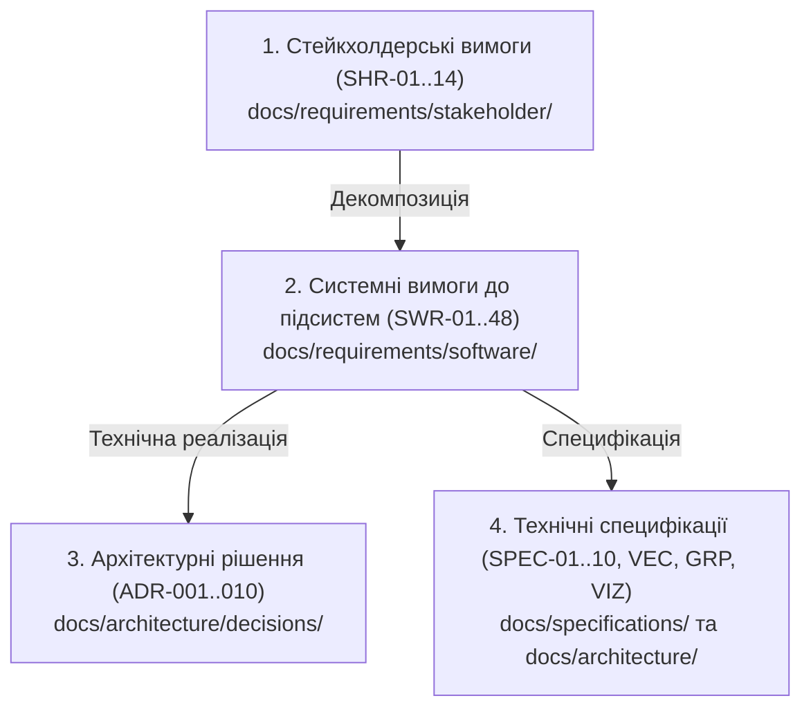

# Ієрархічні вимоги DELMOS (Hierarchical Requirements)

Дата оновлення: 2026-09-23.  
Платформа: **DELMOS** (Discovery, Engineering & Lifecycle Management Operating System).  
Ліцензія: Apache 2.0.

---

## 1. Методологія декомпозиції вимог

Вимоги у платформі DELMOS організовані за принципом наскрізної ієрархічної простежуваності відповідно до стандартів системної інженерії (**ISO/IEC/IEEE 29148** та **ASPICE 4.0 SYS.1–SYS.2**):

$$\text{SHR (Stakeholder Requirements)} \longrightarrow \text{SWR (Software/System Requirements)} \longrightarrow \text{ADR / Architecture} \longrightarrow \text{Acceptance Scenarios}$$

---

## 2. Структура каталогу вимог

1. **[Стейкхолдерські вимоги (Stakeholder Requirements)](stakeholder/README.md):**
   * Визначають інженерні та бізнес-потреби користувачів (менеджерів, архітекторів, інженерів з безпеки, аудиторів).
   * Охоплюють 14 напрямків: від обов'язкового плану та модульності до базових ролей, EVM і векторного семантичного пошуку.
2. **[Системні вимоги (Software / System Requirements)](software/README.md):**
   * Декомпозиція на 48 системних вимог, згрупованих за 10 підсистемами платформи:
     * *Core & Plan Engine:* SWR-01..05
     * *Dynamic Fields & Metadata:* SWR-06..08, SWR-28..30
     * *Milestones, Gates & Dictionaries:* SWR-09..11, SWR-31..32
     * *Events, Triggers, Rules & Scheduler:* SWR-12..14, SWR-16, SWR-19..20, SWR-23..27
     * *Metrics & Calculations:* SWR-21..22
     * *Modules & UI Host:* SWR-15, SWR-17..18
     * *Composite Specifications:* SWR-33..35
     * *Vector & Graph Subsystem:* SWR-36..38
     * *Project Economics & Resources:* SWR-39..41
       * *Core Access & Assurance:* SWR-42..48
3. **[Консолідований нормативний документ](SYSTEM_REQUIREMENTS.md):**
    * Вимоги до середовища розробки, PostgreSQL і запуску Linux; функціональні вимоги залишаються в окремих SHR/SWR-файлах, а покажчик зв'язків — у [TRACEABILITY.md](../TRACEABILITY.md).
