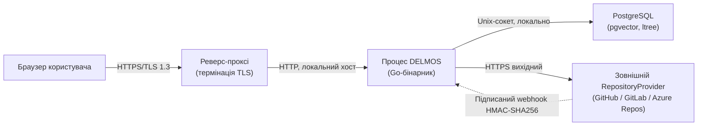

# DELMOS: безпека (Security)

Дата: 2026-09-23. Статус: нормативний реєстр документації з безпеки.
Ліцензія: Apache 2.0.
Контекст: [керування доступом та RBAC](../architecture/ACCESS_CONTROL.md), [вимоги до середовища](../requirements/SYSTEM_REQUIREMENTS.md).

---

## 1. Межі довіри (Trust Boundaries)

Єдиною публічно доступною межею довіри є реверс-проксі з термінацією TLS. Сам процес DELMOS та PostgreSQL слухають виключно локальні інтерфейси (loopback або Unix-сокет), як визначено у [вимогах до мережі](../requirements/SYSTEM_REQUIREMENTS.md#6-вимоги-до-мережі-та-інтеграційних-контурів).

## 2. Документи

| Документ | Призначення |
| --- | --- |
| [SECURITY_SPECIFICATION.md](SECURITY_SPECIFICATION.md) | Шифрування даних у стані спокою та передачі, керування секретами, безпека вебхуків |
| [../architecture/ACCESS_CONTROL.md](../architecture/ACCESS_CONTROL.md) | Автентифікація, сесії, ідентичності, RBAC/ABAC, розподіл обов'язків (SoD) |

## 3. Пов'язані вимоги та рішення

* `SHR-02`, `SHR-03` — політики модулів та їх активація (вплив на поверхню атаки через опційні можливості).
* [ADR-005](../architecture/decisions/ADR-005-multi-provider-repository-abstraction.md) — абстракція постачальників сховищ, що визначає межу довіри до зовнішніх систем контролю версій.
