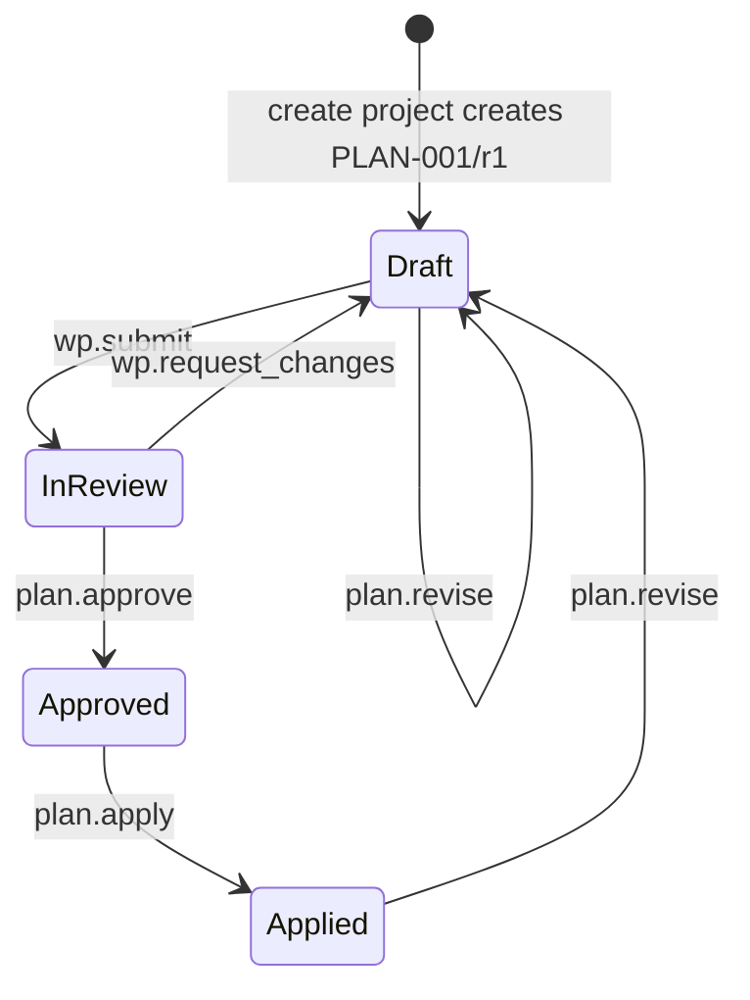

# CORE-CONTRACT-002: Generic Project Plan

Дата: 2026-09-25. Статус: нормативний контракт наступного вертикального зрізу.
Ліцензія: Apache 2.0.

Контекст: [модель проєкту](../architecture/PROJECT_MODEL.md),
[рушій плану](../architecture/PROJECT_PLAN_ENGINE.md),
[модульна система](../architecture/MODULES.md),
[CORE-CONTRACT-001](CORE-CONTRACT-001-ROLE-WORKFLOW.md).

---

## 1. Призначення та межі

`Generic Project Plan` є обов'язковою, версійованою та машинно-виконуваною
конфігурацією проєкту. Кожен проєкт має рівно один Work Product `PLAN-001`
(`type: plan`, `profile: core:project_plan`), але лише застосована ревізія плану
визначає чинні правила для системи.

Markdown у `work_product_revisions.body` призначений тільки для пояснень,
обґрунтувань та посилань. Він не задає системних правил і не читається рушієм
для прийняття рішень. Структурований маніфест зберігається окремо від Markdown.

Generic Plan не нав'язує методологію, галузевий стандарт, типи Work Items,
бюджетну модель або комплаєнс-вимоги. Scrum, Lean, V-Fall та інші підходи
додаються виключно функціональними модулями через власні типізовані секції.

---

## 2. Структурований маніфест

Кожна ревізія `PLAN-001` має рівно один незмінний `GenericPlanManifest`.

Базова версія плану є `revision_number` його Work Product revision: натуральне
число $n \geq 1$. Початкова ревізія має номер `1`, кожна наступна — рівно
`n + 1`; номери не перевикористовуються. `manifest_version` у прикладі нижче
версіонує формат маніфесту, а не конфігурацію проєкту. Аналогічно,
`profile_version` та `plan_schema_version` позначають сумісність профілю або
схеми. Модулі можуть визначати власні версії лише у своєму просторі
`extensions.<module_id>`. `row_version` Work Product використовується лише для
оптимістичного блокування конкурентних змін і не є версією плану.

```json
{
  "manifest_version": "1.0.0",
  "purpose": {
    "name": "Inverter Controller",
    "objective": "Develop and validate the controller",
    "success_criteria": ["Acceptance milestone passed"]
  },
  "scope": {
    "in_scope": ["System requirements", "Firmware"],
    "out_of_scope": ["Serial production"]
  },
  "roles": [
    {
      "id": "ROLE-PM",
      "name": "Project manager",
      "responsibilities": ["plan.manage"],
      "accountable_for": ["MS-RELEASE"]
    }
  ],
  "deliverables": [
    {
      "id": "DEL-ARCH",
      "name": "Architecture",
      "work_product_id": "1da3c104-df6a-4ab2-a4ec-388c2fd9a31d",
      "required_status": "approved"
    }
  ],
  "phases": [
    {
      "id": "PH-DESIGN",
      "name": "Design",
      "planned_start": "2026-10-01",
      "planned_finish": "2026-11-30",
      "depends_on": []
    }
  ],
  "milestones": [
    {
      "id": "MS-RELEASE",
      "name": "Release decision",
      "phase_id": "PH-DESIGN",
      "target_date": "2026-11-30",
      "deliverable_ids": ["DEL-ARCH"],
      "acceptance": {
        "all_deliverables_match_required_status": true,
        "required_gate": true
      }
    }
  ],
  "extensions": {}
}
```

`extensions` має ключі лише у форматі `<module_id>` і є єдиною точкою, де
активний модуль додає власну конфігурацію. Ядро зберігає та хешує ці дані, але
валідує їх лише через зареєстрованого `PlanSectionProvider` відповідного модуля.

### 2.1. Базова семантика

| Секція | Системна дія |
| --- | --- |
| `purpose` і `scope` | Класифікують конфігурацію проєкту; не створюють workflow. |
| `roles` | Визначають відповідальність у плані; не надають RBAC-дозволів. Права надаються тільки через `RoleBinding`. |
| `deliverables` | Явно пов'язують результат плану з існуючим Work Product та його обов'язковим станом. |
| `phases` | Задають упорядкований граф виконання; фаза не може бути відкрита, доки її залежності не завершені. |
| `milestones` | Визначають контрольну точку, її результати й мінімальні умови приймання. |
| `extensions` | Надають типізовану конфігурацію лише активним модулям. |

Нейтральна базова модель навмисно не має спринтів, backlog, story points,
канбан-доріжок, V-моделі, ASIL, rate cards або бюджетних лімітів.

---

## 3. Інваріанти валідації

Перед створенням ревізії плану система зобов'язана перевірити:

1. `manifest_version` підтримується ядром.
2. Усі ідентифікатори `roles`, `deliverables`, `phases` і `milestones` унікальні
   в межах маніфесту та відповідають формату стабільного ключа.
3. Кожен `work_product_id` існує в тому самому проєкті; `PLAN-001` не може бути
   deliverable самого себе.
4. `required_status` належить життєвому циклу Work Product.
5. Дати фази коректні: `planned_start <= planned_finish`; дата milestone лежить
   у межах призначеної фази.
6. `depends_on` посилається лише на іншу фазу, не містить дублікатів і формує
   ациклічний граф.
7. Кожен milestone належить рівно одній фазі; усі його `deliverable_ids`
   існують; порожній список допустимий лише якщо він не має вимоги результатів.
8. Ключ у `extensions` належить активному модулю, доступному системній політиці;
   його значення проходить JSON Schema та додаткову перевірку провайдера.

Порушення інваріанту повертає `422` і не створює ні ревізію, ні проєкцію.

---

## 4. Життєвий цикл та виконання



`plan.apply` є єдиною командою, що змінює чинну конфігурацію проєкту. В одній
транзакції вона:

1. перевіряє точну погоджену ревізію та її `payload_hash`;
2. повторно виконує інваріанти й перевірки модулів;
3. оновлює `project_plan_bindings.effective_plan_revision_id` і збільшує
   `config_generation`;
4. оновлює матеріалізовані проєкції фаз, milestones, deliverables та модульних
   активацій;
5. записує аудит і подію `plan.applied` у transactional outbox.

До появи workflow застосування первинна ревізія є лише чернеткою: вона не дає
системі права автоматично блокувати або дозволяти виконання робіт.

### 4.1. Базові виконувані правила

Після `plan.apply` ядро виконує лише універсальні правила:

* не відкриває фазу, доки не завершені всі залежні фази;
* не приймає milestone, якщо потрібний gate не має рішення `passed`;
* не приймає milestone, якщо хоча б один обов'язковий deliverable не досягнув
  `required_status`;
* не дозволяє застосувати план, коли посилання на результат, фазу або модульну
  конфігурацію втратили чинність.

Під "завершенням" базова модель розуміє зафіксований успішний `GateDecision`.
Власні стани фаз і спеціальні gate rules постачають модулі.

---

## 5. Сховище та API

Маніфест не повинен зберігатися в `work_product_revisions.metadata`: це загальне
розширюване поле Work Product, а не типізований контракт плану. Цільова схема:

```sql
CREATE TABLE core.project_plan_manifests (
    plan_work_product_id uuid NOT NULL REFERENCES core.work_products(id) ON DELETE RESTRICT,
    revision_id uuid PRIMARY KEY REFERENCES core.work_product_revisions(id) ON DELETE RESTRICT,
    manifest jsonb NOT NULL,
    manifest_hash bytea NOT NULL,
    created_at timestamptz NOT NULL DEFAULT now(),
    UNIQUE (plan_work_product_id, revision_id)
);

CREATE TABLE core.plan_phases (
    project_id uuid NOT NULL REFERENCES core.projects(id) ON DELETE RESTRICT,
    plan_revision_id uuid NOT NULL REFERENCES core.work_product_revisions(id) ON DELETE RESTRICT,
    phase_key text NOT NULL,
    name text NOT NULL,
    planned_start date NOT NULL,
    planned_finish date NOT NULL,
    PRIMARY KEY (project_id, plan_revision_id, phase_key)
);
```

Повний зріз також додає `plan_phase_dependencies`, `plan_milestones`,
`plan_milestone_deliverables`, `plan_roles` та `project_module_activations`.
Ці таблиці є відтворюваними проєкціями точної ревізії; історична істина завжди
залишається у `project_plan_manifests`.

Нові API-команди:

| Команда | Призначення | Мінімальний дозвіл |
| --- | --- | --- |
| `PUT /projects/{project_id}/plan/revisions` | Валідує маніфест та створює draft-ревізію. | `plan.edit` |
| `GET /projects/{project_id}/plan` | Повертає latest і effective маніфести та generation. | `project.read` |
| `POST /projects/{project_id}/plan/apply` | Застосовує схвалену точну ревізію. | `plan.apply` |
| `POST /projects/{project_id}/milestones/{milestone_id}/accept` | Виконує базові gate-правила. | `milestone.accept` |

Жодна команда не приймає Markdown як вхід для структурованих правил.

---

## 6. Послідовність реалізації та приймання

1. Додати типи Go, JSON Schema, валідацію маніфесту та тест на кожен інваріант
   розділу 3.
2. Додати міграцію `project_plan_manifests` і API чернеткової ревізії.
3. Додати workflow погодження, `plan.apply`, проєкції та event outbox.
4. Додати виконання фазових і milestone-правил.
5. Додати UI структурованого плану; Markdown лишається окремою вкладкою
   "Notes".
6. Лише після стабілізації ядра додавати `PlanSectionProvider` для Scrum, Lean,
   V-Fall, комплаєнсу та економіки.

Мінімальні acceptance-сценарії:

* проєкт створюється з валідним порожнім Generic Plan без обраної методології;
* некоректний граф фаз, дата milestone або чужий deliverable відхиляються з `422`;
* незастосована ревізія не змінює чинні правила;
* `plan.apply` атомарно змінює effective revision і generation;
* milestone не приймається без обов'язкових deliverables та passed gate;
* модуль не може додати поле поза власним ключем `extensions.<module_id>`.