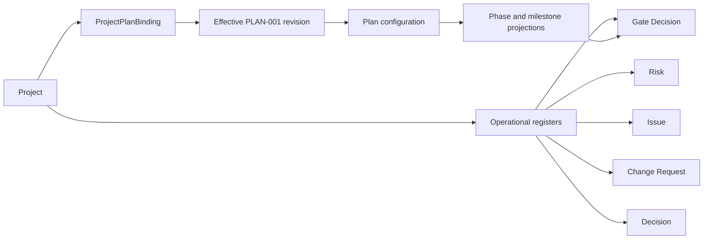

# CORE-CONTRACT-003: Generic Plan Domain and Automation

Дата: 2026-09-25. Статус: нормативний контракт наступного вертикального зрізу.
Ліцензія: Apache 2.0.

Контекст: [Generic Project Plan](CORE-CONTRACT-002-GENERIC-PROJECT-PLAN.md),
[предметна модель](../architecture/DOMAIN_MODEL.md),
[Work Products](../architecture/WORK_PRODUCTS.md), [події та правила](../architecture/EVENTS_TRIGGERS_RULES.md).

## 1. Джерела та принцип відбору

Цей контракт є власним синтезом за офіційними описами:

* [PMBOK Guide, Eighth Edition](https://www.pmi.org/standards/pmbok), PMI, листопад 2025: value delivery, tailoring та домени governance, scope, schedule, finance, stakeholders, resources і risk.
* [SWEBOK Guide v4.0a](https://www.computer.org/education/bodies-of-knowledge/software-engineering), IEEE Computer Society, 2024, оновлення вересня 2025: 18 областей знань, включно з requirements, architecture, testing, operations, configuration management, management, process, quality і security.

PMBOK визначає універсальні об'єкти управління проєктом. SWEBOK визначає
інженерні докази та дисципліни, які можуть бути потрібні проєкту. Жодне джерело
не обґрунтовує примусове застосування єдиної методології до всіх проєктів.
Тому Generic Plan дає нейтральні сутності й виконувані інваріанти, а Scrum,
Lean, V-Fall, безпека, фінанси та інші спеціалізації належать модулям.

## 2. Межа між планом і оперативними реєстрами

`PLAN-001` має одну базову версію `revision_number` і містить незмінну
конфігурацію: намір проєкту, межі, відповідальності, заплановані результати,
граф фаз, віхи, критерії приймання та правила керування змінами.

Оперативні факти не редагують план напряму. Ризик, проблема, запит зміни,
рішення або фактичне gate-рішення є окремою сутністю з власним журналом подій.
Вони підпорядковуються effective revision плану, але їхня зміна не створює нову
ревізію `PLAN-001`. Нова ревізія потрібна лише коли змінюється сама
конфігурація: scope, фази, acceptance rules, ролі, політика або модуль.



## 3. Базові проєктні сутності

| Сутність | Власник і життєвий цикл | Мінімальна структура | Призначення |
| --- | --- | --- | --- |
| `ProjectPlan` | Рівно один `PLAN-001`; immutable revisions | `id`, `project_id`, `profile`, `revision_number`, `payload_hash` | Корінь системної конфігурації. |
| `PlanApplication` | Створюється `plan.apply`; immutable факт | `plan_revision_id`, `config_generation`, `applied_by`, `applied_at` | Визначає effective revision. |
| `ProjectObjective` | Частина маніфесту | `key`, `statement`, `success_criteria` | Мета та умови успіху. |
| `ScopeItem` | Частина маніфесту | `key`, `kind: in_scope|out_of_scope`, `statement`, `rationale` | Явна межа дозволених результатів. |
| `Assumption` | Частина маніфесту | `key`, `statement`, `owner_ref`, `validation_date`, `status` | Явне припущення, яке може вплинути на план і потребує перевірки. |
| `Constraint` | Частина маніфесту | `key`, `kind`, `statement`, `source_ref`, `enforcement` | Межа проєкту, наприклад дата, доступність, фінансування або технологія; без вбудованих фінансових формул. |
| `Stakeholder` | Оперативний реєстр | `id`, `kind: user|organization|external_party`, `name`, `contact_ref`, `interest` | Учасник або зовнішня сторона; не тотожний користувачу чи RBAC-ролі. |
| `ResponsibilityAssignment` | Частина маніфесту; посилається на stakeholder | `role_key`, `stakeholder_id`, `responsibility: responsible|accountable|consulted|informed` | Відповідальність у плані, але не надання доступу. |
| `Deliverable` | Частина маніфесту та effective projection | `key`, `work_product_id`, `required_status`, `acceptance_rule_ids` | Результат, який доводиться конкретним Work Product. |
| `Phase` | Маніфест визначає; проєкція має стан | `key`, `name`, `planned_start`, `planned_finish`, `depends_on` | Вузол ациклічного графа виконання. |
| `Milestone` | Маніфест визначає; проєкція має стан | `key`, `phase_key`, `target_date`, `deliverable_keys`, `acceptance_rule_ids` | Контрольна точка результату. |
| `AcceptanceRule` | Маніфест | `key`, `predicate_key`, `parameters`, `enforcement` | Типізована перевірка; не текст і не довільний код. |
| `Risk` | Оперативний реєстр | `id`, `title`, `owner_ref`, `status`, `response`, `linked_refs` | Невизначеність, яка може вплинути на цілі; модуль може додати шкали та розрахунок exposure. |
| `Issue` | Оперативний реєстр | `id`, `title`, `owner_ref`, `status`, `impact`, `linked_refs` | Уже наявна перешкода, відмінна від ризику. |
| `ChangeRequest` | Оперативний реєстр | `id`, `reason`, `affected_refs`, `impact_summary`, `status`, `decision_ref` | Контрольована зміна effective configuration або baseline. |
| `Decision` | Оперативний реєстр | `id`, `subject_refs`, `decision`, `rationale`, `decided_by`, `occurred_at` | Відтворюване управлінське рішення. |
| `GateDecision` | Оперативний реєстр | `milestone_id`, `outcome: passed|failed|waived`, `evidence_refs`, `decided_by` | Формальний результат приймання milestone. |
| `ProjectDependency` | Маніфест або реєстр | `id`, `predecessor_ref`, `successor_ref`, `kind`, `status` | Залежність між фазами, результатами або зовнішніми зобов'язаннями. |

Усі ключі в маніфесті стабільні в межах його ревізії. Оперативні сутності мають
UUID, project scope, аудит і посилання на effective `config_generation`, за
яким їх було створено або оцінено.

### 3.1. Структура GenericPlanManifest

```json
{
  "manifest_version": "1.0.0",
  "objectives": [],
  "scope_items": [],
   "assumptions": [],
   "constraints": [],
  "responsibility_assignments": [],
  "deliverables": [],
  "phases": [],
  "milestones": [],
  "acceptance_rules": [],
  "governance": {
    "change_control_required": true
  },
  "extensions": {}
}
```

Усі масиви, крім `extensions`, належать ядру. Вони можуть бути порожніми у
новому Generic Project, але `plan.apply` перевіряє посилання, граф і правила,
які фактично оголошені. `Stakeholder` та `Risk` навмисно не копіюються до
кожної ревізії маніфесту: план посилається на чинний реєстр лише через
`responsibility_assignments`.

## 4. Work Products, що виникають у Generic Plan

Generic Plan не створює нові базові `type`. Він використовує наявні шість типів
ядра і фіксовані профілі. `type: plan` зарезервований виключно для `PLAN-001`.

| Профіль Work Product | Базовий `type` | Призначення та обов'язкові дані |
| --- | --- | --- |
| `core:project_plan` | `plan` | Єдиний Generic Project Plan та його маніфест. |
| `core:requirement` | `requirement` | Перевірювана потреба або обмеження; statement, acceptance criteria, verification method. |
| `core:architecture` | `architecture` | Структура рішення, interfaces, constraints, decisions і rationale. |
| `core:test_spec` | `test_spec` | Процедура перевірки; objective, inputs, steps, expected results, verifies refs. |
| `core:verification_report` | `report` | Факт виконаної перевірки; exact subject revisions, environment, observations, conclusion. |
| `core:status_report` | `report` | Стан, прогрес, прогнози, відкриті ризики та проблеми з посиланням на дату зрізу. |
| `core:decision_record` | `record` | Обґрунтоване рішення; subject refs, decision, participants, occurred_at. |
| `core:gate_decision` | `record` | Підписаний доказ `passed`, `failed` або `waived`; evidence refs і SoD. |
| `core:change_record` | `record` | Рішення щодо ChangeRequest, аналіз впливу та посилання на застосовану ревізію. |
| `core:configuration_baseline` | `record` | Незмінний перелік точних ревізій та зв'язків для відтворення. |

Тестовий або валідаційний план може бути профілем `test_spec`; презентаційний
матеріал може бути профілем `report`; процесний план — профілем `record` або
зареєстрованим типом модуля. Жоден з них не є другим Project Plan і не може
мати профіль `core:project_plan`.

## 5. Обробники команд, подій, тригерів і правил

Кожна команда проходить однаковий конвеєр:

```text
authorize -> load effective configuration -> before triggers -> transaction
-> state change + audit + outbox event -> commit -> after triggers
```

`before` trigger виконується в транзакції і може повернути `422` через
`MANDATORY_VETO`. `after` trigger отримує тільки committed event з outbox і
має бути ідемпотентним. Правила використовують лише зареєстровані
`predicate_key` та `action_key`; текст Markdown або значення JSON не можуть
запускати SQL, JavaScript чи довільний код.

| Команда | Before trigger і базове правило | Committed event | After handlers |
| --- | --- | --- | --- |
| `plan.revise` | `plan.before_revise`: валідність маніфесту, унікальні ключі, ациклічність фаз, project-scoped deliverables | `plan.revision_committed` | індексація, позначення незастосованої конфігурації, сповіщення учасників |
| `plan.apply` | `plan.before_apply`: exact approved revision, валідність модулів, відсутність конфлікту generation | `plan.applied` | materialize projections, activate module bindings, re-evaluate milestones |
| `phase.open` | `phase.before_open`: усі залежні фази завершені, стартові rules passed | `phase.opened` | створення запланованих перевірок, сповіщення відповідальних |
| `phase.complete` | `phase.before_complete`: exit milestones мають `passed` або чинний `waived` | `phase.completed` | дозволити готові залежні фази, оновити плановий стан |
| `milestone.accept` | `milestone.before_accept`: усі deliverables у required status, acceptance predicates passed | `milestone.accepted` або `milestone.rejected` | створити GateDecision record, перерахувати готовність фази |
| `risk.register` / `risk.update` | `risk.before_change`: owner існує, посилання належать проєкту | `risk.registered` / `risk.updated` | сповіщення owner; модуль може обчислити exposure |
| `issue.raise` / `issue.resolve` | `issue.before_transition`: коректний стан та owner | `issue.raised` / `issue.resolved` | створити або оновити пов'язаний Work Item, якщо це передбачено ефективним правилом |
| `change.request` | `change.before_submit`: опис впливу, affected refs, право автора | `change.requested` | ініціювати review, позначити залежні артефакти suspect |
| `change.decide` | `change.before_decide`: SoD, потрібний кворум, точний ChangeRequest | `change.approved` або `change.rejected` | дозволити створення plan revision або baseline successor |
| `decision.record` | `decision.before_record`: subject refs та повноваження | `decision.recorded` | аудит і сповіщення зацікавлених сторін |

### 5.1. Незмінні правила Generic Plan

1. Проєкт має рівно один `core:project_plan`, а чинна конфігурація визначається
   лише `effective_plan_revision_id`.
2. Фаза не може посилатися на себе, утворювати цикл або завершитися раніше за
   залежність.
3. Віха не приймається без усіх обов'язкових результатів та позитивного gate.
4. `ResponsibilityAssignment` не надає дозволів; перевірка виконавця завжди
   виконується через RBAC RoleBinding.
5. Ризик, проблема, рішення та зміна не можуть посилатися на інший проєкт.
6. Зміна чинної конфігурації проходить через нову ревізію, review/approval та
   `plan.apply`; оперативний запис не може обійти цей процес.

## 6. Межа модулів

Модуль повинен заявити `extension_target` і тип внеску до того, як ядро
прийме його конфігурацію. Він може:

* додати секцію лише у `extensions.<module_id>`;
* додати профіль Work Product, predicate, rule, milestone type, UI і after handler;
* посилити Generic rule або додати новий gate.

Модуль не може послабити базовий інваріант, переналаштувати `PLAN-001` на інший
профіль, змінити `revision_number` або надати RBAC-доступ через RACI.

## 7. Черговість реалізації

1. Реалізувати `GenericPlanManifest`, PlanApplication і базові проєкції фаз,
   milestones, deliverables та assignments.
2. Реалізувати оперативні реєстри Stakeholder, Risk, Issue, ChangeRequest,
   Decision і GateDecision з project scope та аудитом.
3. Реалізувати `plan.revise`, `plan.apply`, phase і milestone handlers через
   core event/trigger/rule pipeline.
4. Додати базові профілі Work Product і перевірки cross-project references.
5. Лише після цього підключати методологічні, фінансові, ресурсні та
   комплаєнс-модулі.