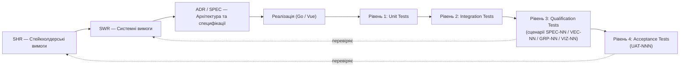

# DELMOS: стратегія тестування (Test Strategy)

Дата: 2026-09-23. Статус: нормативна стратегія верифікації та валідації.
Ліцензія: Apache 2.0.
Контекст: [методологія вимог](../requirements/README.md), [сценарії приймання](../architecture/WORK_PRODUCTS.md),
[UAT](../uat/README.md).

---

## 1. Огляд V-моделі

## 2. Рівні тестування

### Рівень 1 — Unit Tests

| Атрибут | Значення |
| --- | --- |
| Перевіряє | Ізольовану логіку окремої функції, методу чи компонента |
| Простежується до | `SWR-NN` (окрема нормативна вимога підсистеми) |
| Інструментарій | `go test` (backend), `vitest` (frontend Vue) |
| Іменування (Go) | `TestFunctionName_Scenario` у файлі `*_test.go` поруч із тестованим кодом |
| Іменування (Vue/TS) | `ComponentName.spec.ts` поруч із компонентом |
| Регресія | Після реалізації gate повинна виконуватися при кожному коміті через `make validate` |

Що тестується на цьому рівні: валідація вхідних даних, чисті функції обчислення (наприклад, формули EVM у [SPEC-03](../specifications/SPEC-03-PROJECT-ECONOMICS-EVM-MODELS.md)), рендеринг окремих Vue-компонентів, серіалізація/десеріалізація JSON Schema.

### Рівень 2 — Integration Tests

| Атрибут | Значення |
| --- | --- |
| Перевіряє | Взаємодію кількох компонентів через реальну PostgreSQL (тестова база) |
| Простежується до | `ADR-NNN` (архітектурне рішення, що визначає межу інтеграції) |
| Інструментарій | `go test` з тестовим контейнером/схемою PostgreSQL, HTTP-тести проти локального сервера |
| Регресія | Після реалізації gate повинна виконуватися при кожному коміті через `make validate` |

Що тестується на цьому рівні: транзакційна цілісність запису `Work Product` + `event_outbox` (див. [ADR-007](../architecture/decisions/ADR-007-transactional-outbox-event-scheduler.md)), повний цикл `RepositoryProvider` (створення коміту → зчитування файлу), робота `Lease Fencing` під конкурентним доступом кількох воркерів.

### Рівень 3 — Qualification Tests

| Атрибут | Значення |
| --- | --- |
| Перевіряє | Повний наскрізний сценарій системи відповідно до формальних сценаріїв приймання |
| Простежується до | `SWR-NN` через ідентифікатори сценаріїв `SPEC-01`..`SPEC-10` (композитні специфікації), `VEC-01`..`VEC-03` (векторний пошук), `GRP-01`..`GRP-03` (обхід графа трасованості), `VIZ-01`..`VIZ-02` (візуалізація) |
| Інструментарій | Автоматизовані наскрізні тести проти повністю розгорнутого інстансу (backend + PostgreSQL + frontend через Playwright за потреби) |
| Регресія | Виконується перед кожним релізом; критичні сценарії — при кожному злитті в основну гілку |

Мапа сценаріїв кваліфікації на системні вимоги веде реєстр у [WORK_PRODUCTS.md, розділ 9](../architecture/WORK_PRODUCTS.md) та [VECTOR_AND_GRAPH_DATA.md](../architecture/VECTOR_AND_GRAPH_DATA.md).

### Рівень 4 — Acceptance Tests (UAT)

| Атрибут | Значення |
| --- | --- |
| Перевіряє | Спостережувану цінність для конкретної ролі стейкхолдера |
| Простежується до | `SHR-NN` (стейкхолдерська вимога) |
| Інструментарій | Ручне або напівавтоматизоване виконання сценарію реальним користувачем відповідної ролі |
| Формат | Документи `UAT-NNN` у [docs/uat/](../uat/README.md), шаблон — [UAT-TEMPLATE.md](../templates/UAT-TEMPLATE.md) |
| Регресія | Виконується перед кожним мінорним/мажорним релізом |

## 3. Стратегія регресії

| Тригер | Unit | Integration | Qualification | Acceptance |
| --- | --- | --- | --- | --- |
| Кожен коміт (pre-commit / CI) | ✅ | ✅ | — | — |
| Злиття в основну гілку | ✅ | ✅ | Критичні сценарії | — |
| Перед мінорним релізом | ✅ | ✅ | ✅ Повний набір | Вибіркові UAT |
| Перед мажорним релізом | ✅ | ✅ | ✅ Повний набір | ✅ Повний набір |

## 4. Правила іменування ідентифікаторів тестів

| Рівень | Патерн | Приклад |
| --- | --- | --- |
| Unit | `TestXxx_Scenario` (Go) / `describe/it` (Vue) | `TestComputeEVM_NegativeSPI` |
| Integration | `TestIntegration_Xxx` | `TestIntegration_OutboxTransactionalWrite` |
| Qualification | `SPEC-NN`, `VEC-NN`, `GRP-NN`, `VIZ-NN` | `SPEC-04`, `VEC-02` |
| Acceptance | `UAT-NNN` | `UAT-001` |

## 5. Пріоритет впровадження

| Етап | Дії | Орієнтовні зусилля |
| --- | --- | --- |
| Фаза 1 | Unit-покриття ядра доменної моделі (`Work Item`/`Work Product`, композитні специфікації) | Високий пріоритет, супроводжує розробку кожного модуля |
| Фаза 2 | Integration-тести транзакційного outbox та `RepositoryProvider` | Високий пріоритет для ADR-005 та ADR-007 |
| Фаза 3 | Автоматизація сценаріїв кваліфікації `SPEC-01`..`SPEC-10`, `VEC-01`..`VEC-03`, `GRP-01`..`GRP-03` | Середній пріоритет, паралельно з реалізацією підсистем |
| Фаза 4 | Формалізація та регулярне виконання `UAT-NNN` | Супроводжує кожен реліз, починаючи з першого публічного PoC |

## 6. Посилання

* [docs/uat/README.md](../uat/README.md) — реєстр сценаріїв приймального тестування.
* [docs/templates/UAT-TEMPLATE.md](../templates/UAT-TEMPLATE.md) — шаблон нового сценарію.
* [docs/architecture/WORK_PRODUCTS.md](../architecture/WORK_PRODUCTS.md) — формальні сценарії приймання композитних специфікацій.
