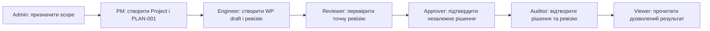

# DELMOS: каталог сценаріїв базових ролей

Дата: 2026-09-23. Статус: цільовий каталог Core use cases; бізнес-правила належать відповідним архітектурним контрактам.
Ліцензія: Apache 2.0.
Контекст: [ролі та дозволи](../architecture/ACCESS_CONTROL.md), [предметна модель](../architecture/DOMAIN_MODEL.md), [готовність до кодування](../architecture/PRE_CODING_GUIDE.md), [Guided UI](../architecture/gui/GUIDED_EXPERIENCE.md).

---

## Що означає «базова роль»

Роль у [RoleDefinition](../architecture/ACCESS_CONTROL.md) — доступний профіль повноважень, **не** автоматичний дозвіл кожному користувачу. Права виникають лише з явного `RoleBinding` у System/Programme/Project, з урахуванням стану, classification, призначення й SoD. Ролі можуть поєднуватися, але сума дозволів не скасовує серверних обмежень. Сценарії описують цільову поведінку; не всі можливості вже реалізовано.

| Роль / актор | Сценарії | Межа ядра |
| --- | --- | --- |
| Будь-який інтерактивний User | [USR-001..005](COMMON_USER.md) | Вхід/вихід, проєктний контекст, налаштування, deeplink, безпечна відмова. |
| Viewer | [VIEW-001..004](VIEWER.md) | Читає тільки дозволені записи та ревізії; не змінює й не експортує закриті дані за замовчуванням. |
| Engineer | [ENG-001..005](ENGINEER.md) | Створює й подає WP, керує дозволеними зв'язками; `Task.done` не означає Approval. |
| Reviewer | [REV-001..004](REVIEWER.md) | Перевіряє конкретну ревізію, запитує зміни; не ухвалює фінальне рішення без Approver. |
| Approver | [APR-001..004](APPROVER.md) | Погоджує точний хеш після серверних перевірок кворуму та незалежності. |
| Auditor | [AUD-001..005](AUDITOR.md) | Перевіряє історію, рішення, бейзлайн і журнали; право експорту окреме. |
| Project Manager | [PM-001..020](PROJECT_MANAGER.md) | Core: проєкт, `PLAN-001`, планування, подання/застосування плану; модульні методології, стандарти, економіка та EVM — пізніше. |
| System Administrator / Host Operator | [ADM-001..016](ADMINISTRATOR.md) | Core: сесії, доступ, конфігурація, здоров'я, резервне копіювання; політики майбутніх модулів — окремий етап. Host Operator не отримує права погодження WP. |

**Safety / Compliance Officer** названо в [ACCESS_CONTROL.md](../architecture/ACCESS_CONTROL.md) як роль, але конкретні процедури оцінки стандартів — предмет майбутніх галузевих модулів. Не включати їх у перевірку готовності ядра. `ServicePrincipal` — технічна ідентичність без інтерактивної сесії, не восьма роль вебкористувача. Programme Manager у межах Core не отримує нового набору повноважень автоматично: це має бути окремий RoleBinding з явно визначеними діями; до появи нормативного контракту не припускати, що повноваження PM на один проєкт діють на всю програму.

## Наскрізний зріз першого випуску

Кожна стрілка має перевірятися за прямим API-запитом і адресним UI, включно з відмовами: невидимий проєкт, 409 при зміні `row_version`, 422 при порушенні інваріанта, автор намагається погодити себе, Auditor намагається змінити дані. Першу ітерацію завершити на рецензії/затвердженні; граф зв'язків і бейзлайн додавати після відповідних доменних контрактів. Базову матрицю дозволів, кворум і відмову визначають [SWR-42..48](../requirements/software/SWR-10-core-access-assurance.md); технічні негативні тести залишаються необхідними до реалізації фінального `wp.approve`.

## Стан і трасування

Вимоги до відокремлення роботи від результату наведені в [SWR-02](../requirements/software/SWR-02-dynamic-fields-content.md) та [SHR-09](../requirements/stakeholder/SHR-09-work-item-and-work-product.md); правила ревізій і життєвого циклу — у [WORK_PRODUCTS.md](../architecture/WORK_PRODUCTS.md), контроль доступу — у [ACCESS_CONTROL.md](../architecture/ACCESS_CONTROL.md). У сценаріях не з'являються нові дозволи «через назву ролі»: остаточну матрицю `RoleDefinition × permission key × scope` слід перевірити на негативних кейсах перед першим кодом доступу.

Базовий доступ, ізоляція проєктів, незалежні рішення, аудиторське читання й експорт тепер формально визначені в [SHR-14](../requirements/stakeholder/SHR-14-core-access-and-assurance.md) та [SWR-42..48](../requirements/software/SWR-10-core-access-assurance.md). `SHR-09` продовжує визначати відокремлення роботи від результату, а use cases не замінюють серверних правил. Наскрізний сценарій приймання — чернетка [UAT-004](../uat/UAT-004-core-roles-review-approval.md); доки код не реалізовано, не позначати її Passed. Далі сценарії `USR/VIEW/ENG/REV/APR/AUD` включити до [стратегії тестування](../testing/TEST_STRATEGY.md).